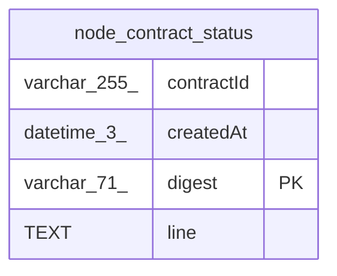

# node_contract_status

## Description

<details>
<summary><strong>Table Definition</strong></summary>

```sql
CREATE TABLE "node_contract_status" ("digest" varchar(71) PRIMARY KEY NOT NULL, "contractId" varchar(255) NOT NULL, "line" text NOT NULL, "createdAt" datetime(3) NOT NULL DEFAULT (STRFTIME('%Y-%m-%d %H:%M:%f', 'NOW')))
```

</details>

## Columns

| Name | Type | Default | Nullable | Children | Parents | Comment |
| ---- | ---- | ------- | -------- | -------- | ------- | ------- |
| contractId | varchar(255) |  | false |  |  |  |
| createdAt | datetime(3) | STRFTIME('%Y-%m-%d %H:%M:%f', 'NOW') | false |  |  |  |
| digest | varchar(71) |  | false |  |  |  |
| line | TEXT |  | false |  |  |  |

## Constraints

| Name | Type | Definition |
| ---- | ---- | ---------- |
| digest | PRIMARY KEY | PRIMARY KEY (digest) |
| sqlite_autoindex_node_contract_status_1 | PRIMARY KEY | PRIMARY KEY (digest) |

## Indexes

| Name | Definition |
| ---- | ---------- |
| IDX_a2de1334540be1ba17cd10b3f6 | CREATE INDEX "IDX_a2de1334540be1ba17cd10b3f6" ON "node_contract_status" ("contractId")  |
| sqlite_autoindex_node_contract_status_1 | PRIMARY KEY (digest) |

## Relations



---

> Generated by [tbls](https://github.com/k1LoW/tbls)
