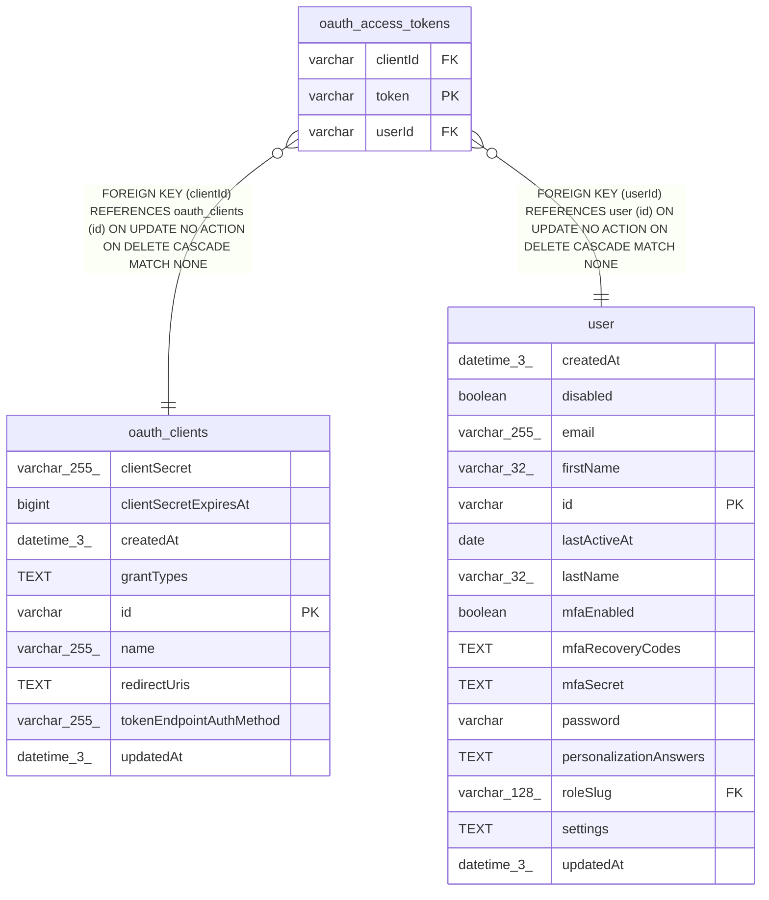

# oauth_access_tokens

## Description

<details>
<summary><strong>Table Definition</strong></summary>

```sql
CREATE TABLE "oauth_access_tokens" ("token" varchar PRIMARY KEY NOT NULL, "clientId" varchar NOT NULL, "userId" varchar NOT NULL, CONSTRAINT "FK_78b26968132b7e5e45b75876481" FOREIGN KEY ("clientId") REFERENCES "oauth_clients" ("id") ON DELETE CASCADE, CONSTRAINT "FK_7234a36d8e49a1fa85095328845" FOREIGN KEY ("userId") REFERENCES "user" ("id") ON DELETE CASCADE)
```

</details>

## Columns

| Name | Type | Default | Nullable | Children | Parents | Comment |
| ---- | ---- | ------- | -------- | -------- | ------- | ------- |
| clientId | varchar |  | false |  | [oauth_clients](oauth_clients.md) |  |
| token | varchar |  | false |  |  |  |
| userId | varchar |  | false |  | [user](user.md) |  |

## Constraints

| Name | Type | Definition |
| ---- | ---- | ---------- |
| - (Foreign key ID: 0) | FOREIGN KEY | FOREIGN KEY (userId) REFERENCES user (id) ON UPDATE NO ACTION ON DELETE CASCADE MATCH NONE |
| - (Foreign key ID: 1) | FOREIGN KEY | FOREIGN KEY (clientId) REFERENCES oauth_clients (id) ON UPDATE NO ACTION ON DELETE CASCADE MATCH NONE |
| sqlite_autoindex_oauth_access_tokens_1 | PRIMARY KEY | PRIMARY KEY (token) |
| token | PRIMARY KEY | PRIMARY KEY (token) |

## Indexes

| Name | Definition |
| ---- | ---------- |
| sqlite_autoindex_oauth_access_tokens_1 | PRIMARY KEY (token) |

## Relations



---

> Generated by [tbls](https://github.com/k1LoW/tbls)
