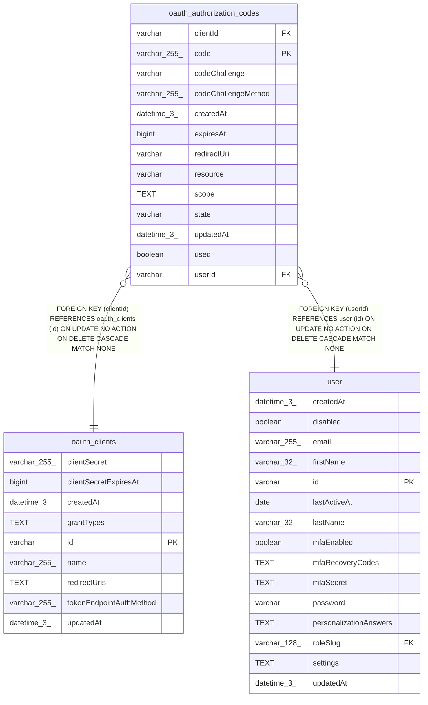

# oauth_authorization_codes

## Description

<details>
<summary><strong>Table Definition</strong></summary>

```sql
CREATE TABLE "oauth_authorization_codes" ("code" varchar(255) PRIMARY KEY NOT NULL, "clientId" varchar NOT NULL, "userId" varchar NOT NULL, "redirectUri" varchar NOT NULL, "codeChallenge" varchar NOT NULL, "codeChallengeMethod" varchar(255) NOT NULL, "expiresAt" bigint NOT NULL, "state" varchar, "used" boolean NOT NULL DEFAULT (false), "createdAt" datetime(3) NOT NULL DEFAULT (STRFTIME('%Y-%m-%d %H:%M:%f', 'NOW')), "updatedAt" datetime(3) NOT NULL DEFAULT (STRFTIME('%Y-%m-%d %H:%M:%f', 'NOW')), "resource" varchar, "scope" text NOT NULL DEFAULT ('["tool:listWorkflows","tool:getWorkflowDetails"]'), CONSTRAINT "FK_e829ca1240b877f73fd5fab14a2" FOREIGN KEY ("userId") REFERENCES "user" ("id") ON DELETE CASCADE ON UPDATE NO ACTION, CONSTRAINT "FK_81de58036895ccabf2214c6d99e" FOREIGN KEY ("clientId") REFERENCES "oauth_clients" ("id") ON DELETE CASCADE ON UPDATE NO ACTION)
```

</details>

## Columns

| Name | Type | Default | Nullable | Children | Parents | Comment |
| ---- | ---- | ------- | -------- | -------- | ------- | ------- |
| clientId | varchar |  | false |  | [oauth_clients](oauth_clients.md) |  |
| code | varchar(255) |  | false |  |  |  |
| codeChallenge | varchar |  | false |  |  |  |
| codeChallengeMethod | varchar(255) |  | false |  |  |  |
| createdAt | datetime(3) | STRFTIME('%Y-%m-%d %H:%M:%f', 'NOW') | false |  |  |  |
| expiresAt | bigint |  | false |  |  |  |
| redirectUri | varchar |  | false |  |  |  |
| resource | varchar |  | true |  |  |  |
| scope | TEXT | '["tool:listWorkflows","tool:getWorkflowDetails"]' | false |  |  |  |
| state | varchar |  | true |  |  |  |
| updatedAt | datetime(3) | STRFTIME('%Y-%m-%d %H:%M:%f', 'NOW') | false |  |  |  |
| used | boolean | false | false |  |  |  |
| userId | varchar |  | false |  | [user](user.md) |  |

## Constraints

| Name | Type | Definition |
| ---- | ---- | ---------- |
| - (Foreign key ID: 0) | FOREIGN KEY | FOREIGN KEY (clientId) REFERENCES oauth_clients (id) ON UPDATE NO ACTION ON DELETE CASCADE MATCH NONE |
| - (Foreign key ID: 1) | FOREIGN KEY | FOREIGN KEY (userId) REFERENCES user (id) ON UPDATE NO ACTION ON DELETE CASCADE MATCH NONE |
| code | PRIMARY KEY | PRIMARY KEY (code) |
| sqlite_autoindex_oauth_authorization_codes_1 | PRIMARY KEY | PRIMARY KEY (code) |

## Indexes

| Name | Definition |
| ---- | ---------- |
| sqlite_autoindex_oauth_authorization_codes_1 | PRIMARY KEY (code) |

## Relations



---

> Generated by [tbls](https://github.com/k1LoW/tbls)
