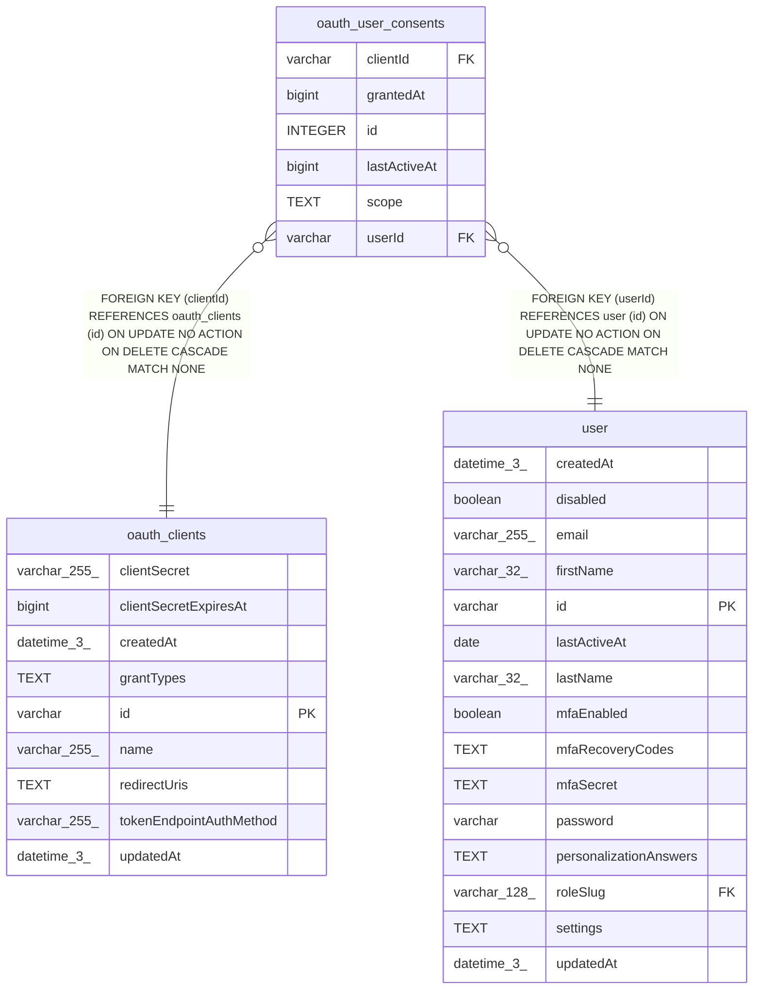

# oauth_user_consents

## Description

<details>
<summary><strong>Table Definition</strong></summary>

```sql
CREATE TABLE "oauth_user_consents" ("id" integer PRIMARY KEY NOT NULL, "userId" varchar NOT NULL, "clientId" varchar NOT NULL, "grantedAt" bigint NOT NULL, "scope" text NOT NULL, "lastActiveAt" bigint, CONSTRAINT "UQ_083721d99ce8db4033e2958ebb4" UNIQUE ("userId", "clientId"), CONSTRAINT "FK_a651acea2f6c97f8c4514935486" FOREIGN KEY ("clientId") REFERENCES "oauth_clients" ("id") ON DELETE CASCADE ON UPDATE NO ACTION, CONSTRAINT "FK_21e6c3c2d78a097478fae6aaefa" FOREIGN KEY ("userId") REFERENCES "user" ("id") ON DELETE CASCADE ON UPDATE NO ACTION)
```

</details>

## Columns

| Name | Type | Default | Nullable | Children | Parents | Comment |
| ---- | ---- | ------- | -------- | -------- | ------- | ------- |
| clientId | varchar |  | false |  | [oauth_clients](oauth_clients.md) |  |
| grantedAt | bigint |  | false |  |  |  |
| id | INTEGER |  | false |  |  |  |
| lastActiveAt | bigint |  | true |  |  |  |
| scope | TEXT |  | false |  |  |  |
| userId | varchar |  | false |  | [user](user.md) |  |

## Constraints

| Name | Type | Definition |
| ---- | ---- | ---------- |
| - (Foreign key ID: 0) | FOREIGN KEY | FOREIGN KEY (userId) REFERENCES user (id) ON UPDATE NO ACTION ON DELETE CASCADE MATCH NONE |
| - (Foreign key ID: 1) | FOREIGN KEY | FOREIGN KEY (clientId) REFERENCES oauth_clients (id) ON UPDATE NO ACTION ON DELETE CASCADE MATCH NONE |
| id | PRIMARY KEY | PRIMARY KEY (id) |
| sqlite_autoindex_oauth_user_consents_1 | UNIQUE | UNIQUE (userId, clientId) |

## Indexes

| Name | Definition |
| ---- | ---------- |
| sqlite_autoindex_oauth_user_consents_1 | UNIQUE (userId, clientId) |

## Relations



---

> Generated by [tbls](https://github.com/k1LoW/tbls)
