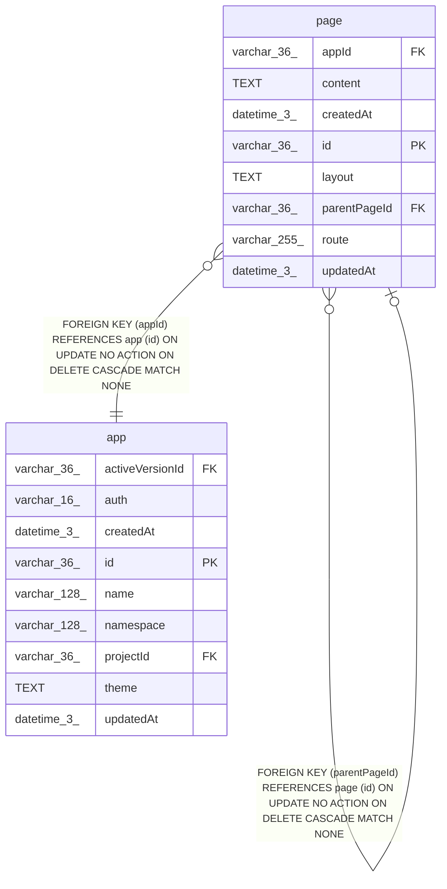

# page

## Description

<details>
<summary><strong>Table Definition</strong></summary>

```sql
CREATE TABLE "page" ("id" varchar(36) PRIMARY KEY NOT NULL, "appId" varchar(36) NOT NULL, "parentPageId" varchar(36), "route" varchar(255) NOT NULL, "content" text, "createdAt" datetime(3) NOT NULL DEFAULT (STRFTIME('%Y-%m-%d %H:%M:%f', 'NOW')), "updatedAt" datetime(3) NOT NULL DEFAULT (STRFTIME('%Y-%m-%d %H:%M:%f', 'NOW')), "layout" text, CONSTRAINT "FK_b85a31f0bff1e857156d27ea152" FOREIGN KEY ("parentPageId") REFERENCES "page" ("id") ON DELETE CASCADE ON UPDATE NO ACTION, CONSTRAINT "FK_5e3cf5ed8328c4993a910bd239b" FOREIGN KEY ("appId") REFERENCES "app" ("id") ON DELETE CASCADE ON UPDATE NO ACTION)
```

</details>

## Columns

| Name | Type | Default | Nullable | Children | Parents | Comment |
| ---- | ---- | ------- | -------- | -------- | ------- | ------- |
| appId | varchar(36) |  | false |  | [app](app.md) |  |
| content | TEXT |  | true |  |  |  |
| createdAt | datetime(3) | STRFTIME('%Y-%m-%d %H:%M:%f', 'NOW') | false |  |  |  |
| id | varchar(36) |  | false | [page](page.md) |  |  |
| layout | TEXT |  | true |  |  |  |
| parentPageId | varchar(36) |  | true |  | [page](page.md) |  |
| route | varchar(255) |  | false |  |  |  |
| updatedAt | datetime(3) | STRFTIME('%Y-%m-%d %H:%M:%f', 'NOW') | false |  |  |  |

## Constraints

| Name | Type | Definition |
| ---- | ---- | ---------- |
| - (Foreign key ID: 0) | FOREIGN KEY | FOREIGN KEY (appId) REFERENCES app (id) ON UPDATE NO ACTION ON DELETE CASCADE MATCH NONE |
| - (Foreign key ID: 1) | FOREIGN KEY | FOREIGN KEY (parentPageId) REFERENCES page (id) ON UPDATE NO ACTION ON DELETE CASCADE MATCH NONE |
| id | PRIMARY KEY | PRIMARY KEY (id) |
| sqlite_autoindex_page_1 | PRIMARY KEY | PRIMARY KEY (id) |

## Indexes

| Name | Definition |
| ---- | ---------- |
| IDX_page_appId | CREATE INDEX "IDX_page_appId" ON "page" ("appId")  |
| IDX_page_parentPageId | CREATE INDEX "IDX_page_parentPageId" ON "page" ("parentPageId")  |
| sqlite_autoindex_page_1 | PRIMARY KEY (id) |

## Relations



---

> Generated by [tbls](https://github.com/k1LoW/tbls)
