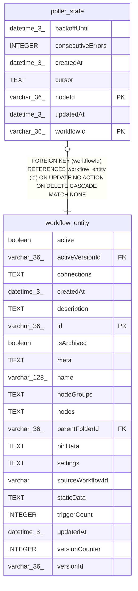

# poller_state

## Description

<details>
<summary><strong>Table Definition</strong></summary>

```sql
CREATE TABLE "poller_state" ("workflowId" varchar(36) NOT NULL, "nodeId" varchar(36) NOT NULL, "cursor" text NOT NULL DEFAULT ('{}'), "consecutiveErrors" integer NOT NULL DEFAULT (0), "backoffUntil" datetime(3), "createdAt" datetime(3) NOT NULL DEFAULT (STRFTIME('%Y-%m-%d %H:%M:%f', 'NOW')), "updatedAt" datetime(3) NOT NULL DEFAULT (STRFTIME('%Y-%m-%d %H:%M:%f', 'NOW')), CONSTRAINT "FK_poller_state_workflowId" FOREIGN KEY ("workflowId") REFERENCES "workflow_entity" ("id") ON DELETE CASCADE, PRIMARY KEY ("workflowId", "nodeId"))
```

</details>

## Columns

| Name | Type | Default | Nullable | Children | Parents | Comment |
| ---- | ---- | ------- | -------- | -------- | ------- | ------- |
| backoffUntil | datetime(3) |  | true |  |  |  |
| consecutiveErrors | INTEGER | 0 | false |  |  |  |
| createdAt | datetime(3) | STRFTIME('%Y-%m-%d %H:%M:%f', 'NOW') | false |  |  |  |
| cursor | TEXT | '{}' | false |  |  |  |
| nodeId | varchar(36) |  | false |  |  |  |
| updatedAt | datetime(3) | STRFTIME('%Y-%m-%d %H:%M:%f', 'NOW') | false |  |  |  |
| workflowId | varchar(36) |  | false |  | [workflow_entity](workflow_entity.md) |  |

## Constraints

| Name | Type | Definition |
| ---- | ---- | ---------- |
| - (Foreign key ID: 0) | FOREIGN KEY | FOREIGN KEY (workflowId) REFERENCES workflow_entity (id) ON UPDATE NO ACTION ON DELETE CASCADE MATCH NONE |
| nodeId | PRIMARY KEY | PRIMARY KEY (nodeId) |
| sqlite_autoindex_poller_state_1 | PRIMARY KEY | PRIMARY KEY (workflowId, nodeId) |
| workflowId | PRIMARY KEY | PRIMARY KEY (workflowId) |

## Indexes

| Name | Definition |
| ---- | ---------- |
| sqlite_autoindex_poller_state_1 | PRIMARY KEY (workflowId, nodeId) |

## Relations



---

> Generated by [tbls](https://github.com/k1LoW/tbls)
