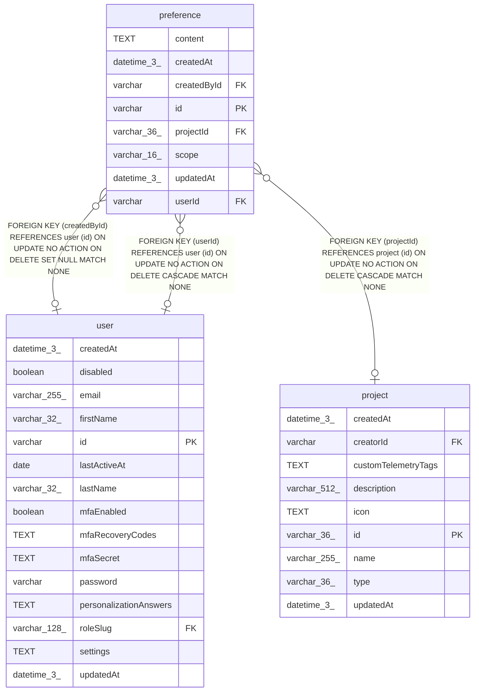

# preference

## Description

<details>
<summary><strong>Table Definition</strong></summary>

```sql
CREATE TABLE "preference" ("id" varchar PRIMARY KEY NOT NULL, "scope" varchar(16) NOT NULL, "content" text NOT NULL, "userId" varchar, "projectId" varchar(36), "createdById" varchar, "createdAt" datetime(3) NOT NULL DEFAULT (STRFTIME('%Y-%m-%d %H:%M:%f', 'NOW')), "updatedAt" datetime(3) NOT NULL DEFAULT (STRFTIME('%Y-%m-%d %H:%M:%f', 'NOW')), CONSTRAINT "CHK_preference_scope_target" CHECK (("scope" = 'global' AND "userId" IS NULL AND "projectId" IS NULL) OR ("scope" = 'personal' AND "userId" IS NOT NULL AND "projectId" IS NULL) OR ("scope" = 'project' AND "userId" IS NULL AND "projectId" IS NOT NULL)), CONSTRAINT "CHK_preference_scope" CHECK ("scope" IN ('global', 'personal', 'project')), CONSTRAINT "FK_0990a6dd2425968d479f4bb91e6" FOREIGN KEY ("userId") REFERENCES "user" ("id") ON DELETE CASCADE, CONSTRAINT "FK_635b7d66838830328bc32423ef8" FOREIGN KEY ("projectId") REFERENCES "project" ("id") ON DELETE CASCADE, CONSTRAINT "FK_47d9aa5a32442eee284f45314ef" FOREIGN KEY ("createdById") REFERENCES "user" ("id") ON DELETE SET NULL)
```

</details>

## Columns

| Name | Type | Default | Nullable | Children | Parents | Comment |
| ---- | ---- | ------- | -------- | -------- | ------- | ------- |
| content | TEXT |  | false |  |  |  |
| createdAt | datetime(3) | STRFTIME('%Y-%m-%d %H:%M:%f', 'NOW') | false |  |  |  |
| createdById | varchar |  | true |  | [user](user.md) |  |
| id | varchar |  | false |  |  |  |
| projectId | varchar(36) |  | true |  | [project](project.md) |  |
| scope | varchar(16) |  | false |  |  |  |
| updatedAt | datetime(3) | STRFTIME('%Y-%m-%d %H:%M:%f', 'NOW') | false |  |  |  |
| userId | varchar |  | true |  | [user](user.md) |  |

## Constraints

| Name | Type | Definition |
| ---- | ---- | ---------- |
| - | CHECK | CHECK (("scope" = 'global' AND "userId" IS NULL AND "projectId" IS NULL) OR ("scope" = 'personal' AND "userId" IS NOT NULL AND "projectId" IS NULL) OR ("scope" = 'project' AND "userId" IS NULL AND "projectId" IS NOT NULL)) |
| - | CHECK | CHECK ("scope" IN ('global', 'personal', 'project')) |
| - (Foreign key ID: 0) | FOREIGN KEY | FOREIGN KEY (createdById) REFERENCES user (id) ON UPDATE NO ACTION ON DELETE SET NULL MATCH NONE |
| - (Foreign key ID: 1) | FOREIGN KEY | FOREIGN KEY (projectId) REFERENCES project (id) ON UPDATE NO ACTION ON DELETE CASCADE MATCH NONE |
| - (Foreign key ID: 2) | FOREIGN KEY | FOREIGN KEY (userId) REFERENCES user (id) ON UPDATE NO ACTION ON DELETE CASCADE MATCH NONE |
| id | PRIMARY KEY | PRIMARY KEY (id) |
| sqlite_autoindex_preference_1 | PRIMARY KEY | PRIMARY KEY (id) |

## Indexes

| Name | Definition |
| ---- | ---------- |
| IDX_0990a6dd2425968d479f4bb91e | CREATE INDEX "IDX_0990a6dd2425968d479f4bb91e" ON "preference" ("userId")  |
| IDX_635b7d66838830328bc32423ef | CREATE INDEX "IDX_635b7d66838830328bc32423ef" ON "preference" ("projectId")  |
| sqlite_autoindex_preference_1 | PRIMARY KEY (id) |

## Relations



---

> Generated by [tbls](https://github.com/k1LoW/tbls)
