# preference_mining_run

## Description

<details>
<summary><strong>Table Definition</strong></summary>

```sql
CREATE TABLE "preference_mining_run" ("id" varchar PRIMARY KEY NOT NULL, "userId" varchar NOT NULL, "projectId" varchar(36) NOT NULL, "summary" text NOT NULL, "data" text NOT NULL, "createdAt" datetime(3) NOT NULL DEFAULT (STRFTIME('%Y-%m-%d %H:%M:%f', 'NOW')), "updatedAt" datetime(3) NOT NULL DEFAULT (STRFTIME('%Y-%m-%d %H:%M:%f', 'NOW')), CONSTRAINT "FK_6b17226945e84e8239777947039" FOREIGN KEY ("userId") REFERENCES "user" ("id") ON DELETE CASCADE, CONSTRAINT "FK_deb0be259d725bf5119466966fd" FOREIGN KEY ("projectId") REFERENCES "project" ("id") ON DELETE CASCADE)
```

</details>

## Columns

| Name | Type | Default | Nullable | Children | Parents | Comment |
| ---- | ---- | ------- | -------- | -------- | ------- | ------- |
| createdAt | datetime(3) | STRFTIME('%Y-%m-%d %H:%M:%f', 'NOW') | false |  |  |  |
| data | TEXT |  | false |  |  |  |
| id | varchar |  | false |  |  |  |
| projectId | varchar(36) |  | false |  | [project](project.md) |  |
| summary | TEXT |  | false |  |  |  |
| updatedAt | datetime(3) | STRFTIME('%Y-%m-%d %H:%M:%f', 'NOW') | false |  |  |  |
| userId | varchar |  | false |  | [user](user.md) |  |

## Constraints

| Name | Type | Definition |
| ---- | ---- | ---------- |
| - (Foreign key ID: 0) | FOREIGN KEY | FOREIGN KEY (projectId) REFERENCES project (id) ON UPDATE NO ACTION ON DELETE CASCADE MATCH NONE |
| - (Foreign key ID: 1) | FOREIGN KEY | FOREIGN KEY (userId) REFERENCES user (id) ON UPDATE NO ACTION ON DELETE CASCADE MATCH NONE |
| id | PRIMARY KEY | PRIMARY KEY (id) |
| sqlite_autoindex_preference_mining_run_1 | PRIMARY KEY | PRIMARY KEY (id) |

## Indexes

| Name | Definition |
| ---- | ---------- |
| IDX_4de9546943820975a7a7c26600 | CREATE INDEX "IDX_4de9546943820975a7a7c26600" ON "preference_mining_run" ("userId", "projectId", "createdAt", "id")  |
| sqlite_autoindex_preference_mining_run_1 | PRIMARY KEY (id) |

## Relations

```mermaid
erDiagram

"preference_mining_run" }o--|| "project" : "FOREIGN KEY (projectId) REFERENCES project (id) ON UPDATE NO ACTION ON DELETE CASCADE MATCH NONE"
"preference_mining_run" }o--|| "user" : "FOREIGN KEY (userId) REFERENCES user (id) ON UPDATE NO ACTION ON DELETE CASCADE MATCH NONE"

"preference_mining_run" {
  datetime_3_ createdAt
  TEXT data
  varchar id PK
  varchar_36_ projectId FK
  TEXT summary
  datetime_3_ updatedAt
  varchar userId FK
}
"project" {
  datetime_3_ createdAt
  varchar creatorId FK
  TEXT customTelemetryTags
  varchar_512_ description
  TEXT icon
  varchar_36_ id PK
  varchar_255_ name
  varchar_36_ type
  datetime_3_ updatedAt
}
"user" {
  datetime_3_ createdAt
  boolean disabled
  varchar_255_ email
  varchar_32_ firstName
  varchar id PK
  date lastActiveAt
  varchar_32_ lastName
  boolean mfaEnabled
  TEXT mfaRecoveryCodes
  TEXT mfaSecret
  varchar password
  TEXT personalizationAnswers
  varchar_128_ roleSlug FK
  TEXT settings
  datetime_3_ updatedAt
}
```



---

> Generated by [tbls](https://github.com/k1LoW/tbls)
