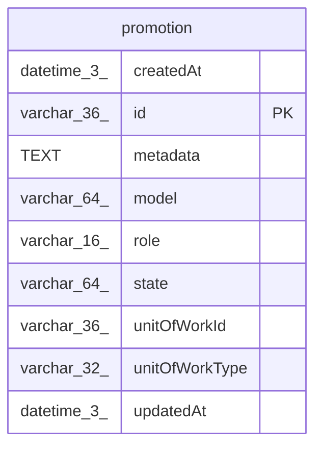

# promotion

## Description

<details>
<summary><strong>Table Definition</strong></summary>

```sql
CREATE TABLE "promotion" ("id" varchar(36) PRIMARY KEY NOT NULL, "model" varchar(64) NOT NULL, "role" varchar(16) NOT NULL, "unitOfWorkType" varchar(32) NOT NULL, "unitOfWorkId" varchar(36) NOT NULL, "state" varchar(64) NOT NULL, "metadata" text NOT NULL, "createdAt" datetime(3) NOT NULL DEFAULT (STRFTIME('%Y-%m-%d %H:%M:%f', 'NOW')), "updatedAt" datetime(3) NOT NULL DEFAULT (STRFTIME('%Y-%m-%d %H:%M:%f', 'NOW')), CONSTRAINT "CHK_promotion_role" CHECK ("role" IN ('source', 'destination')))
```

</details>

## Columns

| Name | Type | Default | Nullable | Children | Parents | Comment |
| ---- | ---- | ------- | -------- | -------- | ------- | ------- |
| createdAt | datetime(3) | STRFTIME('%Y-%m-%d %H:%M:%f', 'NOW') | false |  |  |  |
| id | varchar(36) |  | false |  |  |  |
| metadata | TEXT |  | false |  |  |  |
| model | varchar(64) |  | false |  |  |  |
| role | varchar(16) |  | false |  |  |  |
| state | varchar(64) |  | false |  |  |  |
| unitOfWorkId | varchar(36) |  | false |  |  |  |
| unitOfWorkType | varchar(32) |  | false |  |  |  |
| updatedAt | datetime(3) | STRFTIME('%Y-%m-%d %H:%M:%f', 'NOW') | false |  |  |  |

## Constraints

| Name | Type | Definition |
| ---- | ---- | ---------- |
| - | CHECK | CHECK ("role" IN ('source', 'destination')) |
| id | PRIMARY KEY | PRIMARY KEY (id) |
| sqlite_autoindex_promotion_1 | PRIMARY KEY | PRIMARY KEY (id) |

## Indexes

| Name | Definition |
| ---- | ---------- |
| sqlite_autoindex_promotion_1 | PRIMARY KEY (id) |

## Relations



---

> Generated by [tbls](https://github.com/k1LoW/tbls)
