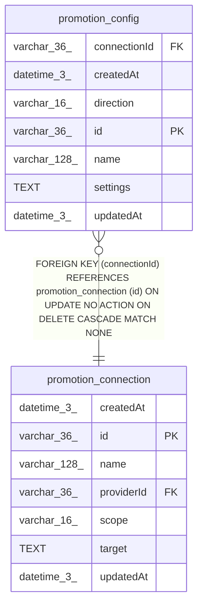

# promotion_config

## Description

<details>
<summary><strong>Table Definition</strong></summary>

```sql
CREATE TABLE "promotion_config" ("id" varchar(36) PRIMARY KEY NOT NULL, "connectionId" varchar(36) NOT NULL, "name" varchar(128) NOT NULL, "direction" varchar(16) NOT NULL, "settings" text NOT NULL, "createdAt" datetime(3) NOT NULL DEFAULT (STRFTIME('%Y-%m-%d %H:%M:%f', 'NOW')), "updatedAt" datetime(3) NOT NULL DEFAULT (STRFTIME('%Y-%m-%d %H:%M:%f', 'NOW')), CONSTRAINT "CHK_promotion_config_direction" CHECK ("direction" IN ('apply', 'promote')), CONSTRAINT "FK_promotion_config_connectionId" FOREIGN KEY ("connectionId") REFERENCES "promotion_connection" ("id") ON DELETE CASCADE)
```

</details>

## Columns

| Name | Type | Default | Nullable | Children | Parents | Comment |
| ---- | ---- | ------- | -------- | -------- | ------- | ------- |
| connectionId | varchar(36) |  | false |  | [promotion_connection](promotion_connection.md) |  |
| createdAt | datetime(3) | STRFTIME('%Y-%m-%d %H:%M:%f', 'NOW') | false |  |  |  |
| direction | varchar(16) |  | false |  |  |  |
| id | varchar(36) |  | false |  |  |  |
| name | varchar(128) |  | false |  |  |  |
| settings | TEXT |  | false |  |  |  |
| updatedAt | datetime(3) | STRFTIME('%Y-%m-%d %H:%M:%f', 'NOW') | false |  |  |  |

## Constraints

| Name | Type | Definition |
| ---- | ---- | ---------- |
| - | CHECK | CHECK ("direction" IN ('apply', 'promote')) |
| - (Foreign key ID: 0) | FOREIGN KEY | FOREIGN KEY (connectionId) REFERENCES promotion_connection (id) ON UPDATE NO ACTION ON DELETE CASCADE MATCH NONE |
| id | PRIMARY KEY | PRIMARY KEY (id) |
| sqlite_autoindex_promotion_config_1 | PRIMARY KEY | PRIMARY KEY (id) |

## Indexes

| Name | Definition |
| ---- | ---------- |
| IDX_promotion_config_connectionId_direction | CREATE UNIQUE INDEX "IDX_promotion_config_connectionId_direction" ON "promotion_config" ("connectionId", "direction")  |
| sqlite_autoindex_promotion_config_1 | PRIMARY KEY (id) |

## Relations



---

> Generated by [tbls](https://github.com/k1LoW/tbls)
