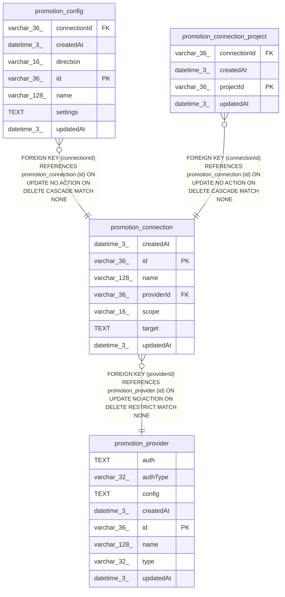

# promotion_connection

## Description

<details>
<summary><strong>Table Definition</strong></summary>

```sql
CREATE TABLE "promotion_connection" ("id" varchar(36) PRIMARY KEY NOT NULL, "name" varchar(128) NOT NULL, "providerId" varchar(36) NOT NULL, "scope" varchar(16) NOT NULL, "target" text NOT NULL, "createdAt" datetime(3) NOT NULL DEFAULT (STRFTIME('%Y-%m-%d %H:%M:%f', 'NOW')), "updatedAt" datetime(3) NOT NULL DEFAULT (STRFTIME('%Y-%m-%d %H:%M:%f', 'NOW')), CONSTRAINT "CHK_promotion_connection_scope" CHECK ("scope" IN ('instance', 'projects')), CONSTRAINT "FK_promotion_connection_providerId" FOREIGN KEY ("providerId") REFERENCES "promotion_provider" ("id") ON DELETE RESTRICT)
```

</details>

## Columns

| Name | Type | Default | Nullable | Children | Parents | Comment |
| ---- | ---- | ------- | -------- | -------- | ------- | ------- |
| createdAt | datetime(3) | STRFTIME('%Y-%m-%d %H:%M:%f', 'NOW') | false |  |  |  |
| id | varchar(36) |  | false | [promotion_config](promotion_config.md) [promotion_connection_project](promotion_connection_project.md) |  |  |
| name | varchar(128) |  | false |  |  |  |
| providerId | varchar(36) |  | false |  | [promotion_provider](promotion_provider.md) |  |
| scope | varchar(16) |  | false |  |  |  |
| target | TEXT |  | false |  |  |  |
| updatedAt | datetime(3) | STRFTIME('%Y-%m-%d %H:%M:%f', 'NOW') | false |  |  |  |

## Constraints

| Name | Type | Definition |
| ---- | ---- | ---------- |
| - | CHECK | CHECK ("scope" IN ('instance', 'projects')) |
| - (Foreign key ID: 0) | FOREIGN KEY | FOREIGN KEY (providerId) REFERENCES promotion_provider (id) ON UPDATE NO ACTION ON DELETE RESTRICT MATCH NONE |
| id | PRIMARY KEY | PRIMARY KEY (id) |
| sqlite_autoindex_promotion_connection_1 | PRIMARY KEY | PRIMARY KEY (id) |

## Indexes

| Name | Definition |
| ---- | ---------- |
| IDX_9917feaa6ed5705046432b117f | CREATE INDEX "IDX_9917feaa6ed5705046432b117f" ON "promotion_connection" ("providerId")  |
| IDX_promotion_connection_scope | CREATE UNIQUE INDEX "IDX_promotion_connection_scope" ON "promotion_connection" ("scope") WHERE "scope" = 'instance' |
| sqlite_autoindex_promotion_connection_1 | PRIMARY KEY (id) |

## Relations



---

> Generated by [tbls](https://github.com/k1LoW/tbls)
