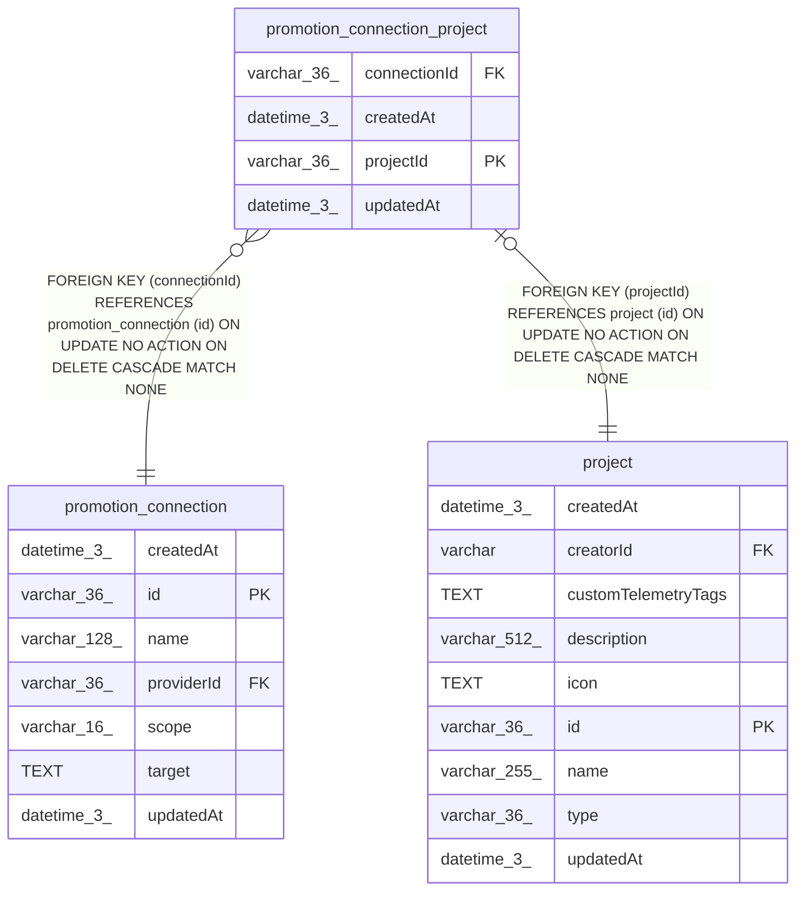

# promotion_connection_project

## Description

<details>
<summary><strong>Table Definition</strong></summary>

```sql
CREATE TABLE "promotion_connection_project" ("projectId" varchar(36) PRIMARY KEY NOT NULL, "connectionId" varchar(36) NOT NULL, "createdAt" datetime(3) NOT NULL DEFAULT (STRFTIME('%Y-%m-%d %H:%M:%f', 'NOW')), "updatedAt" datetime(3) NOT NULL DEFAULT (STRFTIME('%Y-%m-%d %H:%M:%f', 'NOW')), CONSTRAINT "FK_promotion_connection_project_projectId" FOREIGN KEY ("projectId") REFERENCES "project" ("id") ON DELETE CASCADE, CONSTRAINT "FK_promotion_connection_project_connectionId" FOREIGN KEY ("connectionId") REFERENCES "promotion_connection" ("id") ON DELETE CASCADE)
```

</details>

## Columns

| Name | Type | Default | Nullable | Children | Parents | Comment |
| ---- | ---- | ------- | -------- | -------- | ------- | ------- |
| connectionId | varchar(36) |  | false |  | [promotion_connection](promotion_connection.md) |  |
| createdAt | datetime(3) | STRFTIME('%Y-%m-%d %H:%M:%f', 'NOW') | false |  |  |  |
| projectId | varchar(36) |  | false |  | [project](project.md) |  |
| updatedAt | datetime(3) | STRFTIME('%Y-%m-%d %H:%M:%f', 'NOW') | false |  |  |  |

## Constraints

| Name | Type | Definition |
| ---- | ---- | ---------- |
| - (Foreign key ID: 0) | FOREIGN KEY | FOREIGN KEY (connectionId) REFERENCES promotion_connection (id) ON UPDATE NO ACTION ON DELETE CASCADE MATCH NONE |
| - (Foreign key ID: 1) | FOREIGN KEY | FOREIGN KEY (projectId) REFERENCES project (id) ON UPDATE NO ACTION ON DELETE CASCADE MATCH NONE |
| projectId | PRIMARY KEY | PRIMARY KEY (projectId) |
| sqlite_autoindex_promotion_connection_project_1 | PRIMARY KEY | PRIMARY KEY (projectId) |

## Indexes

| Name | Definition |
| ---- | ---------- |
| IDX_2c579b1068b66359de1b4d2de5 | CREATE INDEX "IDX_2c579b1068b66359de1b4d2de5" ON "promotion_connection_project" ("connectionId")  |
| sqlite_autoindex_promotion_connection_project_1 | PRIMARY KEY (projectId) |

## Relations



---

> Generated by [tbls](https://github.com/k1LoW/tbls)
