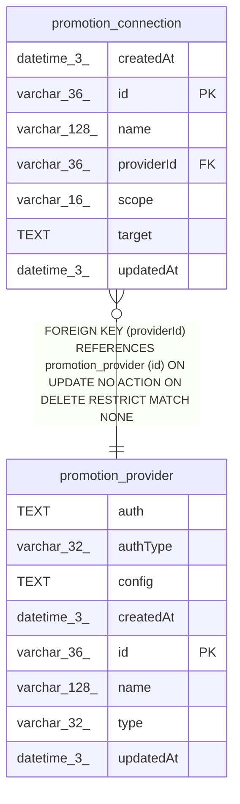

# promotion_provider

## Description

<details>
<summary><strong>Table Definition</strong></summary>

```sql
CREATE TABLE "promotion_provider" ("id" varchar(36) PRIMARY KEY NOT NULL, "name" varchar(128) NOT NULL, "type" varchar(32) NOT NULL, "authType" varchar(32) NOT NULL, "config" text NOT NULL, "auth" text NOT NULL, "createdAt" datetime(3) NOT NULL DEFAULT (STRFTIME('%Y-%m-%d %H:%M:%f', 'NOW')), "updatedAt" datetime(3) NOT NULL DEFAULT (STRFTIME('%Y-%m-%d %H:%M:%f', 'NOW')), CONSTRAINT "CHK_promotion_provider_type" CHECK ("type" IN ('git')), CONSTRAINT "CHK_promotion_provider_authType" CHECK ("authType" IN ('ssh-key', 'token')))
```

</details>

## Columns

| Name | Type | Default | Nullable | Children | Parents | Comment |
| ---- | ---- | ------- | -------- | -------- | ------- | ------- |
| auth | TEXT |  | false |  |  |  |
| authType | varchar(32) |  | false |  |  |  |
| config | TEXT |  | false |  |  |  |
| createdAt | datetime(3) | STRFTIME('%Y-%m-%d %H:%M:%f', 'NOW') | false |  |  |  |
| id | varchar(36) |  | false | [promotion_connection](promotion_connection.md) |  |  |
| name | varchar(128) |  | false |  |  |  |
| type | varchar(32) |  | false |  |  |  |
| updatedAt | datetime(3) | STRFTIME('%Y-%m-%d %H:%M:%f', 'NOW') | false |  |  |  |

## Constraints

| Name | Type | Definition |
| ---- | ---- | ---------- |
| - | CHECK | CHECK ("type" IN ('git')) |
| - | CHECK | CHECK ("authType" IN ('ssh-key', 'token')) |
| id | PRIMARY KEY | PRIMARY KEY (id) |
| sqlite_autoindex_promotion_provider_1 | PRIMARY KEY | PRIMARY KEY (id) |

## Indexes

| Name | Definition |
| ---- | ---------- |
| sqlite_autoindex_promotion_provider_1 | PRIMARY KEY (id) |

## Relations



---

> Generated by [tbls](https://github.com/k1LoW/tbls)
