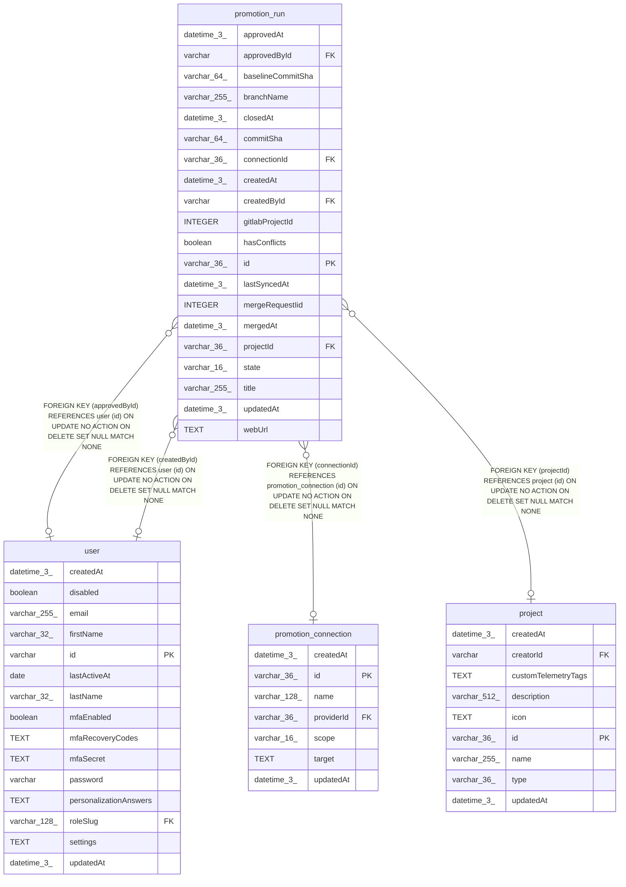

# promotion_run

## Description

<details>
<summary><strong>Table Definition</strong></summary>

```sql
CREATE TABLE "promotion_run" ("id" varchar(36) PRIMARY KEY NOT NULL, "connectionId" varchar(36), "projectId" varchar(36), "createdById" varchar, "branchName" varchar(255) NOT NULL, "commitSha" varchar(64) NOT NULL, "baselineCommitSha" varchar(64), "title" varchar(255) NOT NULL, "gitlabProjectId" integer NOT NULL, "mergeRequestIid" integer NOT NULL, "webUrl" text NOT NULL, "state" varchar(16) NOT NULL DEFAULT ('open'), "hasConflicts" boolean NOT NULL DEFAULT (false), "lastSyncedAt" datetime(3), "mergedAt" datetime(3), "closedAt" datetime(3), "approvedById" varchar, "approvedAt" datetime(3), "createdAt" datetime(3) NOT NULL DEFAULT (STRFTIME('%Y-%m-%d %H:%M:%f', 'NOW')), "updatedAt" datetime(3) NOT NULL DEFAULT (STRFTIME('%Y-%m-%d %H:%M:%f', 'NOW')), CONSTRAINT "CHK_promotion_run_state" CHECK ("state" IN ('open', 'merged', 'closed', 'unavailable')), CONSTRAINT "FK_promotion_run_connectionId" FOREIGN KEY ("connectionId") REFERENCES "promotion_connection" ("id") ON DELETE SET NULL, CONSTRAINT "FK_promotion_run_projectId" FOREIGN KEY ("projectId") REFERENCES "project" ("id") ON DELETE SET NULL, CONSTRAINT "FK_promotion_run_createdById" FOREIGN KEY ("createdById") REFERENCES "user" ("id") ON DELETE SET NULL, CONSTRAINT "FK_promotion_run_approvedById" FOREIGN KEY ("approvedById") REFERENCES "user" ("id") ON DELETE SET NULL)
```

</details>

## Columns

| Name | Type | Default | Nullable | Children | Parents | Comment |
| ---- | ---- | ------- | -------- | -------- | ------- | ------- |
| approvedAt | datetime(3) |  | true |  |  |  |
| approvedById | varchar |  | true |  | [user](user.md) |  |
| baselineCommitSha | varchar(64) |  | true |  |  |  |
| branchName | varchar(255) |  | false |  |  |  |
| closedAt | datetime(3) |  | true |  |  |  |
| commitSha | varchar(64) |  | false |  |  |  |
| connectionId | varchar(36) |  | true |  | [promotion_connection](promotion_connection.md) |  |
| createdAt | datetime(3) | STRFTIME('%Y-%m-%d %H:%M:%f', 'NOW') | false |  |  |  |
| createdById | varchar |  | true |  | [user](user.md) |  |
| gitlabProjectId | INTEGER |  | false |  |  |  |
| hasConflicts | boolean | false | false |  |  |  |
| id | varchar(36) |  | false |  |  |  |
| lastSyncedAt | datetime(3) |  | true |  |  |  |
| mergeRequestIid | INTEGER |  | false |  |  |  |
| mergedAt | datetime(3) |  | true |  |  |  |
| projectId | varchar(36) |  | true |  | [project](project.md) |  |
| state | varchar(16) | 'open' | false |  |  |  |
| title | varchar(255) |  | false |  |  |  |
| updatedAt | datetime(3) | STRFTIME('%Y-%m-%d %H:%M:%f', 'NOW') | false |  |  |  |
| webUrl | TEXT |  | false |  |  |  |

## Constraints

| Name | Type | Definition |
| ---- | ---- | ---------- |
| - | CHECK | CHECK ("state" IN ('open', 'merged', 'closed', 'unavailable')) |
| - (Foreign key ID: 0) | FOREIGN KEY | FOREIGN KEY (approvedById) REFERENCES user (id) ON UPDATE NO ACTION ON DELETE SET NULL MATCH NONE |
| - (Foreign key ID: 1) | FOREIGN KEY | FOREIGN KEY (createdById) REFERENCES user (id) ON UPDATE NO ACTION ON DELETE SET NULL MATCH NONE |
| - (Foreign key ID: 2) | FOREIGN KEY | FOREIGN KEY (projectId) REFERENCES project (id) ON UPDATE NO ACTION ON DELETE SET NULL MATCH NONE |
| - (Foreign key ID: 3) | FOREIGN KEY | FOREIGN KEY (connectionId) REFERENCES promotion_connection (id) ON UPDATE NO ACTION ON DELETE SET NULL MATCH NONE |
| id | PRIMARY KEY | PRIMARY KEY (id) |
| sqlite_autoindex_promotion_run_1 | PRIMARY KEY | PRIMARY KEY (id) |

## Indexes

| Name | Definition |
| ---- | ---------- |
| IDX_promotion_run_connectionId | CREATE INDEX "IDX_promotion_run_connectionId" ON "promotion_run" ("connectionId")  |
| IDX_promotion_run_state_createdAt | CREATE INDEX "IDX_promotion_run_state_createdAt" ON "promotion_run" ("state", "createdAt")  |
| sqlite_autoindex_promotion_run_1 | PRIMARY KEY (id) |

## Relations



---

> Generated by [tbls](https://github.com/k1LoW/tbls)
