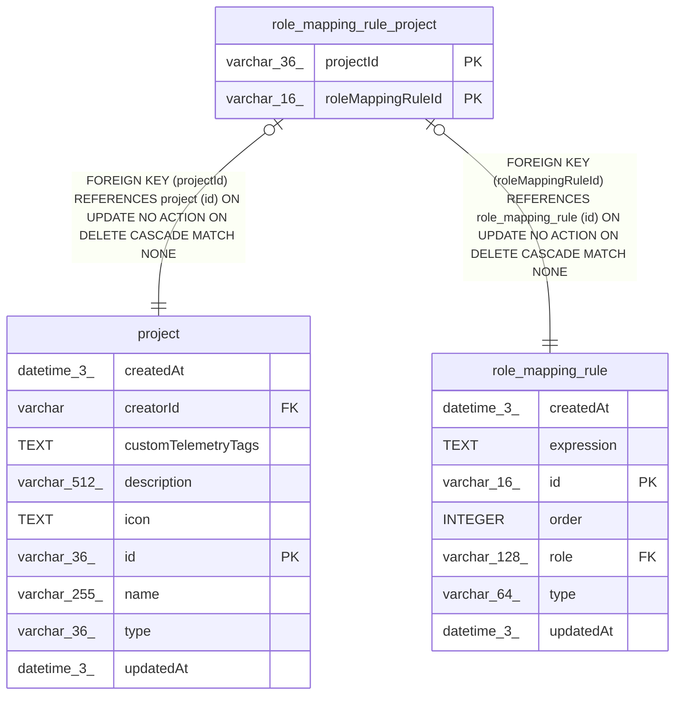

# role_mapping_rule_project

## Description

<details>
<summary><strong>Table Definition</strong></summary>

```sql
CREATE TABLE "role_mapping_rule_project" ("roleMappingRuleId" varchar(16) NOT NULL, "projectId" varchar(36) NOT NULL, CONSTRAINT "FK_dd7ce4dfa09e95b36a626bd9de3" FOREIGN KEY ("roleMappingRuleId") REFERENCES "role_mapping_rule" ("id") ON DELETE CASCADE, CONSTRAINT "FK_35a78869286c65d9330d02b88f5" FOREIGN KEY ("projectId") REFERENCES "project" ("id") ON DELETE CASCADE, PRIMARY KEY ("roleMappingRuleId", "projectId"))
```

</details>

## Columns

| Name | Type | Default | Nullable | Children | Parents | Comment |
| ---- | ---- | ------- | -------- | -------- | ------- | ------- |
| projectId | varchar(36) |  | false |  | [project](project.md) |  |
| roleMappingRuleId | varchar(16) |  | false |  | [role_mapping_rule](role_mapping_rule.md) |  |

## Constraints

| Name | Type | Definition |
| ---- | ---- | ---------- |
| - (Foreign key ID: 0) | FOREIGN KEY | FOREIGN KEY (projectId) REFERENCES project (id) ON UPDATE NO ACTION ON DELETE CASCADE MATCH NONE |
| - (Foreign key ID: 1) | FOREIGN KEY | FOREIGN KEY (roleMappingRuleId) REFERENCES role_mapping_rule (id) ON UPDATE NO ACTION ON DELETE CASCADE MATCH NONE |
| projectId | PRIMARY KEY | PRIMARY KEY (projectId) |
| roleMappingRuleId | PRIMARY KEY | PRIMARY KEY (roleMappingRuleId) |
| sqlite_autoindex_role_mapping_rule_project_1 | PRIMARY KEY | PRIMARY KEY (roleMappingRuleId, projectId) |

## Indexes

| Name | Definition |
| ---- | ---------- |
| IDX_35a78869286c65d9330d02b88f | CREATE INDEX "IDX_35a78869286c65d9330d02b88f" ON "role_mapping_rule_project" ("projectId")  |
| sqlite_autoindex_role_mapping_rule_project_1 | PRIMARY KEY (roleMappingRuleId, projectId) |

## Relations



---

> Generated by [tbls](https://github.com/k1LoW/tbls)
