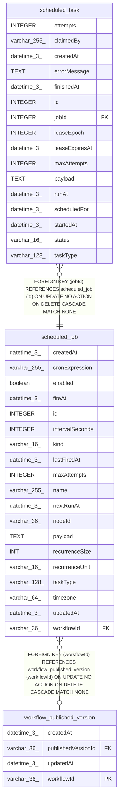

# scheduled_job

## Description

<details>
<summary><strong>Table Definition</strong></summary>

```sql
CREATE TABLE "scheduled_job" ("id" integer PRIMARY KEY NOT NULL, "name" varchar(255) NOT NULL, "workflowId" varchar(36), "nodeId" varchar(36), "taskType" varchar(128) NOT NULL, "payload" text NOT NULL DEFAULT ('{}'), "kind" varchar(16) NOT NULL, "cronExpression" varchar(255), "timezone" varchar(64), "intervalSeconds" integer, "fireAt" datetime(3), "enabled" boolean NOT NULL DEFAULT (true), "nextRunAt" datetime(3), "lastFiredAt" datetime(3), "maxAttempts" integer NOT NULL DEFAULT (1), "createdAt" datetime(3) NOT NULL DEFAULT (STRFTIME('%Y-%m-%d %H:%M:%f', 'NOW')), "updatedAt" datetime(3) NOT NULL DEFAULT (STRFTIME('%Y-%m-%d %H:%M:%f', 'NOW')), "recurrenceUnit" varchar(16), "recurrenceSize" int, CONSTRAINT "CHK_scheduled_job_recurrence_unit" CHECK (("recurrenceUnit" IN ('hours', 'days', 'weeks', 'months'))), CONSTRAINT "CHK_scheduled_job_recurrence_size" CHECK (("recurrenceSize" >= 2)), CONSTRAINT "CHK_scheduled_job_cron_expression" CHECK (("kind" <> 'cron' OR "cronExpression" IS NOT NULL)), CONSTRAINT "CHK_scheduled_job_interval_seconds" CHECK (("kind" <> 'interval' OR "intervalSeconds" IS NOT NULL)), CONSTRAINT "CHK_scheduled_job_fire_at" CHECK (("kind" <> 'one_off' OR "fireAt" IS NOT NULL)), CONSTRAINT "CHK_scheduled_job_kind" CHECK ("kind" IN ('cron', 'interval', 'one_off', 'recurring_cron')), CONSTRAINT "CHK_scheduled_job_recurring_cron" CHECK ("kind" <> 'recurring_cron' OR ("cronExpression" IS NOT NULL AND "recurrenceUnit" IS NOT NULL AND "recurrenceSize" IS NOT NULL)), CONSTRAINT "FK_scheduled_job_workflowId" FOREIGN KEY ("workflowId") REFERENCES "workflow_published_version" ("workflowId") ON DELETE CASCADE ON UPDATE NO ACTION)
```

</details>

## Columns

| Name | Type | Default | Nullable | Children | Parents | Comment |
| ---- | ---- | ------- | -------- | -------- | ------- | ------- |
| createdAt | datetime(3) | STRFTIME('%Y-%m-%d %H:%M:%f', 'NOW') | false |  |  |  |
| cronExpression | varchar(255) |  | true |  |  |  |
| enabled | boolean | true | false |  |  |  |
| fireAt | datetime(3) |  | true |  |  |  |
| id | INTEGER |  | false | [scheduled_task](scheduled_task.md) |  |  |
| intervalSeconds | INTEGER |  | true |  |  |  |
| kind | varchar(16) |  | false |  |  |  |
| lastFiredAt | datetime(3) |  | true |  |  |  |
| maxAttempts | INTEGER | 1 | false |  |  |  |
| name | varchar(255) |  | false |  |  |  |
| nextRunAt | datetime(3) |  | true |  |  |  |
| nodeId | varchar(36) |  | true |  |  |  |
| payload | TEXT | '{}' | false |  |  |  |
| recurrenceSize | INT |  | true |  |  |  |
| recurrenceUnit | varchar(16) |  | true |  |  |  |
| taskType | varchar(128) |  | false |  |  |  |
| timezone | varchar(64) |  | true |  |  |  |
| updatedAt | datetime(3) | STRFTIME('%Y-%m-%d %H:%M:%f', 'NOW') | false |  |  |  |
| workflowId | varchar(36) |  | true |  | [workflow_published_version](workflow_published_version.md) |  |

## Constraints

| Name | Type | Definition |
| ---- | ---- | ---------- |
| - | CHECK | CHECK (("recurrenceUnit" IN ('hours', 'days', 'weeks', 'months'))) |
| - | CHECK | CHECK (("recurrenceSize" >= 2)) |
| - | CHECK | CHECK (("kind" <> 'cron' OR "cronExpression" IS NOT NULL)) |
| - | CHECK | CHECK (("kind" <> 'interval' OR "intervalSeconds" IS NOT NULL)) |
| - | CHECK | CHECK (("kind" <> 'one_off' OR "fireAt" IS NOT NULL)) |
| - | CHECK | CHECK ("kind" IN ('cron', 'interval', 'one_off', 'recurring_cron')) |
| - | CHECK | CHECK ("kind" <> 'recurring_cron' OR ("cronExpression" IS NOT NULL AND "recurrenceUnit" IS NOT NULL AND "recurrenceSize" IS NOT NULL)) |
| - (Foreign key ID: 0) | FOREIGN KEY | FOREIGN KEY (workflowId) REFERENCES workflow_published_version (workflowId) ON UPDATE NO ACTION ON DELETE CASCADE MATCH NONE |
| id | PRIMARY KEY | PRIMARY KEY (id) |

## Indexes

| Name | Definition |
| ---- | ---------- |
| IDX_scheduled_job_name | CREATE UNIQUE INDEX "IDX_scheduled_job_name" ON "scheduled_job" ("name")  |
| IDX_scheduled_job_nextRunAt | CREATE INDEX "IDX_scheduled_job_nextRunAt" ON "scheduled_job" ("nextRunAt") WHERE "enabled" = true AND "nextRunAt" IS NOT NULL |
| IDX_scheduled_job_workflowId | CREATE INDEX "IDX_scheduled_job_workflowId" ON "scheduled_job" ("workflowId") WHERE "workflowId" IS NOT NULL |

## Relations



---

> Generated by [tbls](https://github.com/k1LoW/tbls)
