# scheduled_job

## Description

<details>
<summary><strong>Table Definition</strong></summary>

```sql
CREATE TABLE "scheduled_job" ("id" integer PRIMARY KEY NOT NULL, "workflowId" varchar(36) NOT NULL, "nodeId" varchar(64) NOT NULL, "ruleIndex" integer NOT NULL, "cronExpression" varchar(255) NOT NULL, "timezone" varchar(64) NOT NULL, "recurrence" text, "recurrenceLastValue" integer, "enabled" boolean NOT NULL DEFAULT (false), "nextRunAt" datetime(3), "lastFiredAt" datetime(3), "createdAt" datetime(3) NOT NULL DEFAULT (STRFTIME('%Y-%m-%d %H:%M:%f', 'NOW')), "updatedAt" datetime(3) NOT NULL DEFAULT (STRFTIME('%Y-%m-%d %H:%M:%f', 'NOW')), CONSTRAINT "FK_74fa940fef7c40128383b2c4b82" FOREIGN KEY ("workflowId") REFERENCES "workflow_entity" ("id") ON DELETE CASCADE)
```

</details>

## Columns

| Name | Type | Default | Nullable | Children | Parents | Comment |
| ---- | ---- | ------- | -------- | -------- | ------- | ------- |
| createdAt | datetime(3) | STRFTIME('%Y-%m-%d %H:%M:%f', 'NOW') | false |  |  |  |
| cronExpression | varchar(255) |  | false |  |  |  |
| enabled | boolean | false | false |  |  |  |
| id | INTEGER |  | false | [scheduled_task](scheduled_task.md) |  |  |
| lastFiredAt | datetime(3) |  | true |  |  |  |
| nextRunAt | datetime(3) |  | true |  |  |  |
| nodeId | varchar(64) |  | false |  |  |  |
| recurrence | TEXT |  | true |  |  |  |
| recurrenceLastValue | INTEGER |  | true |  |  |  |
| ruleIndex | INTEGER |  | false |  |  |  |
| timezone | varchar(64) |  | false |  |  |  |
| updatedAt | datetime(3) | STRFTIME('%Y-%m-%d %H:%M:%f', 'NOW') | false |  |  |  |
| workflowId | varchar(36) |  | false |  | [workflow_entity](workflow_entity.md) |  |

## Constraints

| Name | Type | Definition |
| ---- | ---- | ---------- |
| - (Foreign key ID: 0) | FOREIGN KEY | FOREIGN KEY (workflowId) REFERENCES workflow_entity (id) ON UPDATE NO ACTION ON DELETE CASCADE MATCH NONE |
| id | PRIMARY KEY | PRIMARY KEY (id) |

## Indexes

| Name | Definition |
| ---- | ---------- |
| IDX_189f2b3ce8a0952d66e1937a0c | CREATE INDEX "IDX_189f2b3ce8a0952d66e1937a0c" ON "scheduled_job" ("workflowId", "nodeId")  |
| IDX_ce6bd6203b012d6bf7977b3868 | CREATE INDEX "IDX_ce6bd6203b012d6bf7977b3868" ON "scheduled_job" ("enabled", "nextRunAt")  |
| IDX_scheduled_job_workflowId_nodeId_ruleIndex | CREATE UNIQUE INDEX "IDX_scheduled_job_workflowId_nodeId_ruleIndex" ON "scheduled_job" ("workflowId", "nodeId", "ruleIndex")  |

## Relations

```mermaid
erDiagram

"scheduled_task" }o--|| "scheduled_job" : "FOREIGN KEY (jobId) REFERENCES scheduled_job (id) ON UPDATE NO ACTION ON DELETE CASCADE MATCH NONE"
"scheduled_job" }o--|| "workflow_entity" : "FOREIGN KEY (workflowId) REFERENCES workflow_entity (id) ON UPDATE NO ACTION ON DELETE CASCADE MATCH NONE"

"scheduled_job" {
  datetime_3_ createdAt
  varchar_255_ cronExpression
  boolean enabled
  INTEGER id
  datetime_3_ lastFiredAt
  datetime_3_ nextRunAt
  varchar_64_ nodeId
  TEXT recurrence
  INTEGER recurrenceLastValue
  INTEGER ruleIndex
  varchar_64_ timezone
  datetime_3_ updatedAt
  varchar_36_ workflowId FK
}
"scheduled_task" {
  INTEGER attempts
  varchar_64_ claimedBy
  datetime_3_ createdAt
  TEXT errorMessage
  varchar_36_ executionId
  datetime_3_ finishedAt
  INTEGER id
  INTEGER jobId FK
  datetime_3_ leaseExpiresAt
  INTEGER maxAttempts
  varchar_64_ nodeId
  datetime_3_ runAt
  datetime_3_ scheduledFor
  datetime_3_ startedAt
  varchar_16_ status
  datetime_3_ updatedAt
  varchar_36_ workflowId
}
"workflow_entity" {
  boolean active
  varchar_36_ activeVersionId FK
  TEXT connections
  datetime_3_ createdAt
  TEXT description
  varchar_36_ id PK
  boolean isArchived
  TEXT meta
  varchar_128_ name
  TEXT nodeGroups
  TEXT nodes
  varchar_36_ parentFolderId FK
  TEXT pinData
  TEXT settings
  varchar sourceWorkflowId
  TEXT staticData
  INTEGER triggerCount
  datetime_3_ updatedAt
  INTEGER versionCounter
  varchar_36_ versionId
}
```



---

> Generated by [tbls](https://github.com/k1LoW/tbls)
