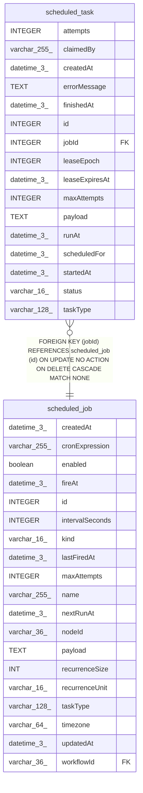

# scheduled_task

## Description

<details>
<summary><strong>Table Definition</strong></summary>

```sql
CREATE TABLE "scheduled_task" ("id" integer PRIMARY KEY NOT NULL, "jobId" integer NOT NULL, "taskType" varchar(128) NOT NULL, "payload" text NOT NULL DEFAULT ('{}'), "scheduledFor" datetime(3) NOT NULL, "runAt" datetime(3) NOT NULL, "status" varchar(16) NOT NULL DEFAULT ('pending'), "attempts" integer NOT NULL DEFAULT (0), "maxAttempts" integer NOT NULL DEFAULT (1), "claimedBy" varchar(255), "leaseExpiresAt" datetime(3), "leaseEpoch" integer NOT NULL DEFAULT (0), "startedAt" datetime(3), "finishedAt" datetime(3), "errorMessage" text, "createdAt" datetime(3) NOT NULL DEFAULT (STRFTIME('%Y-%m-%d %H:%M:%f', 'NOW')), CONSTRAINT "CHK_scheduled_task_running_lease" CHECK ("status" <> 'running' OR "leaseExpiresAt" IS NOT NULL), CONSTRAINT "CHK_scheduled_task_status" CHECK ("status" IN ('pending', 'running', 'succeeded', 'failed', 'missed', 'cancelled')), CONSTRAINT "FK_scheduled_task_jobId" FOREIGN KEY ("jobId") REFERENCES "scheduled_job" ("id") ON DELETE CASCADE)
```

</details>

## Columns

| Name | Type | Default | Nullable | Children | Parents | Comment |
| ---- | ---- | ------- | -------- | -------- | ------- | ------- |
| attempts | INTEGER | 0 | false |  |  |  |
| claimedBy | varchar(255) |  | true |  |  |  |
| createdAt | datetime(3) | STRFTIME('%Y-%m-%d %H:%M:%f', 'NOW') | false |  |  |  |
| errorMessage | TEXT |  | true |  |  |  |
| finishedAt | datetime(3) |  | true |  |  |  |
| id | INTEGER |  | false |  |  |  |
| jobId | INTEGER |  | false |  | [scheduled_job](scheduled_job.md) |  |
| leaseEpoch | INTEGER | 0 | false |  |  |  |
| leaseExpiresAt | datetime(3) |  | true |  |  |  |
| maxAttempts | INTEGER | 1 | false |  |  |  |
| payload | TEXT | '{}' | false |  |  |  |
| runAt | datetime(3) |  | false |  |  |  |
| scheduledFor | datetime(3) |  | false |  |  |  |
| startedAt | datetime(3) |  | true |  |  |  |
| status | varchar(16) | 'pending' | false |  |  |  |
| taskType | varchar(128) |  | false |  |  |  |

## Constraints

| Name | Type | Definition |
| ---- | ---- | ---------- |
| - | CHECK | CHECK ("status" <> 'running' OR "leaseExpiresAt" IS NOT NULL) |
| - | CHECK | CHECK ("status" IN ('pending', 'running', 'succeeded', 'failed', 'missed', 'cancelled')) |
| - (Foreign key ID: 0) | FOREIGN KEY | FOREIGN KEY (jobId) REFERENCES scheduled_job (id) ON UPDATE NO ACTION ON DELETE CASCADE MATCH NONE |
| id | PRIMARY KEY | PRIMARY KEY (id) |

## Indexes

| Name | Definition |
| ---- | ---------- |
| IDX_scheduled_task_finishedAt | CREATE INDEX "IDX_scheduled_task_finishedAt" ON "scheduled_task" ("finishedAt") WHERE "finishedAt" IS NOT NULL |
| IDX_scheduled_task_jobId_scheduledFor | CREATE UNIQUE INDEX "IDX_scheduled_task_jobId_scheduledFor" ON "scheduled_task" ("jobId", "scheduledFor")  |
| IDX_scheduled_task_leaseExpiresAt | CREATE INDEX "IDX_scheduled_task_leaseExpiresAt" ON "scheduled_task" ("leaseExpiresAt") WHERE "status" = 'running' |
| IDX_scheduled_task_runAt | CREATE INDEX "IDX_scheduled_task_runAt" ON "scheduled_task" ("runAt") WHERE "status" = 'pending' |

## Relations



---

> Generated by [tbls](https://github.com/k1LoW/tbls)
