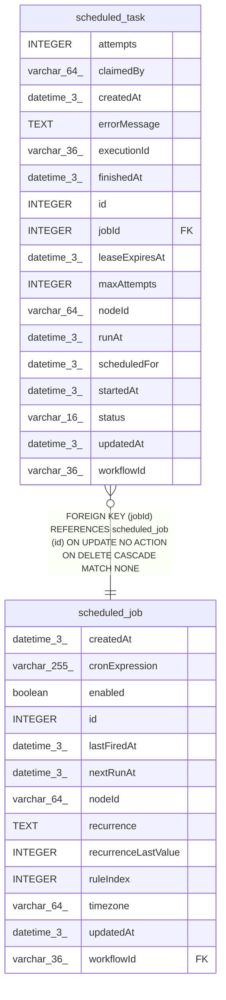

# scheduled_task

## Description

<details>
<summary><strong>Table Definition</strong></summary>

```sql
CREATE TABLE "scheduled_task" ("id" integer PRIMARY KEY NOT NULL, "jobId" integer NOT NULL, "workflowId" varchar(36) NOT NULL, "nodeId" varchar(64) NOT NULL, "scheduledFor" datetime(3) NOT NULL, "runAt" datetime(3) NOT NULL, "status" varchar(16) NOT NULL, "attempts" integer NOT NULL DEFAULT (0), "maxAttempts" integer NOT NULL DEFAULT (1), "claimedBy" varchar(64), "leaseExpiresAt" datetime(3), "executionId" varchar(36), "startedAt" datetime(3), "finishedAt" datetime(3), "errorMessage" text, "createdAt" datetime(3) NOT NULL DEFAULT (STRFTIME('%Y-%m-%d %H:%M:%f', 'NOW')), "updatedAt" datetime(3) NOT NULL DEFAULT (STRFTIME('%Y-%m-%d %H:%M:%f', 'NOW')), CONSTRAINT "CHK_scheduled_task_status" CHECK ("status" IN ('pending', 'running', 'succeeded', 'failed', 'cancelled')), CONSTRAINT "FK_fd05e45e6835cec2ae9cc65d93a" FOREIGN KEY ("jobId") REFERENCES "scheduled_job" ("id") ON DELETE CASCADE)
```

</details>

## Columns

| Name | Type | Default | Nullable | Children | Parents | Comment |
| ---- | ---- | ------- | -------- | -------- | ------- | ------- |
| attempts | INTEGER | 0 | false |  |  |  |
| claimedBy | varchar(64) |  | true |  |  |  |
| createdAt | datetime(3) | STRFTIME('%Y-%m-%d %H:%M:%f', 'NOW') | false |  |  |  |
| errorMessage | TEXT |  | true |  |  |  |
| executionId | varchar(36) |  | true |  |  |  |
| finishedAt | datetime(3) |  | true |  |  |  |
| id | INTEGER |  | false |  |  |  |
| jobId | INTEGER |  | false |  | [scheduled_job](scheduled_job.md) |  |
| leaseExpiresAt | datetime(3) |  | true |  |  |  |
| maxAttempts | INTEGER | 1 | false |  |  |  |
| nodeId | varchar(64) |  | false |  |  |  |
| runAt | datetime(3) |  | false |  |  |  |
| scheduledFor | datetime(3) |  | false |  |  |  |
| startedAt | datetime(3) |  | true |  |  |  |
| status | varchar(16) |  | false |  |  |  |
| updatedAt | datetime(3) | STRFTIME('%Y-%m-%d %H:%M:%f', 'NOW') | false |  |  |  |
| workflowId | varchar(36) |  | false |  |  |  |

## Constraints

| Name | Type | Definition |
| ---- | ---- | ---------- |
| - | CHECK | CHECK ("status" IN ('pending', 'running', 'succeeded', 'failed', 'cancelled')) |
| - (Foreign key ID: 0) | FOREIGN KEY | FOREIGN KEY (jobId) REFERENCES scheduled_job (id) ON UPDATE NO ACTION ON DELETE CASCADE MATCH NONE |
| id | PRIMARY KEY | PRIMARY KEY (id) |

## Indexes

| Name | Definition |
| ---- | ---------- |
| IDX_084afc4270f40eb355f00dcb3a | CREATE INDEX "IDX_084afc4270f40eb355f00dcb3a" ON "scheduled_task" ("workflowId", "nodeId")  |
| IDX_451ab24712630456cba4ba77a8 | CREATE INDEX "IDX_451ab24712630456cba4ba77a8" ON "scheduled_task" ("status", "runAt")  |
| IDX_a4e8a80bc8ce25121a770287f8 | CREATE INDEX "IDX_a4e8a80bc8ce25121a770287f8" ON "scheduled_task" ("status", "leaseExpiresAt")  |
| IDX_fd05e45e6835cec2ae9cc65d93 | CREATE INDEX "IDX_fd05e45e6835cec2ae9cc65d93" ON "scheduled_task" ("jobId")  |
| IDX_scheduled_task_jobId_scheduledFor | CREATE UNIQUE INDEX "IDX_scheduled_task_jobId_scheduledFor" ON "scheduled_task" ("jobId", "scheduledFor")  |

## Relations



---

> Generated by [tbls](https://github.com/k1LoW/tbls)
