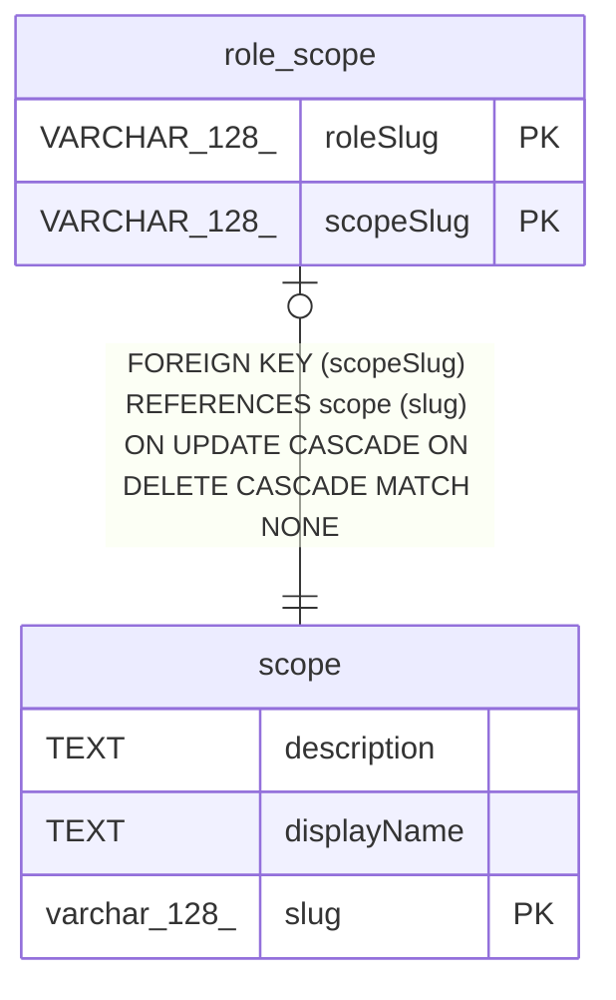

# scope

## Description

<details>
<summary><strong>Table Definition</strong></summary>

```sql
CREATE TABLE "scope" ("slug" varchar(128) PRIMARY KEY NOT NULL, "displayName" text, "description" text)
```

</details>

## Columns

| Name | Type | Default | Nullable | Children | Parents | Comment |
| ---- | ---- | ------- | -------- | -------- | ------- | ------- |
| description | TEXT |  | true |  |  |  |
| displayName | TEXT |  | true |  |  |  |
| slug | varchar(128) |  | false | [role_scope](role_scope.md) |  |  |

## Constraints

| Name | Type | Definition |
| ---- | ---- | ---------- |
| slug | PRIMARY KEY | PRIMARY KEY (slug) |
| sqlite_autoindex_scope_1 | PRIMARY KEY | PRIMARY KEY (slug) |

## Indexes

| Name | Definition |
| ---- | ---------- |
| sqlite_autoindex_scope_1 | PRIMARY KEY (slug) |

## Relations



---

> Generated by [tbls](https://github.com/k1LoW/tbls)
