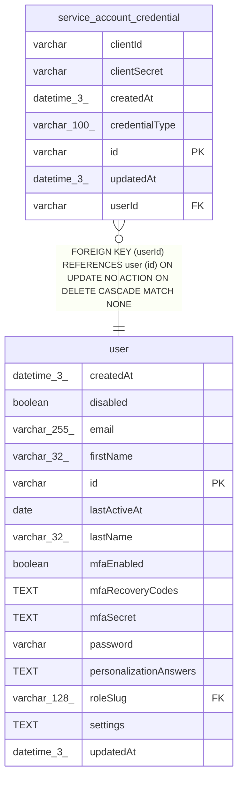

# service_account_credential

## Description

<details>
<summary><strong>Table Definition</strong></summary>

```sql
CREATE TABLE "service_account_credential" ("id" varchar PRIMARY KEY NOT NULL, "userId" varchar NOT NULL, "credentialType" varchar(100) NOT NULL, "clientId" varchar NOT NULL, "clientSecret" varchar NOT NULL, "createdAt" datetime(3) NOT NULL DEFAULT (STRFTIME('%Y-%m-%d %H:%M:%f', 'NOW')), "updatedAt" datetime(3) NOT NULL DEFAULT (STRFTIME('%Y-%m-%d %H:%M:%f', 'NOW')), CONSTRAINT "FK_cd5e25aee84dd359d3560d14335" FOREIGN KEY ("userId") REFERENCES "user" ("id") ON DELETE CASCADE)
```

</details>

## Columns

| Name | Type | Default | Nullable | Children | Parents | Comment |
| ---- | ---- | ------- | -------- | -------- | ------- | ------- |
| clientId | varchar |  | false |  |  |  |
| clientSecret | varchar |  | false |  |  |  |
| createdAt | datetime(3) | STRFTIME('%Y-%m-%d %H:%M:%f', 'NOW') | false |  |  |  |
| credentialType | varchar(100) |  | false |  |  |  |
| id | varchar |  | false |  |  |  |
| updatedAt | datetime(3) | STRFTIME('%Y-%m-%d %H:%M:%f', 'NOW') | false |  |  |  |
| userId | varchar |  | false |  | [user](user.md) |  |

## Constraints

| Name | Type | Definition |
| ---- | ---- | ---------- |
| - (Foreign key ID: 0) | FOREIGN KEY | FOREIGN KEY (userId) REFERENCES user (id) ON UPDATE NO ACTION ON DELETE CASCADE MATCH NONE |
| id | PRIMARY KEY | PRIMARY KEY (id) |
| sqlite_autoindex_service_account_credential_1 | PRIMARY KEY | PRIMARY KEY (id) |

## Indexes

| Name | Definition |
| ---- | ---------- |
| IDX_b370411ca86aed36c6ab4637c8 | CREATE UNIQUE INDEX "IDX_b370411ca86aed36c6ab4637c8" ON "service_account_credential" ("clientId")  |
| IDX_d79432c443978eb5f470093d00 | CREATE INDEX "IDX_d79432c443978eb5f470093d00" ON "service_account_credential" ("userId", "credentialType")  |
| sqlite_autoindex_service_account_credential_1 | PRIMARY KEY (id) |

## Relations



---

> Generated by [tbls](https://github.com/k1LoW/tbls)
