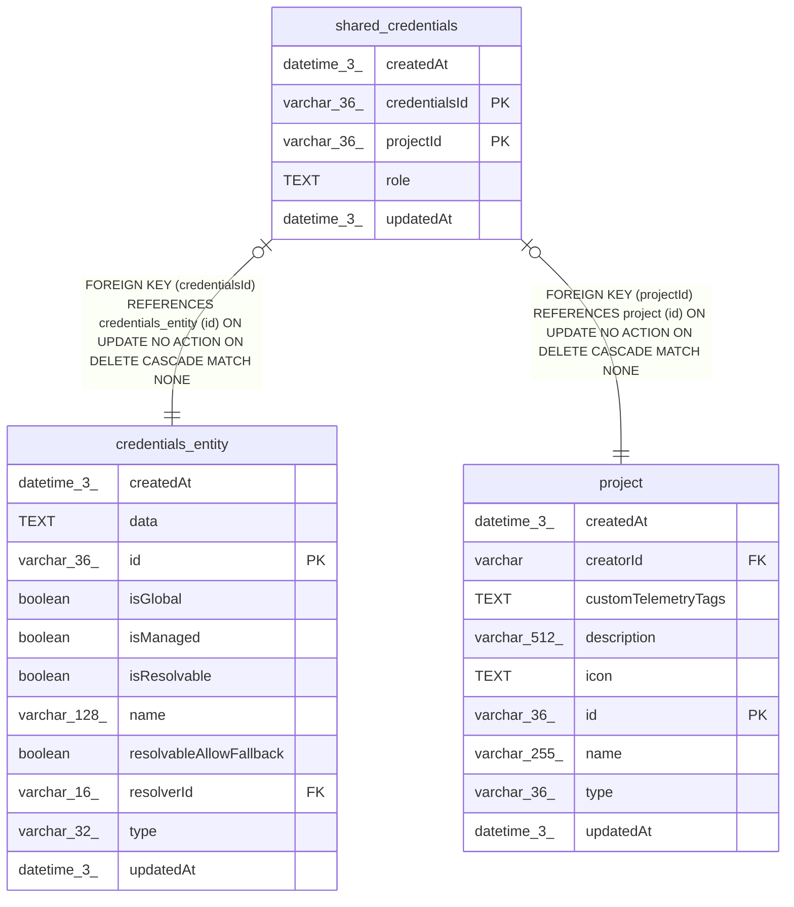

# shared_credentials

## Description

<details>
<summary><strong>Table Definition</strong></summary>

```sql
CREATE TABLE "shared_credentials" ("credentialsId" varchar(36) NOT NULL, "projectId" varchar(36) NOT NULL, "role" text NOT NULL, "createdAt" datetime(3) NOT NULL DEFAULT (STRFTIME('%Y-%m-%d %H:%M:%f', 'NOW')), "updatedAt" datetime(3) NOT NULL DEFAULT (STRFTIME('%Y-%m-%d %H:%M:%f', 'NOW')), CONSTRAINT "FK_416f66fc846c7c442970c094ccf" FOREIGN KEY ("credentialsId") REFERENCES "credentials_entity" ("id") ON DELETE CASCADE, CONSTRAINT "FK_812c2852270da1247756e77f5a4" FOREIGN KEY ("projectId") REFERENCES "project" ("id") ON DELETE CASCADE, PRIMARY KEY ("credentialsId", "projectId"))
```

</details>

## Columns

| Name | Type | Default | Nullable | Children | Parents | Comment |
| ---- | ---- | ------- | -------- | -------- | ------- | ------- |
| createdAt | datetime(3) | STRFTIME('%Y-%m-%d %H:%M:%f', 'NOW') | false |  |  |  |
| credentialsId | varchar(36) |  | false |  | [credentials_entity](credentials_entity.md) |  |
| projectId | varchar(36) |  | false |  | [project](project.md) |  |
| role | TEXT |  | false |  |  |  |
| updatedAt | datetime(3) | STRFTIME('%Y-%m-%d %H:%M:%f', 'NOW') | false |  |  |  |

## Constraints

| Name | Type | Definition |
| ---- | ---- | ---------- |
| - (Foreign key ID: 0) | FOREIGN KEY | FOREIGN KEY (projectId) REFERENCES project (id) ON UPDATE NO ACTION ON DELETE CASCADE MATCH NONE |
| - (Foreign key ID: 1) | FOREIGN KEY | FOREIGN KEY (credentialsId) REFERENCES credentials_entity (id) ON UPDATE NO ACTION ON DELETE CASCADE MATCH NONE |
| credentialsId | PRIMARY KEY | PRIMARY KEY (credentialsId) |
| projectId | PRIMARY KEY | PRIMARY KEY (projectId) |
| sqlite_autoindex_shared_credentials_1 | PRIMARY KEY | PRIMARY KEY (credentialsId, projectId) |

## Indexes

| Name | Definition |
| ---- | ---------- |
| sqlite_autoindex_shared_credentials_1 | PRIMARY KEY (credentialsId, projectId) |

## Relations



---

> Generated by [tbls](https://github.com/k1LoW/tbls)
