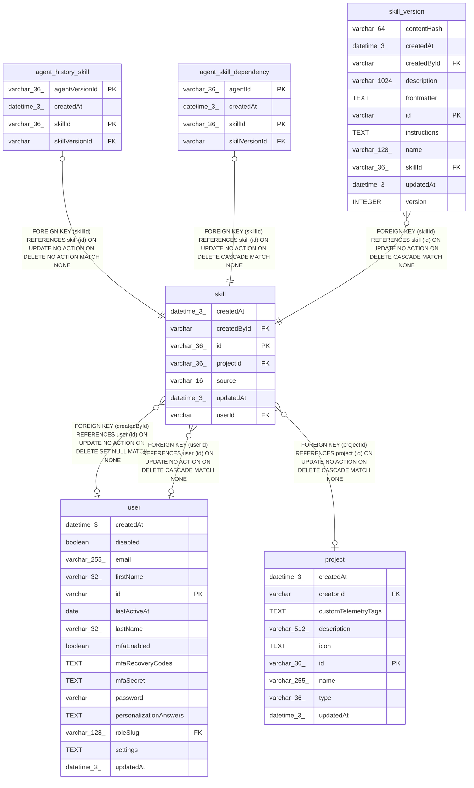

# skill

## Description

<details>
<summary><strong>Table Definition</strong></summary>

```sql
CREATE TABLE "skill" ("id" varchar(36) PRIMARY KEY NOT NULL, "userId" varchar, "projectId" varchar(36), "source" varchar(16) NOT NULL, "createdById" varchar, "createdAt" datetime(3) NOT NULL DEFAULT (STRFTIME('%Y-%m-%d %H:%M:%f', 'NOW')), "updatedAt" datetime(3) NOT NULL DEFAULT (STRFTIME('%Y-%m-%d %H:%M:%f', 'NOW')), CONSTRAINT "CHK_skill_single_target" CHECK ("userId" IS NULL OR "projectId" IS NULL), CONSTRAINT "CHK_skill_source" CHECK ("source" IN ('ui', 'upload', 'agent')), CONSTRAINT "FK_c08612011a88745a32784544b28" FOREIGN KEY ("userId") REFERENCES "user" ("id") ON DELETE CASCADE, CONSTRAINT "FK_402ed37bff0d3134f6e782455ed" FOREIGN KEY ("projectId") REFERENCES "project" ("id") ON DELETE CASCADE, CONSTRAINT "FK_4de4501583cd1fcd6f5ea85f547" FOREIGN KEY ("createdById") REFERENCES "user" ("id") ON DELETE SET NULL)
```

</details>

## Columns

| Name | Type | Default | Nullable | Children | Parents | Comment |
| ---- | ---- | ------- | -------- | -------- | ------- | ------- |
| createdAt | datetime(3) | STRFTIME('%Y-%m-%d %H:%M:%f', 'NOW') | false |  |  |  |
| createdById | varchar |  | true |  | [user](user.md) |  |
| id | varchar(36) |  | false | [agent_history_skill](agent_history_skill.md) [agent_skill_dependency](agent_skill_dependency.md) [skill_version](skill_version.md) |  |  |
| projectId | varchar(36) |  | true |  | [project](project.md) |  |
| source | varchar(16) |  | false |  |  |  |
| updatedAt | datetime(3) | STRFTIME('%Y-%m-%d %H:%M:%f', 'NOW') | false |  |  |  |
| userId | varchar |  | true |  | [user](user.md) |  |

## Constraints

| Name | Type | Definition |
| ---- | ---- | ---------- |
| - | CHECK | CHECK ("userId" IS NULL OR "projectId" IS NULL) |
| - | CHECK | CHECK ("source" IN ('ui', 'upload', 'agent')) |
| - (Foreign key ID: 0) | FOREIGN KEY | FOREIGN KEY (createdById) REFERENCES user (id) ON UPDATE NO ACTION ON DELETE SET NULL MATCH NONE |
| - (Foreign key ID: 1) | FOREIGN KEY | FOREIGN KEY (projectId) REFERENCES project (id) ON UPDATE NO ACTION ON DELETE CASCADE MATCH NONE |
| - (Foreign key ID: 2) | FOREIGN KEY | FOREIGN KEY (userId) REFERENCES user (id) ON UPDATE NO ACTION ON DELETE CASCADE MATCH NONE |
| id | PRIMARY KEY | PRIMARY KEY (id) |
| sqlite_autoindex_skill_1 | PRIMARY KEY | PRIMARY KEY (id) |

## Indexes

| Name | Definition |
| ---- | ---------- |
| IDX_402ed37bff0d3134f6e782455e | CREATE INDEX "IDX_402ed37bff0d3134f6e782455e" ON "skill" ("projectId")  |
| IDX_c08612011a88745a32784544b2 | CREATE INDEX "IDX_c08612011a88745a32784544b2" ON "skill" ("userId")  |
| sqlite_autoindex_skill_1 | PRIMARY KEY (id) |

## Relations



---

> Generated by [tbls](https://github.com/k1LoW/tbls)
