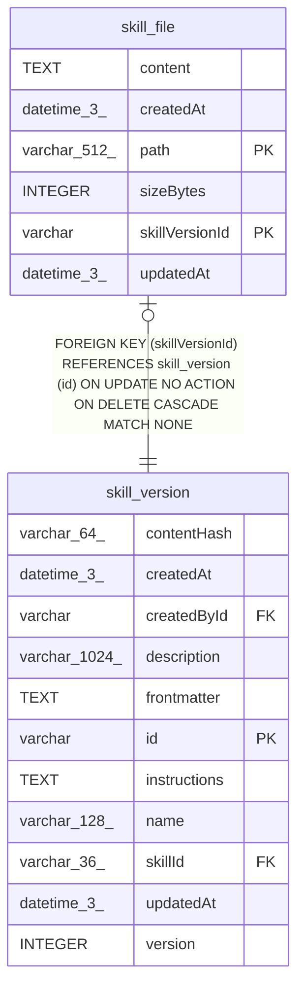

# skill_file

## Description

<details>
<summary><strong>Table Definition</strong></summary>

```sql
CREATE TABLE "skill_file" ("skillVersionId" varchar NOT NULL, "path" varchar(512) NOT NULL, "content" text NOT NULL, "sizeBytes" integer NOT NULL, "createdAt" datetime(3) NOT NULL DEFAULT (STRFTIME('%Y-%m-%d %H:%M:%f', 'NOW')), "updatedAt" datetime(3) NOT NULL DEFAULT (STRFTIME('%Y-%m-%d %H:%M:%f', 'NOW')), CONSTRAINT "FK_e9ab50b795ec8858702b7333d13" FOREIGN KEY ("skillVersionId") REFERENCES "skill_version" ("id") ON DELETE CASCADE, PRIMARY KEY ("skillVersionId", "path"))
```

</details>

## Columns

| Name | Type | Default | Nullable | Children | Parents | Comment |
| ---- | ---- | ------- | -------- | -------- | ------- | ------- |
| content | TEXT |  | false |  |  |  |
| createdAt | datetime(3) | STRFTIME('%Y-%m-%d %H:%M:%f', 'NOW') | false |  |  |  |
| path | varchar(512) |  | false |  |  |  |
| sizeBytes | INTEGER |  | false |  |  |  |
| skillVersionId | varchar |  | false |  | [skill_version](skill_version.md) |  |
| updatedAt | datetime(3) | STRFTIME('%Y-%m-%d %H:%M:%f', 'NOW') | false |  |  |  |

## Constraints

| Name | Type | Definition |
| ---- | ---- | ---------- |
| - (Foreign key ID: 0) | FOREIGN KEY | FOREIGN KEY (skillVersionId) REFERENCES skill_version (id) ON UPDATE NO ACTION ON DELETE CASCADE MATCH NONE |
| path | PRIMARY KEY | PRIMARY KEY (path) |
| skillVersionId | PRIMARY KEY | PRIMARY KEY (skillVersionId) |
| sqlite_autoindex_skill_file_1 | PRIMARY KEY | PRIMARY KEY (skillVersionId, path) |

## Indexes

| Name | Definition |
| ---- | ---------- |
| sqlite_autoindex_skill_file_1 | PRIMARY KEY (skillVersionId, path) |

## Relations



---

> Generated by [tbls](https://github.com/k1LoW/tbls)
