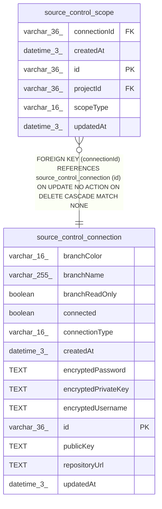

# source_control_connection

## Description

<details>
<summary><strong>Table Definition</strong></summary>

```sql
CREATE TABLE "source_control_connection" ("id" varchar(36) PRIMARY KEY NOT NULL, "repositoryUrl" text NOT NULL, "branchName" varchar(255) NOT NULL DEFAULT ('main'), "branchReadOnly" boolean NOT NULL DEFAULT (false), "branchColor" varchar(16) NOT NULL DEFAULT ('#5296D6'), "connectionType" varchar(16) NOT NULL, "connected" boolean NOT NULL DEFAULT (false), "publicKey" text, "encryptedPrivateKey" text, "encryptedUsername" text, "encryptedPassword" text, "createdAt" datetime(3) NOT NULL DEFAULT (STRFTIME('%Y-%m-%d %H:%M:%f', 'NOW')), "updatedAt" datetime(3) NOT NULL DEFAULT (STRFTIME('%Y-%m-%d %H:%M:%f', 'NOW')), CONSTRAINT "CHK_source_control_connection_connectionType" CHECK ("connectionType" IN ('ssh', 'https')))
```

</details>

## Columns

| Name | Type | Default | Nullable | Children | Parents | Comment |
| ---- | ---- | ------- | -------- | -------- | ------- | ------- |
| branchColor | varchar(16) | '#5296D6' | false |  |  |  |
| branchName | varchar(255) | 'main' | false |  |  |  |
| branchReadOnly | boolean | false | false |  |  |  |
| connected | boolean | false | false |  |  |  |
| connectionType | varchar(16) |  | false |  |  |  |
| createdAt | datetime(3) | STRFTIME('%Y-%m-%d %H:%M:%f', 'NOW') | false |  |  |  |
| encryptedPassword | TEXT |  | true |  |  |  |
| encryptedPrivateKey | TEXT |  | true |  |  |  |
| encryptedUsername | TEXT |  | true |  |  |  |
| id | varchar(36) |  | false | [source_control_scope](source_control_scope.md) |  |  |
| publicKey | TEXT |  | true |  |  |  |
| repositoryUrl | TEXT |  | false |  |  |  |
| updatedAt | datetime(3) | STRFTIME('%Y-%m-%d %H:%M:%f', 'NOW') | false |  |  |  |

## Constraints

| Name | Type | Definition |
| ---- | ---- | ---------- |
| - | CHECK | CHECK ("connectionType" IN ('ssh', 'https')) |
| id | PRIMARY KEY | PRIMARY KEY (id) |
| sqlite_autoindex_source_control_connection_1 | PRIMARY KEY | PRIMARY KEY (id) |

## Indexes

| Name | Definition |
| ---- | ---------- |
| IDX_source_control_connection_repo_branch | CREATE UNIQUE INDEX "IDX_source_control_connection_repo_branch"<br />			ON "source_control_connection"("repositoryUrl", "branchName") |
| sqlite_autoindex_source_control_connection_1 | PRIMARY KEY (id) |

## Relations



---

> Generated by [tbls](https://github.com/k1LoW/tbls)
