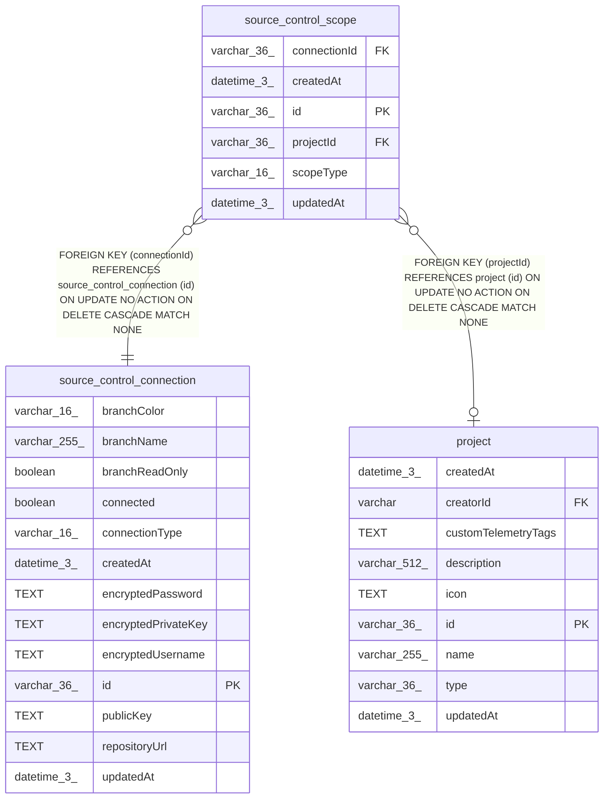

# source_control_scope

## Description

<details>
<summary><strong>Table Definition</strong></summary>

```sql
CREATE TABLE "source_control_scope" ("id" varchar(36) PRIMARY KEY NOT NULL, "connectionId" varchar(36) NOT NULL, "scopeType" varchar(16) NOT NULL, "projectId" varchar(36), "createdAt" datetime(3) NOT NULL DEFAULT (STRFTIME('%Y-%m-%d %H:%M:%f', 'NOW')), "updatedAt" datetime(3) NOT NULL DEFAULT (STRFTIME('%Y-%m-%d %H:%M:%f', 'NOW')), CONSTRAINT "CHK_source_control_scope_scopeType" CHECK ("scopeType" IN ('project', 'instance')), CONSTRAINT "FK_72b7e38e545688d47bce4534384" FOREIGN KEY ("connectionId") REFERENCES "source_control_connection" ("id") ON DELETE CASCADE, CONSTRAINT "FK_97d8e9baacd10e8ea11db44ed35" FOREIGN KEY ("projectId") REFERENCES "project" ("id") ON DELETE CASCADE)
```

</details>

## Columns

| Name | Type | Default | Nullable | Children | Parents | Comment |
| ---- | ---- | ------- | -------- | -------- | ------- | ------- |
| connectionId | varchar(36) |  | false |  | [source_control_connection](source_control_connection.md) |  |
| createdAt | datetime(3) | STRFTIME('%Y-%m-%d %H:%M:%f', 'NOW') | false |  |  |  |
| id | varchar(36) |  | false |  |  |  |
| projectId | varchar(36) |  | true |  | [project](project.md) |  |
| scopeType | varchar(16) |  | false |  |  |  |
| updatedAt | datetime(3) | STRFTIME('%Y-%m-%d %H:%M:%f', 'NOW') | false |  |  |  |

## Constraints

| Name | Type | Definition |
| ---- | ---- | ---------- |
| - | CHECK | CHECK ("scopeType" IN ('project', 'instance')) |
| - (Foreign key ID: 0) | FOREIGN KEY | FOREIGN KEY (projectId) REFERENCES project (id) ON UPDATE NO ACTION ON DELETE CASCADE MATCH NONE |
| - (Foreign key ID: 1) | FOREIGN KEY | FOREIGN KEY (connectionId) REFERENCES source_control_connection (id) ON UPDATE NO ACTION ON DELETE CASCADE MATCH NONE |
| id | PRIMARY KEY | PRIMARY KEY (id) |
| sqlite_autoindex_source_control_scope_1 | PRIMARY KEY | PRIMARY KEY (id) |

## Indexes

| Name | Definition |
| ---- | ---------- |
| IDX_source_control_scope_project | CREATE UNIQUE INDEX "IDX_source_control_scope_project"<br />			ON "source_control_scope"("projectId") |
| sqlite_autoindex_source_control_scope_1 | PRIMARY KEY (id) |

## Relations



---

> Generated by [tbls](https://github.com/k1LoW/tbls)
