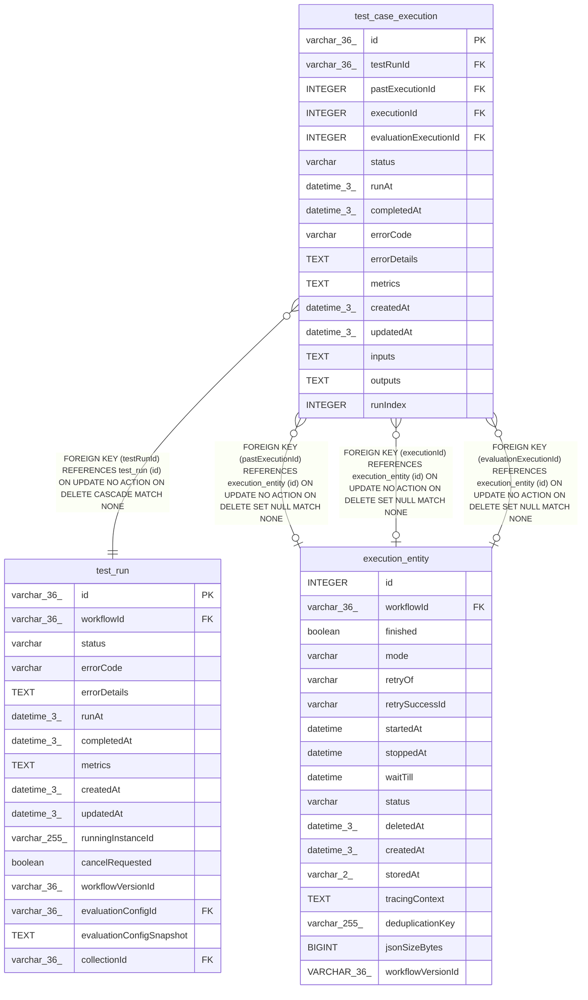

# test_case_execution

## Description

<details>
<summary><strong>Table Definition</strong></summary>

```sql
CREATE TABLE "test_case_execution" ("id" varchar(36) PRIMARY KEY NOT NULL, "testRunId" varchar(36) NOT NULL, "pastExecutionId" integer, "executionId" integer, "evaluationExecutionId" integer, "status" varchar NOT NULL, "runAt" datetime(3), "completedAt" datetime(3), "errorCode" varchar, "errorDetails" text, "metrics" text, "createdAt" datetime(3) NOT NULL DEFAULT (STRFTIME('%Y-%m-%d %H:%M:%f', 'NOW')), "updatedAt" datetime(3) NOT NULL DEFAULT (STRFTIME('%Y-%m-%d %H:%M:%f', 'NOW')), "inputs" text, "outputs" text, "runIndex" INTEGER DEFAULT NULL, CONSTRAINT "FK_dfbe194e3ebdfe49a87bc4692ca" FOREIGN KEY ("evaluationExecutionId") REFERENCES "execution_entity" ("id") ON DELETE SET NULL ON UPDATE NO ACTION, CONSTRAINT "FK_e48965fac35d0f5b9e7f51d8c44" FOREIGN KEY ("executionId") REFERENCES "execution_entity" ("id") ON DELETE SET NULL ON UPDATE NO ACTION, CONSTRAINT "FK_258d954733841d51edd826a562b" FOREIGN KEY ("pastExecutionId") REFERENCES "execution_entity" ("id") ON DELETE SET NULL ON UPDATE NO ACTION, CONSTRAINT "FK_8e4b4774db42f1e6dda3452b2af" FOREIGN KEY ("testRunId") REFERENCES "test_run" ("id") ON DELETE CASCADE ON UPDATE NO ACTION)
```

</details>

## Columns

| Name | Type | Default | Nullable | Children | Parents | Comment |
| ---- | ---- | ------- | -------- | -------- | ------- | ------- |
| id | varchar(36) |  | false |  |  |  |
| testRunId | varchar(36) |  | false |  | [test_run](test_run.md) |  |
| pastExecutionId | INTEGER |  | true |  | [execution_entity](execution_entity.md) |  |
| executionId | INTEGER |  | true |  | [execution_entity](execution_entity.md) |  |
| evaluationExecutionId | INTEGER |  | true |  | [execution_entity](execution_entity.md) |  |
| status | varchar |  | false |  |  |  |
| runAt | datetime(3) |  | true |  |  |  |
| completedAt | datetime(3) |  | true |  |  |  |
| errorCode | varchar |  | true |  |  |  |
| errorDetails | TEXT |  | true |  |  |  |
| metrics | TEXT |  | true |  |  |  |
| createdAt | datetime(3) | STRFTIME('%Y-%m-%d %H:%M:%f', 'NOW') | false |  |  |  |
| updatedAt | datetime(3) | STRFTIME('%Y-%m-%d %H:%M:%f', 'NOW') | false |  |  |  |
| inputs | TEXT |  | true |  |  |  |
| outputs | TEXT |  | true |  |  |  |
| runIndex | INTEGER | NULL | true |  |  |  |

## Constraints

| Name | Type | Definition |
| ---- | ---- | ---------- |
| id | PRIMARY KEY | PRIMARY KEY (id) |
| - (Foreign key ID: 0) | FOREIGN KEY | FOREIGN KEY (testRunId) REFERENCES test_run (id) ON UPDATE NO ACTION ON DELETE CASCADE MATCH NONE |
| - (Foreign key ID: 1) | FOREIGN KEY | FOREIGN KEY (pastExecutionId) REFERENCES execution_entity (id) ON UPDATE NO ACTION ON DELETE SET NULL MATCH NONE |
| - (Foreign key ID: 2) | FOREIGN KEY | FOREIGN KEY (executionId) REFERENCES execution_entity (id) ON UPDATE NO ACTION ON DELETE SET NULL MATCH NONE |
| - (Foreign key ID: 3) | FOREIGN KEY | FOREIGN KEY (evaluationExecutionId) REFERENCES execution_entity (id) ON UPDATE NO ACTION ON DELETE SET NULL MATCH NONE |
| sqlite_autoindex_test_case_execution_1 | PRIMARY KEY | PRIMARY KEY (id) |

## Indexes

| Name | Definition |
| ---- | ---------- |
| IDX_8e4b4774db42f1e6dda3452b2a | CREATE INDEX "IDX_8e4b4774db42f1e6dda3452b2a" ON "test_case_execution" ("testRunId")  |
| sqlite_autoindex_test_case_execution_1 | PRIMARY KEY (id) |

## Relations



---

> Generated by [tbls](https://github.com/k1LoW/tbls)
