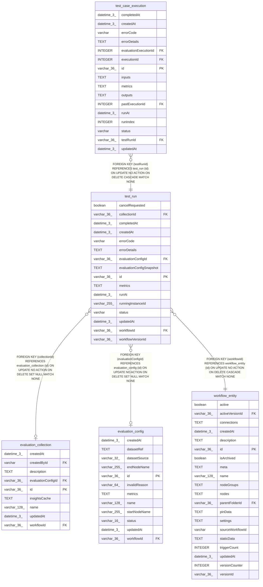

# test_run

## Description

<details>
<summary><strong>Table Definition</strong></summary>

```sql
CREATE TABLE "test_run" ("id" varchar(36) PRIMARY KEY NOT NULL, "workflowId" varchar(36) NOT NULL, "status" varchar NOT NULL, "errorCode" varchar, "errorDetails" text, "runAt" datetime(3), "completedAt" datetime(3), "metrics" text, "createdAt" datetime(3) NOT NULL DEFAULT (STRFTIME('%Y-%m-%d %H:%M:%f', 'NOW')), "updatedAt" datetime(3) NOT NULL DEFAULT (STRFTIME('%Y-%m-%d %H:%M:%f', 'NOW')), "runningInstanceId" varchar(255), "cancelRequested" boolean NOT NULL DEFAULT (FALSE), "workflowVersionId" varchar(36), "evaluationConfigId" varchar(36), "evaluationConfigSnapshot" text, "collectionId" varchar(36), CONSTRAINT "FK_test_run_evaluation_config_id" FOREIGN KEY ("evaluationConfigId") REFERENCES "evaluation_config" ("id") ON DELETE SET NULL ON UPDATE NO ACTION, CONSTRAINT "FK_d6870d3b6e4c185d33926f423c8" FOREIGN KEY ("workflowId") REFERENCES "workflow_entity" ("id") ON DELETE CASCADE ON UPDATE NO ACTION, CONSTRAINT "FK_test_run_collection_id" FOREIGN KEY ("collectionId") REFERENCES "evaluation_collection" ("id") ON DELETE SET NULL)
```

</details>

## Columns

| Name | Type | Default | Nullable | Children | Parents | Comment |
| ---- | ---- | ------- | -------- | -------- | ------- | ------- |
| cancelRequested | boolean | FALSE | false |  |  |  |
| collectionId | varchar(36) |  | true |  | [evaluation_collection](evaluation_collection.md) |  |
| completedAt | datetime(3) |  | true |  |  |  |
| createdAt | datetime(3) | STRFTIME('%Y-%m-%d %H:%M:%f', 'NOW') | false |  |  |  |
| errorCode | varchar |  | true |  |  |  |
| errorDetails | TEXT |  | true |  |  |  |
| evaluationConfigId | varchar(36) |  | true |  | [evaluation_config](evaluation_config.md) |  |
| evaluationConfigSnapshot | TEXT |  | true |  |  |  |
| id | varchar(36) |  | false | [test_case_execution](test_case_execution.md) |  |  |
| metrics | TEXT |  | true |  |  |  |
| runAt | datetime(3) |  | true |  |  |  |
| runningInstanceId | varchar(255) |  | true |  |  |  |
| status | varchar |  | false |  |  |  |
| updatedAt | datetime(3) | STRFTIME('%Y-%m-%d %H:%M:%f', 'NOW') | false |  |  |  |
| workflowId | varchar(36) |  | false |  | [workflow_entity](workflow_entity.md) |  |
| workflowVersionId | varchar(36) |  | true |  |  |  |

## Constraints

| Name | Type | Definition |
| ---- | ---- | ---------- |
| - (Foreign key ID: 0) | FOREIGN KEY | FOREIGN KEY (collectionId) REFERENCES evaluation_collection (id) ON UPDATE NO ACTION ON DELETE SET NULL MATCH NONE |
| - (Foreign key ID: 1) | FOREIGN KEY | FOREIGN KEY (workflowId) REFERENCES workflow_entity (id) ON UPDATE NO ACTION ON DELETE CASCADE MATCH NONE |
| - (Foreign key ID: 2) | FOREIGN KEY | FOREIGN KEY (evaluationConfigId) REFERENCES evaluation_config (id) ON UPDATE NO ACTION ON DELETE SET NULL MATCH NONE |
| id | PRIMARY KEY | PRIMARY KEY (id) |
| sqlite_autoindex_test_run_1 | PRIMARY KEY | PRIMARY KEY (id) |

## Indexes

| Name | Definition |
| ---- | ---------- |
| IDX_d6870d3b6e4c185d33926f423c | CREATE INDEX "IDX_d6870d3b6e4c185d33926f423c" ON "test_run" ("workflowId")  |
| IDX_test_run_collectionId | CREATE INDEX "IDX_test_run_collectionId" ON "test_run" ("collectionId")  |
| IDX_test_run_evaluationConfigId | CREATE INDEX "IDX_test_run_evaluationConfigId" ON "test_run" ("evaluationConfigId")  |
| sqlite_autoindex_test_run_1 | PRIMARY KEY (id) |

## Relations



---

> Generated by [tbls](https://github.com/k1LoW/tbls)
