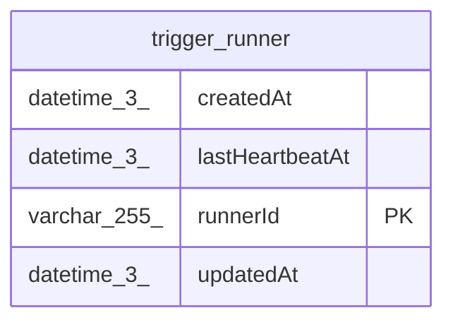

# trigger_runner

## Description

<details>
<summary><strong>Table Definition</strong></summary>

```sql
CREATE TABLE "trigger_runner" ("runnerId" varchar(255) PRIMARY KEY NOT NULL, "lastHeartbeatAt" datetime(3) NOT NULL, "createdAt" datetime(3) NOT NULL DEFAULT (STRFTIME('%Y-%m-%d %H:%M:%f', 'NOW')), "updatedAt" datetime(3) NOT NULL DEFAULT (STRFTIME('%Y-%m-%d %H:%M:%f', 'NOW')))
```

</details>

## Columns

| Name | Type | Default | Nullable | Children | Parents | Comment |
| ---- | ---- | ------- | -------- | -------- | ------- | ------- |
| createdAt | datetime(3) | STRFTIME('%Y-%m-%d %H:%M:%f', 'NOW') | false |  |  |  |
| lastHeartbeatAt | datetime(3) |  | false |  |  |  |
| runnerId | varchar(255) |  | false |  |  |  |
| updatedAt | datetime(3) | STRFTIME('%Y-%m-%d %H:%M:%f', 'NOW') | false |  |  |  |

## Constraints

| Name | Type | Definition |
| ---- | ---- | ---------- |
| runnerId | PRIMARY KEY | PRIMARY KEY (runnerId) |
| sqlite_autoindex_trigger_runner_1 | PRIMARY KEY | PRIMARY KEY (runnerId) |

## Indexes

| Name | Definition |
| ---- | ---------- |
| sqlite_autoindex_trigger_runner_1 | PRIMARY KEY (runnerId) |

## Relations



---

> Generated by [tbls](https://github.com/k1LoW/tbls)
