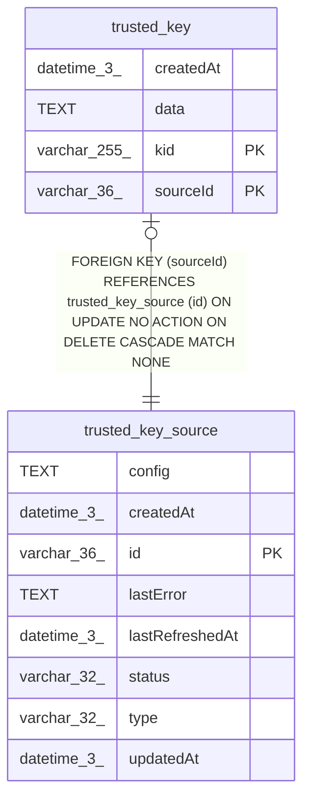

# trusted_key

## Description

<details>
<summary><strong>Table Definition</strong></summary>

```sql
CREATE TABLE "trusted_key" ("sourceId" varchar(36) NOT NULL, "kid" varchar(255) NOT NULL, "data" text NOT NULL, "createdAt" datetime(3) NOT NULL DEFAULT (STRFTIME('%Y-%m-%d %H:%M:%f', 'NOW')), CONSTRAINT "FK_8c2938d746943dd8f608d23c891" FOREIGN KEY ("sourceId") REFERENCES "trusted_key_source" ("id") ON DELETE CASCADE, PRIMARY KEY ("sourceId", "kid"))
```

</details>

## Columns

| Name | Type | Default | Nullable | Children | Parents | Comment |
| ---- | ---- | ------- | -------- | -------- | ------- | ------- |
| createdAt | datetime(3) | STRFTIME('%Y-%m-%d %H:%M:%f', 'NOW') | false |  |  |  |
| data | TEXT |  | false |  |  |  |
| kid | varchar(255) |  | false |  |  |  |
| sourceId | varchar(36) |  | false |  | [trusted_key_source](trusted_key_source.md) |  |

## Constraints

| Name | Type | Definition |
| ---- | ---- | ---------- |
| - (Foreign key ID: 0) | FOREIGN KEY | FOREIGN KEY (sourceId) REFERENCES trusted_key_source (id) ON UPDATE NO ACTION ON DELETE CASCADE MATCH NONE |
| kid | PRIMARY KEY | PRIMARY KEY (kid) |
| sourceId | PRIMARY KEY | PRIMARY KEY (sourceId) |
| sqlite_autoindex_trusted_key_1 | PRIMARY KEY | PRIMARY KEY (sourceId, kid) |

## Indexes

| Name | Definition |
| ---- | ---------- |
| sqlite_autoindex_trusted_key_1 | PRIMARY KEY (sourceId, kid) |

## Relations



---

> Generated by [tbls](https://github.com/k1LoW/tbls)
