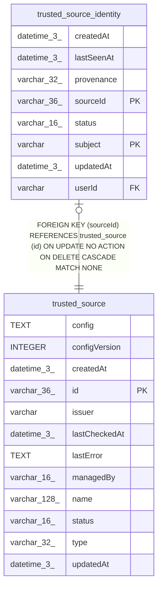

# trusted_source

## Description

<details>
<summary><strong>Table Definition</strong></summary>

```sql
CREATE TABLE "trusted_source" ("id" varchar(36) PRIMARY KEY NOT NULL, "name" varchar(128) NOT NULL, "type" varchar(32) NOT NULL, "issuer" varchar NOT NULL, "managedBy" varchar(16) NOT NULL, "status" varchar(16) NOT NULL, "lastError" text, "lastCheckedAt" datetime(3), "configVersion" integer NOT NULL, "config" text NOT NULL, "createdAt" datetime(3) NOT NULL DEFAULT (STRFTIME('%Y-%m-%d %H:%M:%f', 'NOW')), "updatedAt" datetime(3) NOT NULL DEFAULT (STRFTIME('%Y-%m-%d %H:%M:%f', 'NOW')))
```

</details>

## Columns

| Name | Type | Default | Nullable | Children | Parents | Comment |
| ---- | ---- | ------- | -------- | -------- | ------- | ------- |
| config | TEXT |  | false |  |  |  |
| configVersion | INTEGER |  | false |  |  |  |
| createdAt | datetime(3) | STRFTIME('%Y-%m-%d %H:%M:%f', 'NOW') | false |  |  |  |
| id | varchar(36) |  | false | [trusted_source_identity](trusted_source_identity.md) |  |  |
| issuer | varchar |  | false |  |  |  |
| lastCheckedAt | datetime(3) |  | true |  |  |  |
| lastError | TEXT |  | true |  |  |  |
| managedBy | varchar(16) |  | false |  |  |  |
| name | varchar(128) |  | false |  |  |  |
| status | varchar(16) |  | false |  |  |  |
| type | varchar(32) |  | false |  |  |  |
| updatedAt | datetime(3) | STRFTIME('%Y-%m-%d %H:%M:%f', 'NOW') | false |  |  |  |

## Constraints

| Name | Type | Definition |
| ---- | ---- | ---------- |
| id | PRIMARY KEY | PRIMARY KEY (id) |
| sqlite_autoindex_trusted_source_1 | PRIMARY KEY | PRIMARY KEY (id) |

## Indexes

| Name | Definition |
| ---- | ---------- |
| IDX_519e3445a1740f2ddbab2749b5 | CREATE UNIQUE INDEX "IDX_519e3445a1740f2ddbab2749b5" ON "trusted_source" ("issuer")  |
| IDX_d3055524099cd341a2af4b8eb9 | CREATE UNIQUE INDEX "IDX_d3055524099cd341a2af4b8eb9" ON "trusted_source" ("name")  |
| sqlite_autoindex_trusted_source_1 | PRIMARY KEY (id) |

## Relations



---

> Generated by [tbls](https://github.com/k1LoW/tbls)
