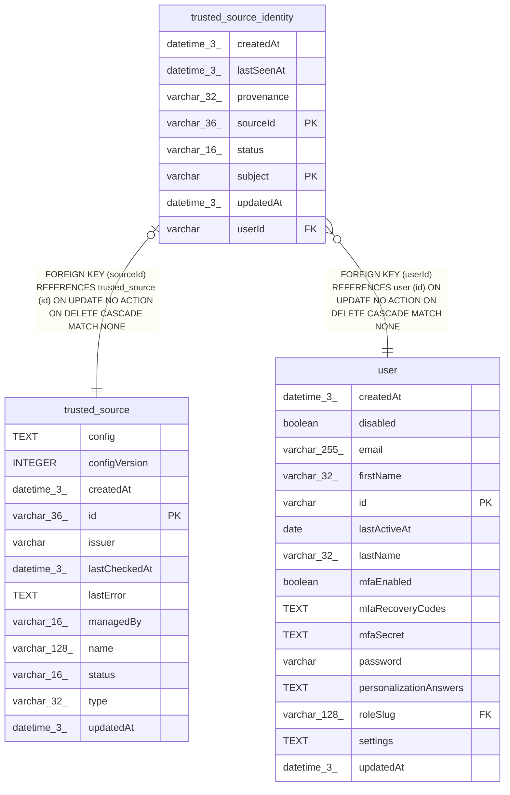

# trusted_source_identity

## Description

<details>
<summary><strong>Table Definition</strong></summary>

```sql
CREATE TABLE "trusted_source_identity" ("sourceId" varchar(36) NOT NULL, "subject" varchar NOT NULL, "userId" varchar NOT NULL, "provenance" varchar(32) NOT NULL, "status" varchar(16) NOT NULL, "lastSeenAt" datetime(3), "createdAt" datetime(3) NOT NULL DEFAULT (STRFTIME('%Y-%m-%d %H:%M:%f', 'NOW')), "updatedAt" datetime(3) NOT NULL DEFAULT (STRFTIME('%Y-%m-%d %H:%M:%f', 'NOW')), CONSTRAINT "trusted_source_identity_sourceId_foreign" FOREIGN KEY ("sourceId") REFERENCES "trusted_source" ("id") ON DELETE CASCADE, CONSTRAINT "trusted_source_identity_userId_foreign" FOREIGN KEY ("userId") REFERENCES "user" ("id") ON DELETE CASCADE, PRIMARY KEY ("sourceId", "subject"))
```

</details>

## Columns

| Name | Type | Default | Nullable | Children | Parents | Comment |
| ---- | ---- | ------- | -------- | -------- | ------- | ------- |
| createdAt | datetime(3) | STRFTIME('%Y-%m-%d %H:%M:%f', 'NOW') | false |  |  |  |
| lastSeenAt | datetime(3) |  | true |  |  |  |
| provenance | varchar(32) |  | false |  |  |  |
| sourceId | varchar(36) |  | false |  | [trusted_source](trusted_source.md) |  |
| status | varchar(16) |  | false |  |  |  |
| subject | varchar |  | false |  |  |  |
| updatedAt | datetime(3) | STRFTIME('%Y-%m-%d %H:%M:%f', 'NOW') | false |  |  |  |
| userId | varchar |  | false |  | [user](user.md) |  |

## Constraints

| Name | Type | Definition |
| ---- | ---- | ---------- |
| - (Foreign key ID: 0) | FOREIGN KEY | FOREIGN KEY (userId) REFERENCES user (id) ON UPDATE NO ACTION ON DELETE CASCADE MATCH NONE |
| - (Foreign key ID: 1) | FOREIGN KEY | FOREIGN KEY (sourceId) REFERENCES trusted_source (id) ON UPDATE NO ACTION ON DELETE CASCADE MATCH NONE |
| sourceId | PRIMARY KEY | PRIMARY KEY (sourceId) |
| sqlite_autoindex_trusted_source_identity_1 | PRIMARY KEY | PRIMARY KEY (sourceId, subject) |
| subject | PRIMARY KEY | PRIMARY KEY (subject) |

## Indexes

| Name | Definition |
| ---- | ---------- |
| IDX_bcc1e89f2ab58755614b601168 | CREATE INDEX "IDX_bcc1e89f2ab58755614b601168" ON "trusted_source_identity" ("userId")  |
| sqlite_autoindex_trusted_source_identity_1 | PRIMARY KEY (sourceId, subject) |

## Relations



---

> Generated by [tbls](https://github.com/k1LoW/tbls)
