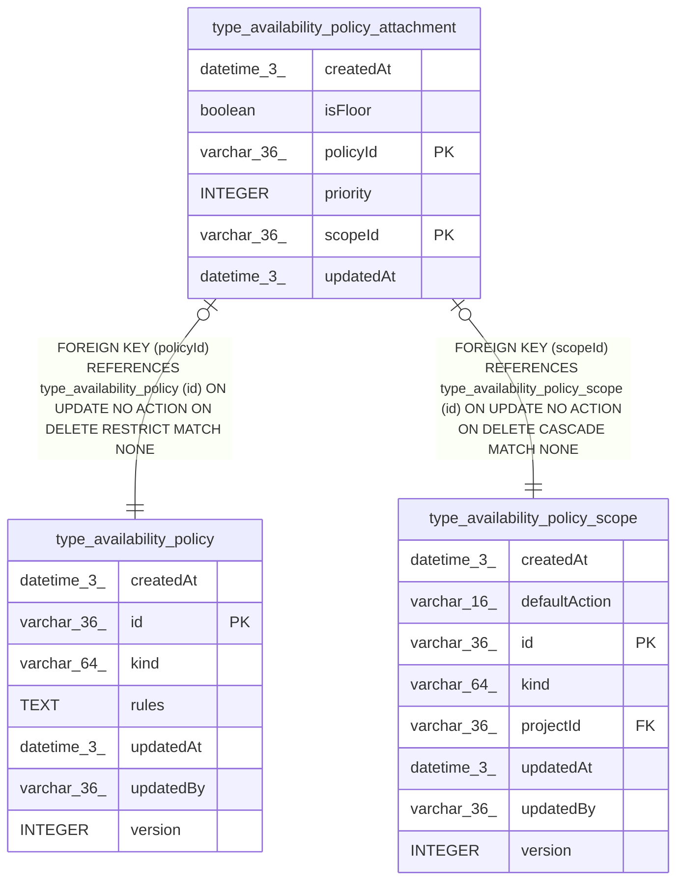

# type_availability_policy_attachment

## Description

<details>
<summary><strong>Table Definition</strong></summary>

```sql
CREATE TABLE "type_availability_policy_attachment" ("scopeId" varchar(36) NOT NULL, "policyId" varchar(36) NOT NULL, "priority" integer NOT NULL, "isFloor" boolean NOT NULL DEFAULT (false), "createdAt" datetime(3) NOT NULL DEFAULT (STRFTIME('%Y-%m-%d %H:%M:%f', 'NOW')), "updatedAt" datetime(3) NOT NULL DEFAULT (STRFTIME('%Y-%m-%d %H:%M:%f', 'NOW')), CONSTRAINT "FK_118709fc9fe21d3406f81665a53" FOREIGN KEY ("scopeId") REFERENCES "type_availability_policy_scope" ("id") ON DELETE CASCADE, CONSTRAINT "FK_674705e4c8a3d3eb0736f8e8eee" FOREIGN KEY ("policyId") REFERENCES "type_availability_policy" ("id") ON DELETE RESTRICT, PRIMARY KEY ("scopeId", "policyId"))
```

</details>

## Columns

| Name | Type | Default | Nullable | Children | Parents | Comment |
| ---- | ---- | ------- | -------- | -------- | ------- | ------- |
| createdAt | datetime(3) | STRFTIME('%Y-%m-%d %H:%M:%f', 'NOW') | false |  |  |  |
| isFloor | boolean | false | false |  |  |  |
| policyId | varchar(36) |  | false |  | [type_availability_policy](type_availability_policy.md) |  |
| priority | INTEGER |  | false |  |  |  |
| scopeId | varchar(36) |  | false |  | [type_availability_policy_scope](type_availability_policy_scope.md) |  |
| updatedAt | datetime(3) | STRFTIME('%Y-%m-%d %H:%M:%f', 'NOW') | false |  |  |  |

## Constraints

| Name | Type | Definition |
| ---- | ---- | ---------- |
| - (Foreign key ID: 0) | FOREIGN KEY | FOREIGN KEY (policyId) REFERENCES type_availability_policy (id) ON UPDATE NO ACTION ON DELETE RESTRICT MATCH NONE |
| - (Foreign key ID: 1) | FOREIGN KEY | FOREIGN KEY (scopeId) REFERENCES type_availability_policy_scope (id) ON UPDATE NO ACTION ON DELETE CASCADE MATCH NONE |
| policyId | PRIMARY KEY | PRIMARY KEY (policyId) |
| scopeId | PRIMARY KEY | PRIMARY KEY (scopeId) |
| sqlite_autoindex_type_availability_policy_attachment_1 | PRIMARY KEY | PRIMARY KEY (scopeId, policyId) |

## Indexes

| Name | Definition |
| ---- | ---------- |
| IDX_674705e4c8a3d3eb0736f8e8ee | CREATE INDEX "IDX_674705e4c8a3d3eb0736f8e8ee" ON "type_availability_policy_attachment" ("policyId")  |
| sqlite_autoindex_type_availability_policy_attachment_1 | PRIMARY KEY (scopeId, policyId) |
| uq_type_availability_attachment_slot | CREATE UNIQUE INDEX "uq_type_availability_attachment_slot" ON "type_availability_policy_attachment" ("scopeId", "isFloor", "priority")  |

## Relations



---

> Generated by [tbls](https://github.com/k1LoW/tbls)
