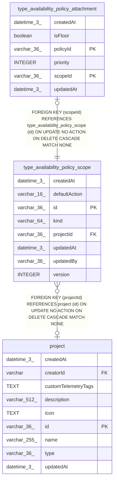

# type_availability_policy_scope

## Description

<details>
<summary><strong>Table Definition</strong></summary>

```sql
CREATE TABLE "type_availability_policy_scope" ("id" varchar(36) PRIMARY KEY NOT NULL, "kind" varchar(64) NOT NULL, "projectId" varchar(36), "defaultAction" varchar(16) NOT NULL, "version" integer NOT NULL DEFAULT (1), "updatedBy" varchar(36) NOT NULL, "createdAt" datetime(3) NOT NULL DEFAULT (STRFTIME('%Y-%m-%d %H:%M:%f', 'NOW')), "updatedAt" datetime(3) NOT NULL DEFAULT (STRFTIME('%Y-%m-%d %H:%M:%f', 'NOW')), CONSTRAINT "CHK_type_availability_policy_scope_defaultAction" CHECK ("defaultAction" IN ('allow', 'deny', 'delegate')), CONSTRAINT "FK_73c152c542cea477208c3106193" FOREIGN KEY ("projectId") REFERENCES "project" ("id") ON DELETE CASCADE)
```

</details>

## Columns

| Name | Type | Default | Nullable | Children | Parents | Comment |
| ---- | ---- | ------- | -------- | -------- | ------- | ------- |
| createdAt | datetime(3) | STRFTIME('%Y-%m-%d %H:%M:%f', 'NOW') | false |  |  |  |
| defaultAction | varchar(16) |  | false |  |  |  |
| id | varchar(36) |  | false | [type_availability_policy_attachment](type_availability_policy_attachment.md) |  |  |
| kind | varchar(64) |  | false |  |  |  |
| projectId | varchar(36) |  | true |  | [project](project.md) |  |
| updatedAt | datetime(3) | STRFTIME('%Y-%m-%d %H:%M:%f', 'NOW') | false |  |  |  |
| updatedBy | varchar(36) |  | false |  |  |  |
| version | INTEGER | 1 | false |  |  |  |

## Constraints

| Name | Type | Definition |
| ---- | ---- | ---------- |
| - | CHECK | CHECK ("defaultAction" IN ('allow', 'deny', 'delegate')) |
| - (Foreign key ID: 0) | FOREIGN KEY | FOREIGN KEY (projectId) REFERENCES project (id) ON UPDATE NO ACTION ON DELETE CASCADE MATCH NONE |
| id | PRIMARY KEY | PRIMARY KEY (id) |
| sqlite_autoindex_type_availability_policy_scope_1 | PRIMARY KEY | PRIMARY KEY (id) |

## Indexes

| Name | Definition |
| ---- | ---------- |
| sqlite_autoindex_type_availability_policy_scope_1 | PRIMARY KEY (id) |
| uq_type_availability_policy_scope_instance | CREATE UNIQUE INDEX "uq_type_availability_policy_scope_instance" ON "type_availability_policy_scope" ("kind") WHERE "projectId" IS NULL |
| uq_type_availability_policy_scope_project | CREATE UNIQUE INDEX "uq_type_availability_policy_scope_project" ON "type_availability_policy_scope" ("kind", "projectId") WHERE "projectId" IS NOT NULL |

## Relations



---

> Generated by [tbls](https://github.com/k1LoW/tbls)
