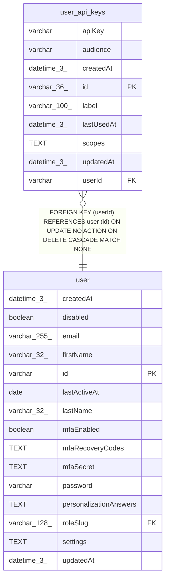

# user_api_keys

## Description

<details>
<summary><strong>Table Definition</strong></summary>

```sql
CREATE TABLE "user_api_keys" ("id" varchar(36) PRIMARY KEY NOT NULL, "userId" varchar NOT NULL, "label" varchar(100) NOT NULL, "apiKey" varchar NOT NULL, "createdAt" datetime(3) NOT NULL DEFAULT (STRFTIME('%Y-%m-%d %H:%M:%f', 'NOW')), "updatedAt" datetime(3) NOT NULL DEFAULT (STRFTIME('%Y-%m-%d %H:%M:%f', 'NOW')), "scopes" text, "audience" varchar NOT NULL DEFAULT ('public-api'), "lastUsedAt" datetime(3), CONSTRAINT "UQ_1ef35bac35d20bdae979d917a36" UNIQUE ("apiKey"), CONSTRAINT "UQ_63d7bbae72c767cf162d459fccd" UNIQUE ("userId", "label"), CONSTRAINT "FK_e131705cbbc8fb589889b02d457" FOREIGN KEY ("userId") REFERENCES "user" ("id") ON DELETE CASCADE ON UPDATE NO ACTION)
```

</details>

## Columns

| Name | Type | Default | Nullable | Children | Parents | Comment |
| ---- | ---- | ------- | -------- | -------- | ------- | ------- |
| apiKey | varchar |  | false |  |  |  |
| audience | varchar | 'public-api' | false |  |  |  |
| createdAt | datetime(3) | STRFTIME('%Y-%m-%d %H:%M:%f', 'NOW') | false |  |  |  |
| id | varchar(36) |  | false |  |  |  |
| label | varchar(100) |  | false |  |  |  |
| lastUsedAt | datetime(3) |  | true |  |  |  |
| scopes | TEXT |  | true |  |  |  |
| updatedAt | datetime(3) | STRFTIME('%Y-%m-%d %H:%M:%f', 'NOW') | false |  |  |  |
| userId | varchar |  | false |  | [user](user.md) |  |

## Constraints

| Name | Type | Definition |
| ---- | ---- | ---------- |
| - (Foreign key ID: 0) | FOREIGN KEY | FOREIGN KEY (userId) REFERENCES user (id) ON UPDATE NO ACTION ON DELETE CASCADE MATCH NONE |
| id | PRIMARY KEY | PRIMARY KEY (id) |
| sqlite_autoindex_user_api_keys_1 | PRIMARY KEY | PRIMARY KEY (id) |
| sqlite_autoindex_user_api_keys_2 | UNIQUE | UNIQUE (apiKey) |
| sqlite_autoindex_user_api_keys_3 | UNIQUE | UNIQUE (userId, label) |

## Indexes

| Name | Definition |
| ---- | ---------- |
| sqlite_autoindex_user_api_keys_1 | PRIMARY KEY (id) |
| sqlite_autoindex_user_api_keys_2 | UNIQUE (apiKey) |
| sqlite_autoindex_user_api_keys_3 | UNIQUE (userId, label) |

## Relations



---

> Generated by [tbls](https://github.com/k1LoW/tbls)
