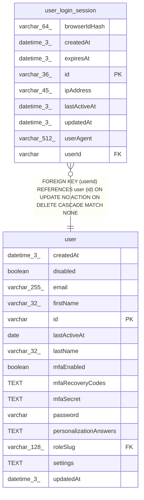

# user_login_session

## Description

<details>
<summary><strong>Table Definition</strong></summary>

```sql
CREATE TABLE "user_login_session" ("id" varchar(36) PRIMARY KEY NOT NULL, "userId" varchar NOT NULL, "browserIdHash" varchar(64), "userAgent" varchar(512), "ipAddress" varchar(45), "expiresAt" datetime(3) NOT NULL, "lastActiveAt" datetime(3), "createdAt" datetime(3) NOT NULL DEFAULT (STRFTIME('%Y-%m-%d %H:%M:%f', 'NOW')), "updatedAt" datetime(3) NOT NULL DEFAULT (STRFTIME('%Y-%m-%d %H:%M:%f', 'NOW')), CONSTRAINT "FK_043fbbc79e15a2f9999015d226f" FOREIGN KEY ("userId") REFERENCES "user" ("id") ON DELETE CASCADE)
```

</details>

## Columns

| Name | Type | Default | Nullable | Children | Parents | Comment |
| ---- | ---- | ------- | -------- | -------- | ------- | ------- |
| browserIdHash | varchar(64) |  | true |  |  |  |
| createdAt | datetime(3) | STRFTIME('%Y-%m-%d %H:%M:%f', 'NOW') | false |  |  |  |
| expiresAt | datetime(3) |  | false |  |  |  |
| id | varchar(36) |  | false |  |  |  |
| ipAddress | varchar(45) |  | true |  |  |  |
| lastActiveAt | datetime(3) |  | true |  |  |  |
| updatedAt | datetime(3) | STRFTIME('%Y-%m-%d %H:%M:%f', 'NOW') | false |  |  |  |
| userAgent | varchar(512) |  | true |  |  |  |
| userId | varchar |  | false |  | [user](user.md) |  |

## Constraints

| Name | Type | Definition |
| ---- | ---- | ---------- |
| - (Foreign key ID: 0) | FOREIGN KEY | FOREIGN KEY (userId) REFERENCES user (id) ON UPDATE NO ACTION ON DELETE CASCADE MATCH NONE |
| id | PRIMARY KEY | PRIMARY KEY (id) |
| sqlite_autoindex_user_login_session_1 | PRIMARY KEY | PRIMARY KEY (id) |

## Indexes

| Name | Definition |
| ---- | ---------- |
| IDX_043fbbc79e15a2f9999015d226 | CREATE INDEX "IDX_043fbbc79e15a2f9999015d226" ON "user_login_session" ("userId")  |
| sqlite_autoindex_user_login_session_1 | PRIMARY KEY (id) |

## Relations



---

> Generated by [tbls](https://github.com/k1LoW/tbls)
