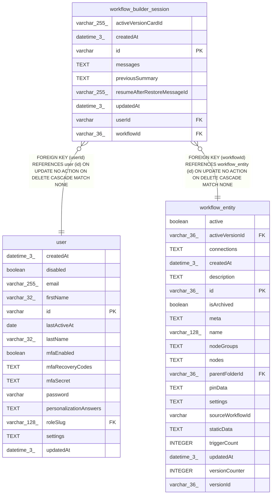

# workflow_builder_session

## Description

<details>
<summary><strong>Table Definition</strong></summary>

```sql
CREATE TABLE "workflow_builder_session" ("id" varchar PRIMARY KEY NOT NULL, "workflowId" varchar(36) NOT NULL, "userId" varchar NOT NULL, "messages" text NOT NULL DEFAULT ('[]'), "previousSummary" text, "createdAt" datetime(3) NOT NULL DEFAULT (STRFTIME('%Y-%m-%d %H:%M:%f', 'NOW')), "updatedAt" datetime(3) NOT NULL DEFAULT (STRFTIME('%Y-%m-%d %H:%M:%f', 'NOW')), "activeVersionCardId" varchar(255), "resumeAfterRestoreMessageId" varchar(255), CONSTRAINT "UQ_ec2aa73632932d485a1d5192ce1" UNIQUE ("workflowId", "userId"), CONSTRAINT "FK_00290cdeee4d4d7db84709be936" FOREIGN KEY ("userId") REFERENCES "user" ("id") ON DELETE CASCADE ON UPDATE NO ACTION, CONSTRAINT "FK_7983c618db48f47bf5a4cc1e1e4" FOREIGN KEY ("workflowId") REFERENCES "workflow_entity" ("id") ON DELETE CASCADE ON UPDATE NO ACTION)
```

</details>

## Columns

| Name | Type | Default | Nullable | Children | Parents | Comment |
| ---- | ---- | ------- | -------- | -------- | ------- | ------- |
| activeVersionCardId | varchar(255) |  | true |  |  |  |
| createdAt | datetime(3) | STRFTIME('%Y-%m-%d %H:%M:%f', 'NOW') | false |  |  |  |
| id | varchar |  | false |  |  |  |
| messages | TEXT | '[]' | false |  |  |  |
| previousSummary | TEXT |  | true |  |  |  |
| resumeAfterRestoreMessageId | varchar(255) |  | true |  |  |  |
| updatedAt | datetime(3) | STRFTIME('%Y-%m-%d %H:%M:%f', 'NOW') | false |  |  |  |
| userId | varchar |  | false |  | [user](user.md) |  |
| workflowId | varchar(36) |  | false |  | [workflow_entity](workflow_entity.md) |  |

## Constraints

| Name | Type | Definition |
| ---- | ---- | ---------- |
| - (Foreign key ID: 0) | FOREIGN KEY | FOREIGN KEY (workflowId) REFERENCES workflow_entity (id) ON UPDATE NO ACTION ON DELETE CASCADE MATCH NONE |
| - (Foreign key ID: 1) | FOREIGN KEY | FOREIGN KEY (userId) REFERENCES user (id) ON UPDATE NO ACTION ON DELETE CASCADE MATCH NONE |
| id | PRIMARY KEY | PRIMARY KEY (id) |
| sqlite_autoindex_workflow_builder_session_1 | PRIMARY KEY | PRIMARY KEY (id) |
| sqlite_autoindex_workflow_builder_session_2 | UNIQUE | UNIQUE (workflowId, userId) |

## Indexes

| Name | Definition |
| ---- | ---------- |
| sqlite_autoindex_workflow_builder_session_1 | PRIMARY KEY (id) |
| sqlite_autoindex_workflow_builder_session_2 | UNIQUE (workflowId, userId) |

## Relations



---

> Generated by [tbls](https://github.com/k1LoW/tbls)
