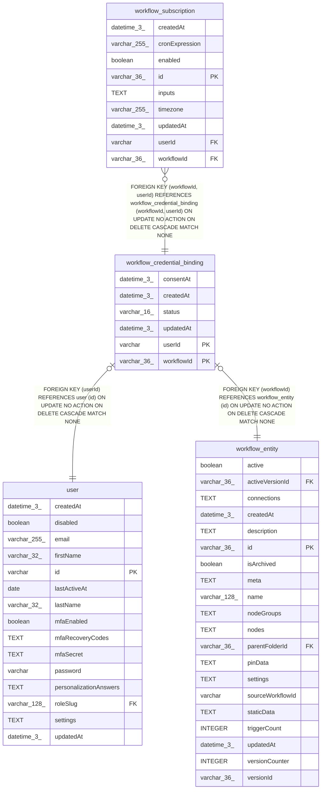

# workflow_credential_binding

## Description

<details>
<summary><strong>Table Definition</strong></summary>

```sql
CREATE TABLE "workflow_credential_binding" ("workflowId" varchar(36) NOT NULL, "userId" varchar NOT NULL, "status" varchar(16) NOT NULL DEFAULT ('active'), "consentAt" datetime(3) NOT NULL, "createdAt" datetime(3) NOT NULL DEFAULT (STRFTIME('%Y-%m-%d %H:%M:%f', 'NOW')), "updatedAt" datetime(3) NOT NULL DEFAULT (STRFTIME('%Y-%m-%d %H:%M:%f', 'NOW')), CONSTRAINT "CHK_workflow_credential_binding_status" CHECK ("status" IN ('active', 'revoked')), CONSTRAINT "FK_e537568aefaad06f226e06cffdd" FOREIGN KEY ("workflowId") REFERENCES "workflow_entity" ("id") ON DELETE CASCADE, CONSTRAINT "FK_cbd29dd8d24dbb7cce9e4abf1ee" FOREIGN KEY ("userId") REFERENCES "user" ("id") ON DELETE CASCADE, PRIMARY KEY ("workflowId", "userId"))
```

</details>

## Columns

| Name | Type | Default | Nullable | Children | Parents | Comment |
| ---- | ---- | ------- | -------- | -------- | ------- | ------- |
| consentAt | datetime(3) |  | false |  |  |  |
| createdAt | datetime(3) | STRFTIME('%Y-%m-%d %H:%M:%f', 'NOW') | false |  |  |  |
| status | varchar(16) | 'active' | false |  |  |  |
| updatedAt | datetime(3) | STRFTIME('%Y-%m-%d %H:%M:%f', 'NOW') | false |  |  |  |
| userId | varchar |  | false | [workflow_subscription](workflow_subscription.md) | [user](user.md) |  |
| workflowId | varchar(36) |  | false | [workflow_subscription](workflow_subscription.md) | [workflow_entity](workflow_entity.md) |  |

## Constraints

| Name | Type | Definition |
| ---- | ---- | ---------- |
| - | CHECK | CHECK ("status" IN ('active', 'revoked')) |
| - (Foreign key ID: 0) | FOREIGN KEY | FOREIGN KEY (userId) REFERENCES user (id) ON UPDATE NO ACTION ON DELETE CASCADE MATCH NONE |
| - (Foreign key ID: 1) | FOREIGN KEY | FOREIGN KEY (workflowId) REFERENCES workflow_entity (id) ON UPDATE NO ACTION ON DELETE CASCADE MATCH NONE |
| sqlite_autoindex_workflow_credential_binding_1 | PRIMARY KEY | PRIMARY KEY (workflowId, userId) |
| userId | PRIMARY KEY | PRIMARY KEY (userId) |
| workflowId | PRIMARY KEY | PRIMARY KEY (workflowId) |

## Indexes

| Name | Definition |
| ---- | ---------- |
| IDX_cbd29dd8d24dbb7cce9e4abf1e | CREATE INDEX "IDX_cbd29dd8d24dbb7cce9e4abf1e" ON "workflow_credential_binding" ("userId")  |
| sqlite_autoindex_workflow_credential_binding_1 | PRIMARY KEY (workflowId, userId) |

## Relations



---

> Generated by [tbls](https://github.com/k1LoW/tbls)
