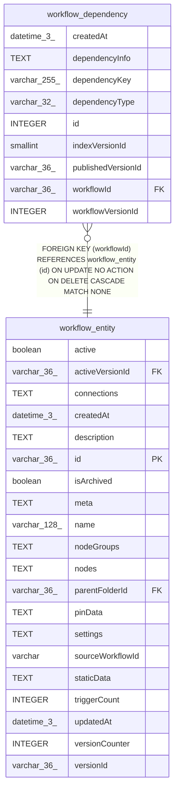

# workflow_dependency

## Description

<details>
<summary><strong>Table Definition</strong></summary>

```sql
CREATE TABLE "workflow_dependency" ("id" integer PRIMARY KEY NOT NULL, "workflowId" varchar(36) NOT NULL, "workflowVersionId" integer NOT NULL, "dependencyType" varchar(32) NOT NULL, "dependencyKey" varchar(255) NOT NULL, "indexVersionId" smallint NOT NULL DEFAULT (1), "createdAt" datetime(3) NOT NULL DEFAULT (STRFTIME('%Y-%m-%d %H:%M:%f', 'NOW')), "dependencyInfo" text, "publishedVersionId" varchar(36), CONSTRAINT "FK_a4ff2d9b9628ea988fa9e7d0bf8" FOREIGN KEY ("workflowId") REFERENCES "workflow_entity" ("id") ON DELETE CASCADE ON UPDATE NO ACTION)
```

</details>

## Columns

| Name | Type | Default | Nullable | Children | Parents | Comment |
| ---- | ---- | ------- | -------- | -------- | ------- | ------- |
| createdAt | datetime(3) | STRFTIME('%Y-%m-%d %H:%M:%f', 'NOW') | false |  |  |  |
| dependencyInfo | TEXT |  | true |  |  |  |
| dependencyKey | varchar(255) |  | false |  |  |  |
| dependencyType | varchar(32) |  | false |  |  |  |
| id | INTEGER |  | false |  |  |  |
| indexVersionId | smallint | 1 | false |  |  |  |
| publishedVersionId | varchar(36) |  | true |  |  |  |
| workflowId | varchar(36) |  | false |  | [workflow_entity](workflow_entity.md) |  |
| workflowVersionId | INTEGER |  | false |  |  |  |

## Constraints

| Name | Type | Definition |
| ---- | ---- | ---------- |
| - (Foreign key ID: 0) | FOREIGN KEY | FOREIGN KEY (workflowId) REFERENCES workflow_entity (id) ON UPDATE NO ACTION ON DELETE CASCADE MATCH NONE |
| id | PRIMARY KEY | PRIMARY KEY (id) |

## Indexes

| Name | Definition |
| ---- | ---------- |
| IDX_a4ff2d9b9628ea988fa9e7d0bf | CREATE INDEX "IDX_a4ff2d9b9628ea988fa9e7d0bf" ON "workflow_dependency" ("workflowId")  |
| IDX_e48a201071ab85d9d09119d640 | CREATE INDEX "IDX_e48a201071ab85d9d09119d640" ON "workflow_dependency" ("dependencyKey")  |
| IDX_e7fe1cfda990c14a445937d0b9 | CREATE INDEX "IDX_e7fe1cfda990c14a445937d0b9" ON "workflow_dependency" ("dependencyType")  |
| IDX_workflow_dependency_publishedVersionId | CREATE INDEX "IDX_workflow_dependency_publishedVersionId" ON "workflow_dependency" ("publishedVersionId")  |

## Relations



---

> Generated by [tbls](https://github.com/k1LoW/tbls)
