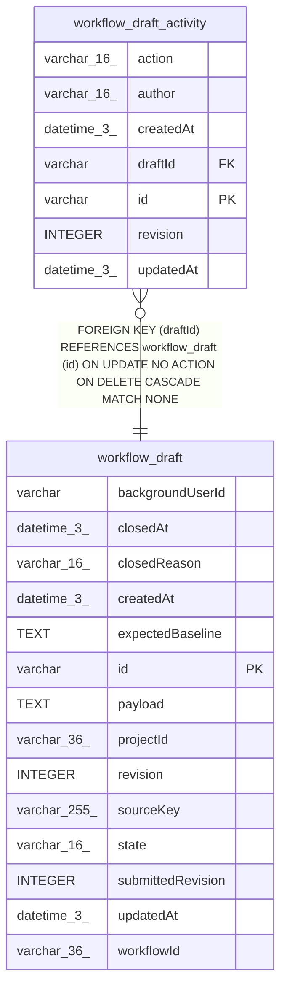

# workflow_draft

## Description

<details>
<summary><strong>Table Definition</strong></summary>

```sql
CREATE TABLE "workflow_draft" ("id" varchar PRIMARY KEY NOT NULL, "sourceKey" varchar(255) NOT NULL, "workflowId" varchar(36) NOT NULL, "projectId" varchar(36) NOT NULL, "backgroundUserId" varchar NOT NULL, "expectedBaseline" text NOT NULL, "state" varchar(16) NOT NULL, "revision" integer NOT NULL, "submittedRevision" integer, "closedReason" varchar(16), "closedAt" datetime(3), "payload" text, "createdAt" datetime(3) NOT NULL DEFAULT (STRFTIME('%Y-%m-%d %H:%M:%f', 'NOW')), "updatedAt" datetime(3) NOT NULL DEFAULT (STRFTIME('%Y-%m-%d %H:%M:%f', 'NOW')), CONSTRAINT "CHK_workflow_draft_state" CHECK ("state" IN ('preparing', 'pending', 'closed')), CONSTRAINT "CHK_workflow_draft_closedReason" CHECK ("closedReason" IN ('outdated', 'abandoned', 'applied', 'discarded')))
```

</details>

## Columns

| Name | Type | Default | Nullable | Children | Parents | Comment |
| ---- | ---- | ------- | -------- | -------- | ------- | ------- |
| backgroundUserId | varchar |  | false |  |  |  |
| closedAt | datetime(3) |  | true |  |  |  |
| closedReason | varchar(16) |  | true |  |  |  |
| createdAt | datetime(3) | STRFTIME('%Y-%m-%d %H:%M:%f', 'NOW') | false |  |  |  |
| expectedBaseline | TEXT |  | false |  |  |  |
| id | varchar |  | false | [workflow_draft_activity](workflow_draft_activity.md) |  |  |
| payload | TEXT |  | true |  |  |  |
| projectId | varchar(36) |  | false |  |  |  |
| revision | INTEGER |  | false |  |  |  |
| sourceKey | varchar(255) |  | false |  |  |  |
| state | varchar(16) |  | false |  |  |  |
| submittedRevision | INTEGER |  | true |  |  |  |
| updatedAt | datetime(3) | STRFTIME('%Y-%m-%d %H:%M:%f', 'NOW') | false |  |  |  |
| workflowId | varchar(36) |  | false |  |  |  |

## Constraints

| Name | Type | Definition |
| ---- | ---- | ---------- |
| - | CHECK | CHECK ("state" IN ('preparing', 'pending', 'closed')) |
| - | CHECK | CHECK ("closedReason" IN ('outdated', 'abandoned', 'applied', 'discarded')) |
| id | PRIMARY KEY | PRIMARY KEY (id) |
| sqlite_autoindex_workflow_draft_1 | PRIMARY KEY | PRIMARY KEY (id) |

## Indexes

| Name | Definition |
| ---- | ---------- |
| IDX_6d6a68a2f4d7b09d5787c2b8ab | CREATE INDEX "IDX_6d6a68a2f4d7b09d5787c2b8ab" ON "workflow_draft" ("state", "updatedAt")  |
| IDX_6f0bf61a98bc2ae9f6eeef9f57 | CREATE UNIQUE INDEX "IDX_6f0bf61a98bc2ae9f6eeef9f57" ON "workflow_draft" ("sourceKey")  |
| IDX_73ce6bf77fb31372aacb1486fd | CREATE INDEX "IDX_73ce6bf77fb31372aacb1486fd" ON "workflow_draft" ("state", "closedAt")  |
| IDX_workflow_draft_workflowId | CREATE UNIQUE INDEX "IDX_workflow_draft_workflowId" ON "workflow_draft" ("workflowId") WHERE "state" = 'pending' |
| sqlite_autoindex_workflow_draft_1 | PRIMARY KEY (id) |

## Relations



---

> Generated by [tbls](https://github.com/k1LoW/tbls)
