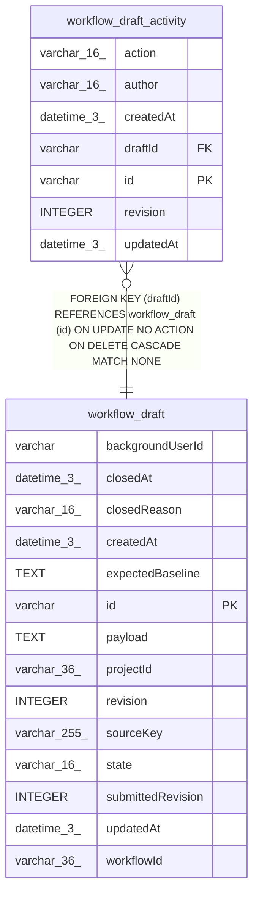

# workflow_draft_activity

## Description

<details>
<summary><strong>Table Definition</strong></summary>

```sql
CREATE TABLE "workflow_draft_activity" ("id" varchar PRIMARY KEY NOT NULL, "draftId" varchar NOT NULL, "action" varchar(16) NOT NULL, "author" varchar(16) NOT NULL, "revision" integer NOT NULL, "createdAt" datetime(3) NOT NULL DEFAULT (STRFTIME('%Y-%m-%d %H:%M:%f', 'NOW')), "updatedAt" datetime(3) NOT NULL DEFAULT (STRFTIME('%Y-%m-%d %H:%M:%f', 'NOW')), CONSTRAINT "CHK_workflow_draft_activity_action" CHECK ("action" IN ('submitted')), CONSTRAINT "CHK_workflow_draft_activity_author" CHECK ("author" IN ('assistant')), CONSTRAINT "FK_e8f5dbf00482c8b39592a4e0062" FOREIGN KEY ("draftId") REFERENCES "workflow_draft" ("id") ON DELETE CASCADE)
```

</details>

## Columns

| Name | Type | Default | Nullable | Children | Parents | Comment |
| ---- | ---- | ------- | -------- | -------- | ------- | ------- |
| action | varchar(16) |  | false |  |  |  |
| author | varchar(16) |  | false |  |  |  |
| createdAt | datetime(3) | STRFTIME('%Y-%m-%d %H:%M:%f', 'NOW') | false |  |  |  |
| draftId | varchar |  | false |  | [workflow_draft](workflow_draft.md) |  |
| id | varchar |  | false |  |  |  |
| revision | INTEGER |  | false |  |  |  |
| updatedAt | datetime(3) | STRFTIME('%Y-%m-%d %H:%M:%f', 'NOW') | false |  |  |  |

## Constraints

| Name | Type | Definition |
| ---- | ---- | ---------- |
| - | CHECK | CHECK ("action" IN ('submitted')) |
| - | CHECK | CHECK ("author" IN ('assistant')) |
| - (Foreign key ID: 0) | FOREIGN KEY | FOREIGN KEY (draftId) REFERENCES workflow_draft (id) ON UPDATE NO ACTION ON DELETE CASCADE MATCH NONE |
| id | PRIMARY KEY | PRIMARY KEY (id) |
| sqlite_autoindex_workflow_draft_activity_1 | PRIMARY KEY | PRIMARY KEY (id) |

## Indexes

| Name | Definition |
| ---- | ---------- |
| IDX_c7fdcda0e866ac65c287acdb3d | CREATE UNIQUE INDEX "IDX_c7fdcda0e866ac65c287acdb3d" ON "workflow_draft_activity" ("draftId", "action")  |
| sqlite_autoindex_workflow_draft_activity_1 | PRIMARY KEY (id) |

## Relations



---

> Generated by [tbls](https://github.com/k1LoW/tbls)
