# workflow_entity

## Description

<details>
<summary><strong>Table Definition</strong></summary>

```sql
CREATE TABLE "workflow_entity" ("id" varchar(36) PRIMARY KEY NOT NULL, "name" varchar(128) NOT NULL, "active" boolean NOT NULL, "nodes" text, "connections" text, "settings" text, "staticData" text, "pinData" text, "versionId" varchar(36) NOT NULL, "triggerCount" integer DEFAULT (0), "meta" text, "parentFolderId" varchar(36), "createdAt" datetime(3) NOT NULL DEFAULT (STRFTIME('%Y-%m-%d %H:%M:%f', 'NOW')), "updatedAt" datetime(3) NOT NULL DEFAULT (STRFTIME('%Y-%m-%d %H:%M:%f', 'NOW')), "isArchived" boolean NOT NULL DEFAULT (FALSE), "versionCounter" integer NOT NULL DEFAULT (1), "description" text, "activeVersionId" varchar(36), "nodeGroups" text NOT NULL DEFAULT ('[]'), "sourceWorkflowId" varchar, CONSTRAINT "FK_04a4db5906fbc5606c71448d912" FOREIGN KEY ("parentFolderId") REFERENCES "folder" ("id") ON DELETE CASCADE ON UPDATE NO ACTION, CONSTRAINT "FK_08d6c67b7f722b0039d9d5ed620" FOREIGN KEY ("activeVersionId") REFERENCES "workflow_history" ("versionId") ON DELETE RESTRICT ON UPDATE NO ACTION)
```

</details>

## Columns

| Name | Type | Default | Nullable | Children | Parents | Comment |
| ---- | ---- | ------- | -------- | -------- | ------- | ------- |
| active | boolean |  | false |  |  |  |
| activeVersionId | varchar(36) |  | true |  | [workflow_history](workflow_history.md) |  |
| connections | TEXT |  | true |  |  |  |
| createdAt | datetime(3) | STRFTIME('%Y-%m-%d %H:%M:%f', 'NOW') | false |  |  |  |
| description | TEXT |  | true |  |  |  |
| id | varchar(36) |  | false | [ai_builder_temporary_workflow](ai_builder_temporary_workflow.md) [chat_hub_messages](chat_hub_messages.md) [chat_hub_sessions](chat_hub_sessions.md) [evaluation_collection](evaluation_collection.md) [evaluation_config](evaluation_config.md) [execution_entity](execution_entity.md) [insights_metadata](insights_metadata.md) [processed_data](processed_data.md) [shared_workflow](shared_workflow.md) [test_run](test_run.md) [workflow_builder_session](workflow_builder_session.md) [workflow_dependency](workflow_dependency.md) [workflow_history](workflow_history.md) [workflow_publication_trigger_status](workflow_publication_trigger_status.md) [workflow_publish_history](workflow_publish_history.md) [workflow_published_version](workflow_published_version.md) [workflows_tags](workflows_tags.md) |  |  |
| isArchived | boolean | FALSE | false |  |  |  |
| meta | TEXT |  | true |  |  |  |
| name | varchar(128) |  | false |  |  |  |
| nodeGroups | TEXT | '[]' | false |  |  |  |
| nodes | TEXT |  | true |  |  |  |
| parentFolderId | varchar(36) |  | true |  | [folder](folder.md) |  |
| pinData | TEXT |  | true |  |  |  |
| settings | TEXT |  | true |  |  |  |
| sourceWorkflowId | varchar |  | true |  |  |  |
| staticData | TEXT |  | true |  |  |  |
| triggerCount | INTEGER | 0 | true |  |  |  |
| updatedAt | datetime(3) | STRFTIME('%Y-%m-%d %H:%M:%f', 'NOW') | false |  |  |  |
| versionCounter | INTEGER | 1 | false |  |  |  |
| versionId | varchar(36) |  | false |  |  |  |

## Constraints

| Name | Type | Definition |
| ---- | ---- | ---------- |
| - (Foreign key ID: 0) | FOREIGN KEY | FOREIGN KEY (activeVersionId) REFERENCES workflow_history (versionId) ON UPDATE NO ACTION ON DELETE RESTRICT MATCH NONE |
| - (Foreign key ID: 1) | FOREIGN KEY | FOREIGN KEY (parentFolderId) REFERENCES folder (id) ON UPDATE NO ACTION ON DELETE CASCADE MATCH NONE |
| id | PRIMARY KEY | PRIMARY KEY (id) |
| sqlite_autoindex_workflow_entity_1 | PRIMARY KEY | PRIMARY KEY (id) |

## Indexes

| Name | Definition |
| ---- | ---------- |
| IDX_e10425f6ab9964c4c1623a4a03 | CREATE INDEX "IDX_e10425f6ab9964c4c1623a4a03" ON "workflow_entity" ("name")  |
| IDX_workflow_entity_sourceWorkflowId | CREATE INDEX "IDX_workflow_entity_sourceWorkflowId" ON "workflow_entity" ("sourceWorkflowId") WHERE "sourceWorkflowId" IS NOT NULL |
| sqlite_autoindex_workflow_entity_1 | PRIMARY KEY (id) |

## Triggers

| Name | Definition |
| ---- | ---------- |
| workflow_version_increment | CREATE TRIGGER "workflow_version_increment"<br />			AFTER UPDATE ON "workflow_entity"<br />			FOR EACH ROW<br />			WHEN OLD."versionCounter" = NEW."versionCounter"<br />				AND (OLD."nodes" IS NOT NEW."nodes" OR OLD."settings" IS NOT NEW."settings")<br />			BEGIN<br />				UPDATE "workflow_entity"<br />				SET "versionCounter" = "versionCounter" + 1<br />				WHERE "id" = NEW."id";<br />			END |

## Relations

```mermaid
erDiagram

"workflow_entity" }o--o| "workflow_history" : "FOREIGN KEY (activeVersionId) REFERENCES workflow_history (versionId) ON UPDATE NO ACTION ON DELETE RESTRICT MATCH NONE"
"ai_builder_temporary_workflow" |o--|| "workflow_entity" : "FOREIGN KEY (workflowId) REFERENCES workflow_entity (id) ON UPDATE NO ACTION ON DELETE CASCADE MATCH NONE"
"chat_hub_messages" }o--o| "workflow_entity" : "FOREIGN KEY (workflowId) REFERENCES workflow_entity (id) ON UPDATE NO ACTION ON DELETE SET NULL MATCH NONE"
"chat_hub_sessions" }o--o| "workflow_entity" : "FOREIGN KEY (workflowId) REFERENCES workflow_entity (id) ON UPDATE NO ACTION ON DELETE SET NULL MATCH NONE"
"evaluation_collection" }o--|| "workflow_entity" : "FOREIGN KEY (workflowId) REFERENCES workflow_entity (id) ON UPDATE NO ACTION ON DELETE CASCADE MATCH NONE"
"evaluation_config" }o--|| "workflow_entity" : "FOREIGN KEY (workflowId) REFERENCES workflow_entity (id) ON UPDATE NO ACTION ON DELETE CASCADE MATCH NONE"
"execution_entity" }o--|| "workflow_entity" : "FOREIGN KEY (workflowId) REFERENCES workflow_entity (id) ON UPDATE NO ACTION ON DELETE CASCADE MATCH NONE"
"insights_metadata" }o--o| "workflow_entity" : "FOREIGN KEY (workflowId) REFERENCES workflow_entity (id) ON UPDATE NO ACTION ON DELETE SET NULL MATCH NONE"
"processed_data" |o--|| "workflow_entity" : "FOREIGN KEY (workflowId) REFERENCES workflow_entity (id) ON UPDATE NO ACTION ON DELETE CASCADE MATCH NONE"
"shared_workflow" |o--|| "workflow_entity" : "FOREIGN KEY (workflowId) REFERENCES workflow_entity (id) ON UPDATE NO ACTION ON DELETE CASCADE MATCH NONE"
"test_run" }o--|| "workflow_entity" : "FOREIGN KEY (workflowId) REFERENCES workflow_entity (id) ON UPDATE NO ACTION ON DELETE CASCADE MATCH NONE"
"workflow_builder_session" }o--|| "workflow_entity" : "FOREIGN KEY (workflowId) REFERENCES workflow_entity (id) ON UPDATE NO ACTION ON DELETE CASCADE MATCH NONE"
"workflow_dependency" }o--|| "workflow_entity" : "FOREIGN KEY (workflowId) REFERENCES workflow_entity (id) ON UPDATE NO ACTION ON DELETE CASCADE MATCH NONE"
"workflow_history" }o--|| "workflow_entity" : "FOREIGN KEY (workflowId) REFERENCES workflow_entity (id) ON UPDATE NO ACTION ON DELETE CASCADE MATCH NONE"
"workflow_publication_trigger_status" |o--|| "workflow_entity" : "FOREIGN KEY (workflowId) REFERENCES workflow_entity (id) ON UPDATE NO ACTION ON DELETE CASCADE MATCH NONE"
"workflow_publish_history" }o--|| "workflow_entity" : "FOREIGN KEY (workflowId) REFERENCES workflow_entity (id) ON UPDATE NO ACTION ON DELETE CASCADE MATCH NONE"
"workflow_published_version" |o--|| "workflow_entity" : "FOREIGN KEY (workflowId) REFERENCES workflow_entity (id) ON UPDATE NO ACTION ON DELETE RESTRICT MATCH NONE"
"workflow_published_version" |o--|| "workflow_entity" : "FOREIGN KEY (workflowId) REFERENCES workflow_entity (id) ON UPDATE NO ACTION ON DELETE CASCADE MATCH NONE"
"workflows_tags" |o--|| "workflow_entity" : "FOREIGN KEY (workflowId) REFERENCES workflow_entity (id) ON UPDATE NO ACTION ON DELETE CASCADE MATCH NONE"
"workflow_entity" }o--o| "folder" : "FOREIGN KEY (parentFolderId) REFERENCES folder (id) ON UPDATE NO ACTION ON DELETE CASCADE MATCH NONE"

"workflow_entity" {
  boolean active
  varchar_36_ activeVersionId FK
  TEXT connections
  datetime_3_ createdAt
  TEXT description
  varchar_36_ id PK
  boolean isArchived
  TEXT meta
  varchar_128_ name
  TEXT nodeGroups
  TEXT nodes
  varchar_36_ parentFolderId FK
  TEXT pinData
  TEXT settings
  varchar sourceWorkflowId
  TEXT staticData
  INTEGER triggerCount
  datetime_3_ updatedAt
  INTEGER versionCounter
  varchar_36_ versionId
}
"workflow_history" {
  varchar_255_ authors
  boolean autosaved
  TEXT connections
  datetime_3_ createdAt
  TEXT description
  varchar_128_ name
  TEXT nodeGroups
  TEXT nodes
  datetime_3_ updatedAt
  varchar_36_ versionId PK
  varchar_36_ workflowId FK
}
"ai_builder_temporary_workflow" {
  datetime_3_ createdAt
  varchar threadId FK
  datetime_3_ updatedAt
  varchar_36_ workflowId PK
}
"chat_hub_messages" {
  varchar_36_ agentId FK
  TEXT attachments
  TEXT content
  datetime_3_ createdAt
  INTEGER executionId FK
  varchar id PK
  VARCHAR_256_ model
  varchar_128_ name
  varchar previousMessageId FK
  varchar_16_ provider
  varchar retryOfMessageId FK
  varchar revisionOfMessageId FK
  varchar sessionId FK
  varchar_16_ status
  varchar_16_ type
  datetime_3_ updatedAt
  varchar_36_ workflowId FK
}
"chat_hub_sessions" {
  varchar_36_ agentId FK
  varchar_128_ agentName
  datetime_3_ createdAt
  varchar_36_ credentialId FK
  varchar id PK
  datetime_3_ lastMessageAt
  varchar_64_ model
  varchar ownerId FK
  varchar_16_ provider
  varchar_256_ title
  varchar_16_ type
  datetime_3_ updatedAt
  varchar_36_ workflowId FK
}
"evaluation_collection" {
  datetime_3_ createdAt
  varchar createdById FK
  TEXT description
  varchar_36_ evaluationConfigId FK
  varchar_36_ id PK
  TEXT insightsCache
  varchar_128_ name
  datetime_3_ updatedAt
  varchar_36_ workflowId FK
}
"evaluation_config" {
  datetime_3_ createdAt
  TEXT datasetRef
  varchar_32_ datasetSource
  varchar_255_ endNodeName
  varchar_36_ id PK
  varchar_64_ invalidReason
  TEXT metrics
  varchar_128_ name
  varchar_255_ startNodeName
  varchar_16_ status
  datetime_3_ updatedAt
  varchar_36_ workflowId FK
}
"execution_entity" {
  bigint binaryDataSizeBytes
  datetime_3_ createdAt
  varchar_255_ deduplicationKey
  datetime_3_ deletedAt
  boolean finished
  INTEGER id
  bigint jsonSizeBytes
  varchar mode
  varchar retryOf
  varchar retrySuccessId
  datetime startedAt
  varchar status
  datetime stoppedAt
  varchar_2_ storedAt
  TEXT tracingContext
  BOOLEAN usedPrivateCredentials
  datetime waitTill
  varchar_36_ workflowId FK
  varchar_36_ workflowVersionId
}
"insights_metadata" {
  INTEGER metaId
  varchar_36_ projectId FK
  varchar_255_ projectName
  varchar_16_ workflowId FK
  varchar_128_ workflowName
}
"processed_data" {
  varchar_255_ context PK
  datetime_3_ createdAt
  datetime_3_ updatedAt
  TEXT value
  varchar_36_ workflowId PK
}
"shared_workflow" {
  datetime_3_ createdAt
  varchar_36_ projectId PK
  TEXT role
  datetime_3_ updatedAt
  varchar_36_ workflowId PK
}
"test_run" {
  boolean cancelRequested
  varchar_36_ collectionId FK
  datetime_3_ completedAt
  datetime_3_ createdAt
  varchar errorCode
  TEXT errorDetails
  varchar_36_ evaluationConfigId FK
  TEXT evaluationConfigSnapshot
  varchar_36_ id PK
  TEXT metrics
  datetime_3_ runAt
  varchar_255_ runningInstanceId
  varchar status
  datetime_3_ updatedAt
  varchar_36_ workflowId FK
  varchar_36_ workflowVersionId
}
"workflow_builder_session" {
  varchar_255_ activeVersionCardId
  datetime_3_ createdAt
  varchar id PK
  TEXT messages
  TEXT previousSummary
  varchar_255_ resumeAfterRestoreMessageId
  datetime_3_ updatedAt
  varchar userId FK
  varchar_36_ workflowId FK
}
"workflow_dependency" {
  datetime_3_ createdAt
  TEXT dependencyInfo
  varchar_255_ dependencyKey
  varchar_32_ dependencyType
  INTEGER id
  smallint indexVersionId
  varchar_36_ publishedVersionId
  varchar_36_ workflowId FK
  INTEGER workflowVersionId
}
"workflow_publication_trigger_status" {
  datetime_3_ createdAt
  TEXT errorMessage
  varchar_36_ nodeId PK
  varchar_20_ status
  datetime_3_ updatedAt
  varchar_36_ versionId FK
  varchar_36_ workflowId PK
}
"workflow_publish_history" {
  datetime_3_ createdAt
  varchar_36_ event
  INTEGER id
  varchar userId FK
  varchar_36_ versionId FK
  varchar_36_ workflowId FK
}
"workflow_published_version" {
  datetime_3_ createdAt
  varchar_36_ publishedVersionId FK
  datetime_3_ updatedAt
  varchar_36_ workflowId PK
}
"workflows_tags" {
  INTEGER tagId PK
  varchar_36_ workflowId PK
}
"folder" {
  datetime_3_ createdAt
  varchar_36_ id PK
  varchar_128_ name
  varchar_36_ parentFolderId FK
  varchar_36_ projectId FK
  datetime_3_ updatedAt
}
```



---

> Generated by [tbls](https://github.com/k1LoW/tbls)
