# workflow_entity

## Description

<details>
<summary><strong>Table Definition</strong></summary>

```sql
CREATE TABLE "workflow_entity" ("id" varchar(36) PRIMARY KEY NOT NULL, "name" varchar(128) NOT NULL, "active" boolean NOT NULL, "nodes" text, "connections" text, "settings" text, "staticData" text, "pinData" text, "versionId" varchar(36) NOT NULL, "triggerCount" integer DEFAULT (0), "meta" text, "parentFolderId" varchar(36), "createdAt" datetime(3) NOT NULL DEFAULT (STRFTIME('%Y-%m-%d %H:%M:%f', 'NOW')), "updatedAt" datetime(3) NOT NULL DEFAULT (STRFTIME('%Y-%m-%d %H:%M:%f', 'NOW')), "isArchived" boolean NOT NULL DEFAULT (FALSE), "versionCounter" integer NOT NULL DEFAULT (1), "description" text, "activeVersionId" varchar(36), "nodeGroups" text NOT NULL DEFAULT ('[]'), "sourceWorkflowId" varchar, CONSTRAINT "FK_04a4db5906fbc5606c71448d912" FOREIGN KEY ("parentFolderId") REFERENCES "folder" ("id") ON DELETE CASCADE ON UPDATE NO ACTION, CONSTRAINT "FK_08d6c67b7f722b0039d9d5ed620" FOREIGN KEY ("activeVersionId") REFERENCES "workflow_history" ("versionId") ON DELETE RESTRICT ON UPDATE NO ACTION)
```

</details>

## Columns

| Name | Type | Default | Nullable | Children | Parents | Comment |
| ---- | ---- | ------- | -------- | -------- | ------- | ------- |
| id | varchar(36) |  | false | [workflows_tags](workflows_tags.md) [shared_workflow](shared_workflow.md) [processed_data](processed_data.md) [insights_metadata](insights_metadata.md) [chat_hub_messages](chat_hub_messages.md) [workflow_dependency](workflow_dependency.md) [workflow_published_version](workflow_published_version.md) [chat_hub_sessions](chat_hub_sessions.md) [workflow_builder_session](workflow_builder_session.md) [workflow_publish_history](workflow_publish_history.md) [ai_builder_temporary_workflow](ai_builder_temporary_workflow.md) [execution_entity](execution_entity.md) [evaluation_config](evaluation_config.md) [evaluation_collection](evaluation_collection.md) [test_run](test_run.md) [workflow_history](workflow_history.md) |  |  |
| name | varchar(128) |  | false |  |  |  |
| active | boolean |  | false |  |  |  |
| nodes | TEXT |  | true |  |  |  |
| connections | TEXT |  | true |  |  |  |
| settings | TEXT |  | true |  |  |  |
| staticData | TEXT |  | true |  |  |  |
| pinData | TEXT |  | true |  |  |  |
| versionId | varchar(36) |  | false |  |  |  |
| triggerCount | INTEGER | 0 | true |  |  |  |
| meta | TEXT |  | true |  |  |  |
| parentFolderId | varchar(36) |  | true |  | [folder](folder.md) |  |
| createdAt | datetime(3) | STRFTIME('%Y-%m-%d %H:%M:%f', 'NOW') | false |  |  |  |
| updatedAt | datetime(3) | STRFTIME('%Y-%m-%d %H:%M:%f', 'NOW') | false |  |  |  |
| isArchived | boolean | FALSE | false |  |  |  |
| versionCounter | INTEGER | 1 | false |  |  |  |
| description | TEXT |  | true |  |  |  |
| activeVersionId | varchar(36) |  | true |  | [workflow_history](workflow_history.md) |  |
| nodeGroups | TEXT | '[]' | false |  |  |  |
| sourceWorkflowId | varchar |  | true |  |  |  |

## Constraints

| Name | Type | Definition |
| ---- | ---- | ---------- |
| id | PRIMARY KEY | PRIMARY KEY (id) |
| - (Foreign key ID: 0) | FOREIGN KEY | FOREIGN KEY (activeVersionId) REFERENCES workflow_history (versionId) ON UPDATE NO ACTION ON DELETE RESTRICT MATCH NONE |
| - (Foreign key ID: 1) | FOREIGN KEY | FOREIGN KEY (parentFolderId) REFERENCES folder (id) ON UPDATE NO ACTION ON DELETE CASCADE MATCH NONE |
| sqlite_autoindex_workflow_entity_1 | PRIMARY KEY | PRIMARY KEY (id) |

## Indexes

| Name | Definition |
| ---- | ---------- |
| IDX_workflow_entity_sourceWorkflowId | CREATE INDEX "IDX_workflow_entity_sourceWorkflowId" ON "workflow_entity" ("sourceWorkflowId") WHERE "sourceWorkflowId" IS NOT NULL |
| IDX_e10425f6ab9964c4c1623a4a03 | CREATE INDEX "IDX_e10425f6ab9964c4c1623a4a03" ON "workflow_entity" ("name")  |
| sqlite_autoindex_workflow_entity_1 | PRIMARY KEY (id) |

## Triggers

| Name | Definition |
| ---- | ---------- |
| workflow_version_increment | CREATE TRIGGER "workflow_version_increment"<br />			AFTER UPDATE ON "workflow_entity"<br />			FOR EACH ROW<br />			WHEN OLD."versionCounter" = NEW."versionCounter"<br />				AND (OLD."nodes" IS NOT NEW."nodes" OR OLD."settings" IS NOT NEW."settings")<br />			BEGIN<br />				UPDATE "workflow_entity"<br />				SET "versionCounter" = "versionCounter" + 1<br />				WHERE "id" = NEW."id";<br />			END |

## Relations

```mermaid
erDiagram

"workflows_tags" |o--|| "workflow_entity" : "FOREIGN KEY (workflowId) REFERENCES workflow_entity (id) ON UPDATE NO ACTION ON DELETE CASCADE MATCH NONE"
"shared_workflow" |o--|| "workflow_entity" : "FOREIGN KEY (workflowId) REFERENCES workflow_entity (id) ON UPDATE NO ACTION ON DELETE CASCADE MATCH NONE"
"processed_data" |o--|| "workflow_entity" : "FOREIGN KEY (workflowId) REFERENCES workflow_entity (id) ON UPDATE NO ACTION ON DELETE CASCADE MATCH NONE"
"insights_metadata" }o--o| "workflow_entity" : "FOREIGN KEY (workflowId) REFERENCES workflow_entity (id) ON UPDATE NO ACTION ON DELETE SET NULL MATCH NONE"
"chat_hub_messages" }o--o| "workflow_entity" : "FOREIGN KEY (workflowId) REFERENCES workflow_entity (id) ON UPDATE NO ACTION ON DELETE SET NULL MATCH NONE"
"workflow_dependency" }o--|| "workflow_entity" : "FOREIGN KEY (workflowId) REFERENCES workflow_entity (id) ON UPDATE NO ACTION ON DELETE CASCADE MATCH NONE"
"workflow_published_version" |o--|| "workflow_entity" : "FOREIGN KEY (workflowId) REFERENCES workflow_entity (id) ON UPDATE NO ACTION ON DELETE RESTRICT MATCH NONE"
"workflow_published_version" |o--|| "workflow_entity" : "FOREIGN KEY (workflowId) REFERENCES workflow_entity (id) ON UPDATE NO ACTION ON DELETE CASCADE MATCH NONE"
"chat_hub_sessions" }o--o| "workflow_entity" : "FOREIGN KEY (workflowId) REFERENCES workflow_entity (id) ON UPDATE NO ACTION ON DELETE SET NULL MATCH NONE"
"workflow_builder_session" }o--|| "workflow_entity" : "FOREIGN KEY (workflowId) REFERENCES workflow_entity (id) ON UPDATE NO ACTION ON DELETE CASCADE MATCH NONE"
"workflow_publish_history" }o--|| "workflow_entity" : "FOREIGN KEY (workflowId) REFERENCES workflow_entity (id) ON UPDATE NO ACTION ON DELETE CASCADE MATCH NONE"
"ai_builder_temporary_workflow" |o--|| "workflow_entity" : "FOREIGN KEY (workflowId) REFERENCES workflow_entity (id) ON UPDATE NO ACTION ON DELETE CASCADE MATCH NONE"
"execution_entity" }o--|| "workflow_entity" : "FOREIGN KEY (workflowId) REFERENCES workflow_entity (id) ON UPDATE NO ACTION ON DELETE CASCADE MATCH NONE"
"evaluation_config" }o--|| "workflow_entity" : "FOREIGN KEY (workflowId) REFERENCES workflow_entity (id) ON UPDATE NO ACTION ON DELETE CASCADE MATCH NONE"
"evaluation_collection" }o--|| "workflow_entity" : "FOREIGN KEY (workflowId) REFERENCES workflow_entity (id) ON UPDATE NO ACTION ON DELETE CASCADE MATCH NONE"
"test_run" }o--|| "workflow_entity" : "FOREIGN KEY (workflowId) REFERENCES workflow_entity (id) ON UPDATE NO ACTION ON DELETE CASCADE MATCH NONE"
"workflow_history" }o--|| "workflow_entity" : "FOREIGN KEY (workflowId) REFERENCES workflow_entity (id) ON UPDATE NO ACTION ON DELETE CASCADE MATCH NONE"
"workflow_entity" }o--o| "folder" : "FOREIGN KEY (parentFolderId) REFERENCES folder (id) ON UPDATE NO ACTION ON DELETE CASCADE MATCH NONE"
"workflow_entity" }o--o| "workflow_history" : "FOREIGN KEY (activeVersionId) REFERENCES workflow_history (versionId) ON UPDATE NO ACTION ON DELETE RESTRICT MATCH NONE"

"workflow_entity" {
  varchar_36_ id PK
  varchar_128_ name
  boolean active
  TEXT nodes
  TEXT connections
  TEXT settings
  TEXT staticData
  TEXT pinData
  varchar_36_ versionId
  INTEGER triggerCount
  TEXT meta
  varchar_36_ parentFolderId FK
  datetime_3_ createdAt
  datetime_3_ updatedAt
  boolean isArchived
  INTEGER versionCounter
  TEXT description
  varchar_36_ activeVersionId FK
  TEXT nodeGroups
  varchar sourceWorkflowId
}
"workflows_tags" {
  varchar_36_ workflowId PK
  INTEGER tagId PK
}
"shared_workflow" {
  varchar_36_ workflowId PK
  varchar_36_ projectId PK
  TEXT role
  datetime_3_ createdAt
  datetime_3_ updatedAt
}
"processed_data" {
  varchar_36_ workflowId PK
  varchar_255_ context PK
  datetime_3_ createdAt
  datetime_3_ updatedAt
  TEXT value
}
"insights_metadata" {
  INTEGER metaId
  varchar_16_ workflowId FK
  varchar_36_ projectId FK
  varchar_128_ workflowName
  varchar_255_ projectName
}
"chat_hub_messages" {
  varchar id PK
  varchar sessionId FK
  varchar previousMessageId FK
  varchar revisionOfMessageId FK
  varchar retryOfMessageId FK
  varchar_16_ type
  varchar_128_ name
  TEXT content
  varchar_16_ provider
  varchar_36_ workflowId FK
  INTEGER executionId FK
  datetime_3_ createdAt
  datetime_3_ updatedAt
  varchar_36_ agentId FK
  varchar_16_ status
  TEXT attachments
  VARCHAR_256_ model
}
"workflow_dependency" {
  INTEGER id
  varchar_36_ workflowId FK
  INTEGER workflowVersionId
  varchar_32_ dependencyType
  varchar_255_ dependencyKey
  smallint indexVersionId
  datetime_3_ createdAt
  TEXT dependencyInfo
  varchar_36_ publishedVersionId
}
"workflow_published_version" {
  varchar_36_ workflowId PK
  varchar_36_ publishedVersionId FK
  datetime_3_ createdAt
  datetime_3_ updatedAt
}
"chat_hub_sessions" {
  varchar id PK
  varchar_256_ title
  varchar ownerId FK
  datetime_3_ lastMessageAt
  varchar_36_ credentialId FK
  varchar_16_ provider
  varchar_64_ model
  varchar_36_ workflowId FK
  datetime_3_ createdAt
  datetime_3_ updatedAt
  varchar_36_ agentId FK
  varchar_128_ agentName
  varchar_16_ type
}
"workflow_builder_session" {
  varchar id PK
  varchar_36_ workflowId FK
  varchar userId FK
  TEXT messages
  TEXT previousSummary
  datetime_3_ createdAt
  datetime_3_ updatedAt
  varchar_255_ activeVersionCardId
  varchar_255_ resumeAfterRestoreMessageId
}
"workflow_publish_history" {
  INTEGER id
  varchar_36_ workflowId FK
  varchar_36_ versionId FK
  varchar_36_ event
  varchar userId FK
  datetime_3_ createdAt
}
"ai_builder_temporary_workflow" {
  varchar_36_ workflowId PK
  varchar threadId FK
  datetime_3_ createdAt
  datetime_3_ updatedAt
}
"execution_entity" {
  INTEGER id
  varchar_36_ workflowId FK
  boolean finished
  varchar mode
  varchar retryOf
  varchar retrySuccessId
  datetime startedAt
  datetime stoppedAt
  datetime waitTill
  varchar status
  datetime_3_ deletedAt
  datetime_3_ createdAt
  varchar_2_ storedAt
  TEXT tracingContext
  varchar_255_ deduplicationKey
  BIGINT jsonSizeBytes
  VARCHAR_36_ workflowVersionId
}
"evaluation_config" {
  varchar_36_ id PK
  varchar_36_ workflowId FK
  varchar_128_ name
  varchar_16_ status
  varchar_64_ invalidReason
  varchar_32_ datasetSource
  TEXT datasetRef
  varchar_255_ startNodeName
  varchar_255_ endNodeName
  TEXT metrics
  datetime_3_ createdAt
  datetime_3_ updatedAt
}
"evaluation_collection" {
  varchar_36_ id PK
  varchar_128_ name
  TEXT description
  varchar_36_ workflowId FK
  varchar_36_ evaluationConfigId FK
  varchar createdById FK
  TEXT insightsCache
  datetime_3_ createdAt
  datetime_3_ updatedAt
}
"test_run" {
  varchar_36_ id PK
  varchar_36_ workflowId FK
  varchar status
  varchar errorCode
  TEXT errorDetails
  datetime_3_ runAt
  datetime_3_ completedAt
  TEXT metrics
  datetime_3_ createdAt
  datetime_3_ updatedAt
  varchar_255_ runningInstanceId
  boolean cancelRequested
  varchar_36_ workflowVersionId
  varchar_36_ evaluationConfigId FK
  TEXT evaluationConfigSnapshot
  varchar_36_ collectionId FK
}
"workflow_history" {
  varchar_36_ versionId PK
  varchar_36_ workflowId FK
  varchar_255_ authors
  datetime_3_ createdAt
  datetime_3_ updatedAt
  TEXT nodes
  TEXT connections
  varchar_128_ name
  boolean autosaved
  TEXT description
  TEXT nodeGroups
}
"folder" {
  varchar_36_ id PK
  varchar_128_ name
  varchar_36_ parentFolderId FK
  varchar_36_ projectId FK
  datetime_3_ createdAt
  datetime_3_ updatedAt
}
```



---

> Generated by [tbls](https://github.com/k1LoW/tbls)
