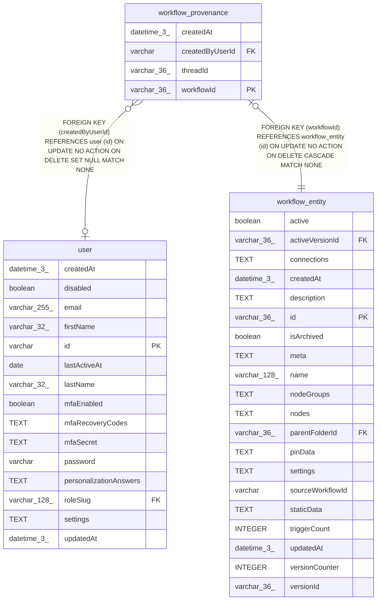

# workflow_provenance

## Description

<details>
<summary><strong>Table Definition</strong></summary>

```sql
CREATE TABLE "workflow_provenance" ("workflowId" varchar(36) PRIMARY KEY NOT NULL, "threadId" varchar(36) NOT NULL, "createdByUserId" varchar, "createdAt" datetime(3) NOT NULL DEFAULT (STRFTIME('%Y-%m-%d %H:%M:%f', 'NOW')), CONSTRAINT "FK_7a08ff4bf45a0c3c3f0c25ebd00" FOREIGN KEY ("workflowId") REFERENCES "workflow_entity" ("id") ON DELETE CASCADE, CONSTRAINT "FK_8f282b184798e83ef1c2a9f3ae9" FOREIGN KEY ("createdByUserId") REFERENCES "user" ("id") ON DELETE SET NULL)
```

</details>

## Columns

| Name | Type | Default | Nullable | Children | Parents | Comment |
| ---- | ---- | ------- | -------- | -------- | ------- | ------- |
| createdAt | datetime(3) | STRFTIME('%Y-%m-%d %H:%M:%f', 'NOW') | false |  |  |  |
| createdByUserId | varchar |  | true |  | [user](user.md) |  |
| threadId | varchar(36) |  | false |  |  |  |
| workflowId | varchar(36) |  | false |  | [workflow_entity](workflow_entity.md) |  |

## Constraints

| Name | Type | Definition |
| ---- | ---- | ---------- |
| - (Foreign key ID: 0) | FOREIGN KEY | FOREIGN KEY (createdByUserId) REFERENCES user (id) ON UPDATE NO ACTION ON DELETE SET NULL MATCH NONE |
| - (Foreign key ID: 1) | FOREIGN KEY | FOREIGN KEY (workflowId) REFERENCES workflow_entity (id) ON UPDATE NO ACTION ON DELETE CASCADE MATCH NONE |
| sqlite_autoindex_workflow_provenance_1 | PRIMARY KEY | PRIMARY KEY (workflowId) |
| workflowId | PRIMARY KEY | PRIMARY KEY (workflowId) |

## Indexes

| Name | Definition |
| ---- | ---------- |
| IDX_8f282b184798e83ef1c2a9f3ae | CREATE INDEX "IDX_8f282b184798e83ef1c2a9f3ae" ON "workflow_provenance" ("createdByUserId")  |
| sqlite_autoindex_workflow_provenance_1 | PRIMARY KEY (workflowId) |

## Relations



---

> Generated by [tbls](https://github.com/k1LoW/tbls)
