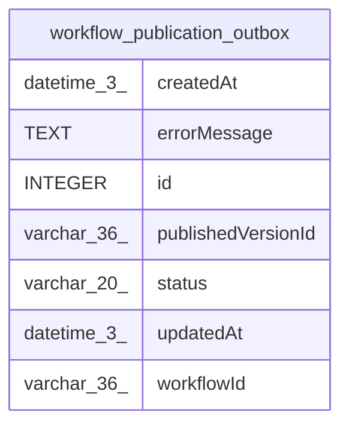

# workflow_publication_outbox

## Description

<details>
<summary><strong>Table Definition</strong></summary>

```sql
CREATE TABLE "workflow_publication_outbox" ("id" integer PRIMARY KEY NOT NULL, "workflowId" varchar(36) NOT NULL, "publishedVersionId" varchar(36) NOT NULL, "status" varchar(20) NOT NULL, "errorMessage" text, "createdAt" datetime(3) NOT NULL DEFAULT (STRFTIME('%Y-%m-%d %H:%M:%f', 'NOW')), "updatedAt" datetime(3) NOT NULL DEFAULT (STRFTIME('%Y-%m-%d %H:%M:%f', 'NOW')), CONSTRAINT "CHK_workflow_publication_outbox_status" CHECK ("status" IN ('pending', 'in_progress', 'completed', 'partial_success', 'failed')))
```

</details>

## Columns

| Name | Type | Default | Nullable | Children | Parents | Comment |
| ---- | ---- | ------- | -------- | -------- | ------- | ------- |
| createdAt | datetime(3) | STRFTIME('%Y-%m-%d %H:%M:%f', 'NOW') | false |  |  |  |
| errorMessage | TEXT |  | true |  |  |  |
| id | INTEGER |  | false |  |  |  |
| publishedVersionId | varchar(36) |  | false |  |  |  |
| status | varchar(20) |  | false |  |  |  |
| updatedAt | datetime(3) | STRFTIME('%Y-%m-%d %H:%M:%f', 'NOW') | false |  |  |  |
| workflowId | varchar(36) |  | false |  |  |  |

## Constraints

| Name | Type | Definition |
| ---- | ---- | ---------- |
| - | CHECK | CHECK ("status" IN ('pending', 'in_progress', 'completed', 'partial_success', 'failed')) |
| id | PRIMARY KEY | PRIMARY KEY (id) |

## Indexes

| Name | Definition |
| ---- | ---------- |
| IDX_workflow_publication_outbox_active_workflow_status | CREATE UNIQUE INDEX "IDX_workflow_publication_outbox_active_workflow_status" ON "workflow_publication_outbox" ("workflowId", "status") WHERE status IN ('pending', 'in_progress') |

## Relations



---

> Generated by [tbls](https://github.com/k1LoW/tbls)
