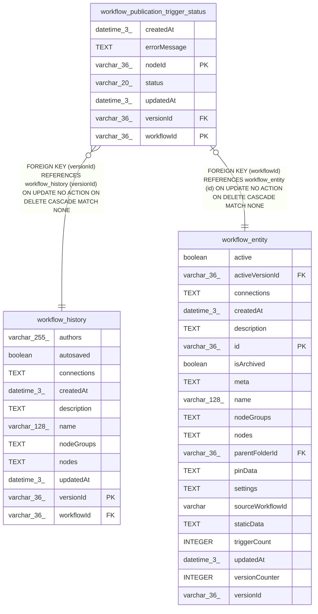

# workflow_publication_trigger_status

## Description

<details>
<summary><strong>Table Definition</strong></summary>

```sql
CREATE TABLE "workflow_publication_trigger_status" ("workflowId" varchar(36) NOT NULL, "nodeId" varchar(36) NOT NULL, "versionId" varchar(36) NOT NULL, "status" varchar(20) NOT NULL, "errorMessage" text, "createdAt" datetime(3) NOT NULL DEFAULT (STRFTIME('%Y-%m-%d %H:%M:%f', 'NOW')), "updatedAt" datetime(3) NOT NULL DEFAULT (STRFTIME('%Y-%m-%d %H:%M:%f', 'NOW')), CONSTRAINT "CHK_workflow_publication_trigger_status_status" CHECK ("status" IN ('activated', 'failed')), CONSTRAINT "FK_b7b496d8d1a21158c65f475cd88" FOREIGN KEY ("workflowId") REFERENCES "workflow_entity" ("id") ON DELETE CASCADE, CONSTRAINT "FK_ef1994db9d0ac1b6a5c89b5f729" FOREIGN KEY ("versionId") REFERENCES "workflow_history" ("versionId") ON DELETE CASCADE, PRIMARY KEY ("workflowId", "nodeId"))
```

</details>

## Columns

| Name | Type | Default | Nullable | Children | Parents | Comment |
| ---- | ---- | ------- | -------- | -------- | ------- | ------- |
| createdAt | datetime(3) | STRFTIME('%Y-%m-%d %H:%M:%f', 'NOW') | false |  |  |  |
| errorMessage | TEXT |  | true |  |  |  |
| nodeId | varchar(36) |  | false |  |  |  |
| status | varchar(20) |  | false |  |  |  |
| updatedAt | datetime(3) | STRFTIME('%Y-%m-%d %H:%M:%f', 'NOW') | false |  |  |  |
| versionId | varchar(36) |  | false |  | [workflow_history](workflow_history.md) |  |
| workflowId | varchar(36) |  | false |  | [workflow_entity](workflow_entity.md) |  |

## Constraints

| Name | Type | Definition |
| ---- | ---- | ---------- |
| - | CHECK | CHECK ("status" IN ('activated', 'failed')) |
| - (Foreign key ID: 0) | FOREIGN KEY | FOREIGN KEY (versionId) REFERENCES workflow_history (versionId) ON UPDATE NO ACTION ON DELETE CASCADE MATCH NONE |
| - (Foreign key ID: 1) | FOREIGN KEY | FOREIGN KEY (workflowId) REFERENCES workflow_entity (id) ON UPDATE NO ACTION ON DELETE CASCADE MATCH NONE |
| nodeId | PRIMARY KEY | PRIMARY KEY (nodeId) |
| sqlite_autoindex_workflow_publication_trigger_status_1 | PRIMARY KEY | PRIMARY KEY (workflowId, nodeId) |
| workflowId | PRIMARY KEY | PRIMARY KEY (workflowId) |

## Indexes

| Name | Definition |
| ---- | ---------- |
| sqlite_autoindex_workflow_publication_trigger_status_1 | PRIMARY KEY (workflowId, nodeId) |

## Relations



---

> Generated by [tbls](https://github.com/k1LoW/tbls)
