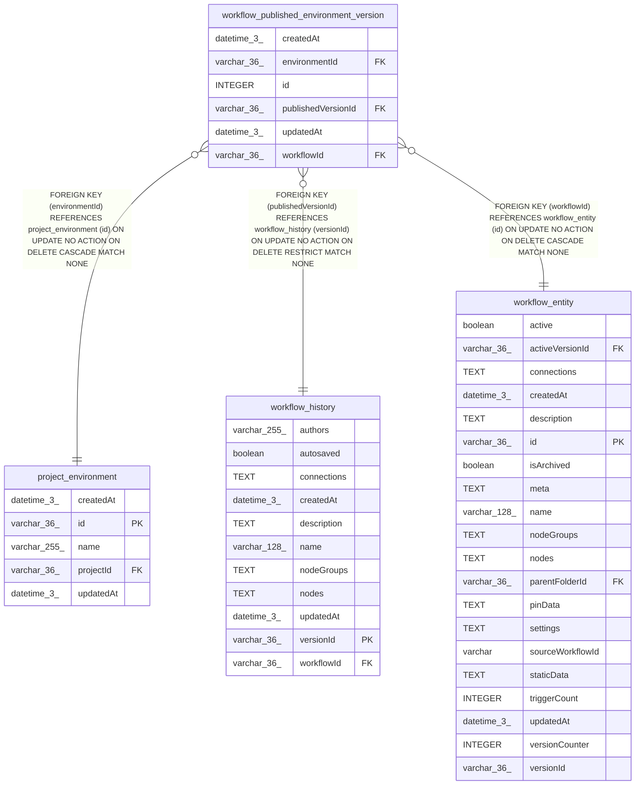

# workflow_published_environment_version

## Description

<details>
<summary><strong>Table Definition</strong></summary>

```sql
CREATE TABLE "workflow_published_environment_version" ("id" integer PRIMARY KEY AUTOINCREMENT NOT NULL, "workflowId" varchar(36) NOT NULL, "environmentId" varchar(36) NOT NULL, "publishedVersionId" varchar(36) NOT NULL, "createdAt" datetime(3) NOT NULL DEFAULT (STRFTIME('%Y-%m-%d %H:%M:%f', 'NOW')), "updatedAt" datetime(3) NOT NULL DEFAULT (STRFTIME('%Y-%m-%d %H:%M:%f', 'NOW')), CONSTRAINT "UQ_b00f98e42c5fdc598c59cb95a4b" UNIQUE ("workflowId", "environmentId"), CONSTRAINT "FK_471e5bd52047db57e393c4dcd04" FOREIGN KEY ("workflowId") REFERENCES "workflow_entity" ("id") ON DELETE CASCADE, CONSTRAINT "FK_2d7601f18eb96fa5407020119cd" FOREIGN KEY ("environmentId") REFERENCES "project_environment" ("id") ON DELETE CASCADE, CONSTRAINT "FK_00bdc2bb2b15944414034950f5d" FOREIGN KEY ("publishedVersionId") REFERENCES "workflow_history" ("versionId") ON DELETE RESTRICT)
```

</details>

## Columns

| Name | Type | Default | Nullable | Children | Parents | Comment |
| ---- | ---- | ------- | -------- | -------- | ------- | ------- |
| createdAt | datetime(3) | STRFTIME('%Y-%m-%d %H:%M:%f', 'NOW') | false |  |  |  |
| environmentId | varchar(36) |  | false |  | [project_environment](project_environment.md) |  |
| id | INTEGER |  | false |  |  |  |
| publishedVersionId | varchar(36) |  | false |  | [workflow_history](workflow_history.md) |  |
| updatedAt | datetime(3) | STRFTIME('%Y-%m-%d %H:%M:%f', 'NOW') | false |  |  |  |
| workflowId | varchar(36) |  | false |  | [workflow_entity](workflow_entity.md) |  |

## Constraints

| Name | Type | Definition |
| ---- | ---- | ---------- |
| - (Foreign key ID: 0) | FOREIGN KEY | FOREIGN KEY (publishedVersionId) REFERENCES workflow_history (versionId) ON UPDATE NO ACTION ON DELETE RESTRICT MATCH NONE |
| - (Foreign key ID: 1) | FOREIGN KEY | FOREIGN KEY (environmentId) REFERENCES project_environment (id) ON UPDATE NO ACTION ON DELETE CASCADE MATCH NONE |
| - (Foreign key ID: 2) | FOREIGN KEY | FOREIGN KEY (workflowId) REFERENCES workflow_entity (id) ON UPDATE NO ACTION ON DELETE CASCADE MATCH NONE |
| id | PRIMARY KEY | PRIMARY KEY (id) |
| sqlite_autoindex_workflow_published_environment_version_1 | UNIQUE | UNIQUE (workflowId, environmentId) |

## Indexes

| Name | Definition |
| ---- | ---------- |
| sqlite_autoindex_workflow_published_environment_version_1 | UNIQUE (workflowId, environmentId) |

## Relations



---

> Generated by [tbls](https://github.com/k1LoW/tbls)
