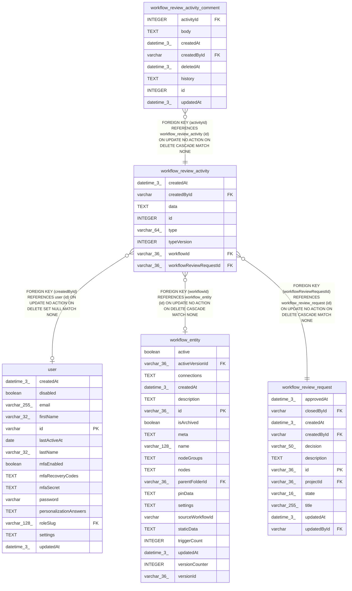

# workflow_review_activity

## Description

<details>
<summary><strong>Table Definition</strong></summary>

```sql
CREATE TABLE "workflow_review_activity" ("id" integer PRIMARY KEY NOT NULL, "workflowReviewRequestId" varchar(36) NOT NULL, "type" varchar(64) NOT NULL, "typeVersion" integer NOT NULL DEFAULT (1), "data" text, "createdById" varchar, "workflowId" varchar(36), "createdAt" datetime(3) NOT NULL DEFAULT (STRFTIME('%Y-%m-%d %H:%M:%f', 'NOW')), CONSTRAINT "CHK_workflow_review_activity_type" CHECK ("type" IN ('review.opened', 'comment.created', 'review.changes_requested', 'review.version_updated', 'review.approved', 'workflow.published', 'review.closed')), CONSTRAINT "FK_61048bf6220dd354c955a9d9379" FOREIGN KEY ("workflowReviewRequestId") REFERENCES "workflow_review_request" ("id") ON DELETE CASCADE, CONSTRAINT "FK_fcf78b037a72fc7aa01ab237e08" FOREIGN KEY ("createdById") REFERENCES "user" ("id") ON DELETE SET NULL, CONSTRAINT "FK_d0162c063ffb699b0f1d1172508" FOREIGN KEY ("workflowId") REFERENCES "workflow_entity" ("id") ON DELETE CASCADE)
```

</details>

## Columns

| Name | Type | Default | Nullable | Children | Parents | Comment |
| ---- | ---- | ------- | -------- | -------- | ------- | ------- |
| createdAt | datetime(3) | STRFTIME('%Y-%m-%d %H:%M:%f', 'NOW') | false |  |  |  |
| createdById | varchar |  | true |  | [user](user.md) |  |
| data | TEXT |  | true |  |  |  |
| id | INTEGER |  | false | [workflow_review_activity_comment](workflow_review_activity_comment.md) |  |  |
| type | varchar(64) |  | false |  |  |  |
| typeVersion | INTEGER | 1 | false |  |  |  |
| workflowId | varchar(36) |  | true |  | [workflow_entity](workflow_entity.md) |  |
| workflowReviewRequestId | varchar(36) |  | false |  | [workflow_review_request](workflow_review_request.md) |  |

## Constraints

| Name | Type | Definition |
| ---- | ---- | ---------- |
| - | CHECK | CHECK ("type" IN ('review.opened', 'comment.created', 'review.changes_requested', 'review.version_updated', 'review.approved', 'workflow.published', 'review.closed')) |
| - (Foreign key ID: 0) | FOREIGN KEY | FOREIGN KEY (workflowId) REFERENCES workflow_entity (id) ON UPDATE NO ACTION ON DELETE CASCADE MATCH NONE |
| - (Foreign key ID: 1) | FOREIGN KEY | FOREIGN KEY (createdById) REFERENCES user (id) ON UPDATE NO ACTION ON DELETE SET NULL MATCH NONE |
| - (Foreign key ID: 2) | FOREIGN KEY | FOREIGN KEY (workflowReviewRequestId) REFERENCES workflow_review_request (id) ON UPDATE NO ACTION ON DELETE CASCADE MATCH NONE |
| id | PRIMARY KEY | PRIMARY KEY (id) |

## Indexes

| Name | Definition |
| ---- | ---------- |
| IDX_workflow_review_activity_request | CREATE INDEX "IDX_workflow_review_activity_request" ON "workflow_review_activity" ("workflowReviewRequestId", "id")  |

## Relations



---

> Generated by [tbls](https://github.com/k1LoW/tbls)
