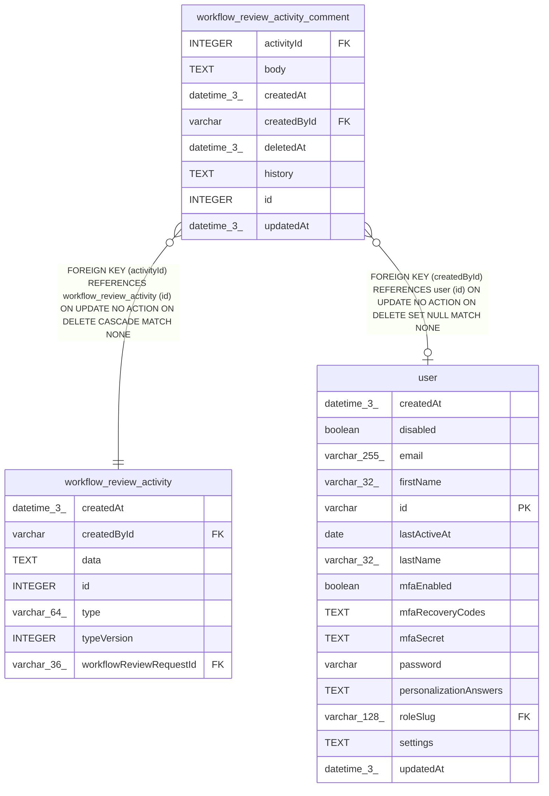

# workflow_review_activity_comment

## Description

<details>
<summary><strong>Table Definition</strong></summary>

```sql
CREATE TABLE "workflow_review_activity_comment" ("id" integer PRIMARY KEY NOT NULL, "activityId" integer NOT NULL, "createdById" varchar, "body" text, "history" text, "updatedAt" datetime(3), "deletedAt" datetime(3), "createdAt" datetime(3) NOT NULL DEFAULT (STRFTIME('%Y-%m-%d %H:%M:%f', 'NOW')), CONSTRAINT "FK_3cd755e8ce44ee49bdf7e9222ec" FOREIGN KEY ("activityId") REFERENCES "workflow_review_activity" ("id") ON DELETE CASCADE, CONSTRAINT "FK_9cfac4b106553d0930a1962bea0" FOREIGN KEY ("createdById") REFERENCES "user" ("id") ON DELETE SET NULL)
```

</details>

## Columns

| Name | Type | Default | Nullable | Children | Parents | Comment |
| ---- | ---- | ------- | -------- | -------- | ------- | ------- |
| activityId | INTEGER |  | false |  | [workflow_review_activity](workflow_review_activity.md) |  |
| body | TEXT |  | true |  |  |  |
| createdAt | datetime(3) | STRFTIME('%Y-%m-%d %H:%M:%f', 'NOW') | false |  |  |  |
| createdById | varchar |  | true |  | [user](user.md) |  |
| deletedAt | datetime(3) |  | true |  |  |  |
| history | TEXT |  | true |  |  |  |
| id | INTEGER |  | false |  |  |  |
| updatedAt | datetime(3) |  | true |  |  |  |

## Constraints

| Name | Type | Definition |
| ---- | ---- | ---------- |
| - (Foreign key ID: 0) | FOREIGN KEY | FOREIGN KEY (createdById) REFERENCES user (id) ON UPDATE NO ACTION ON DELETE SET NULL MATCH NONE |
| - (Foreign key ID: 1) | FOREIGN KEY | FOREIGN KEY (activityId) REFERENCES workflow_review_activity (id) ON UPDATE NO ACTION ON DELETE CASCADE MATCH NONE |
| id | PRIMARY KEY | PRIMARY KEY (id) |

## Indexes

| Name | Definition |
| ---- | ---------- |
| IDX_workflow_review_activity_comment_activity | CREATE INDEX "IDX_workflow_review_activity_comment_activity" ON "workflow_review_activity_comment" ("activityId", "id")  |

## Relations



---

> Generated by [tbls](https://github.com/k1LoW/tbls)
