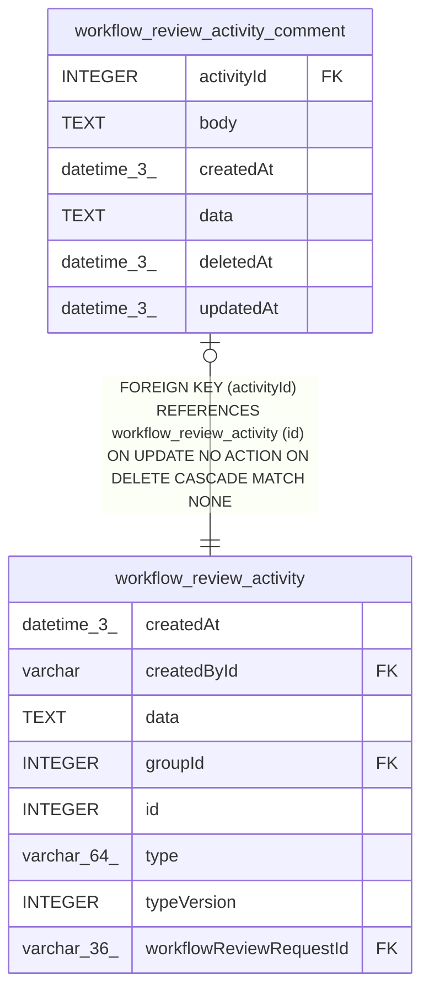

# workflow_review_activity_comment

## Description

<details>
<summary><strong>Table Definition</strong></summary>

```sql
CREATE TABLE "workflow_review_activity_comment" ("activityId" integer PRIMARY KEY NOT NULL, "body" text, "data" text, "updatedAt" datetime(3), "deletedAt" datetime(3), "createdAt" datetime(3) NOT NULL DEFAULT (STRFTIME('%Y-%m-%d %H:%M:%f', 'NOW')), CONSTRAINT "FK_3cd755e8ce44ee49bdf7e9222ec" FOREIGN KEY ("activityId") REFERENCES "workflow_review_activity" ("id") ON DELETE CASCADE)
```

</details>

## Columns

| Name | Type | Default | Nullable | Children | Parents | Comment |
| ---- | ---- | ------- | -------- | -------- | ------- | ------- |
| activityId | INTEGER |  | false |  | [workflow_review_activity](workflow_review_activity.md) |  |
| body | TEXT |  | true |  |  |  |
| createdAt | datetime(3) | STRFTIME('%Y-%m-%d %H:%M:%f', 'NOW') | false |  |  |  |
| data | TEXT |  | true |  |  |  |
| deletedAt | datetime(3) |  | true |  |  |  |
| updatedAt | datetime(3) |  | true |  |  |  |

## Constraints

| Name | Type | Definition |
| ---- | ---- | ---------- |
| - (Foreign key ID: 0) | FOREIGN KEY | FOREIGN KEY (activityId) REFERENCES workflow_review_activity (id) ON UPDATE NO ACTION ON DELETE CASCADE MATCH NONE |
| activityId | PRIMARY KEY | PRIMARY KEY (activityId) |

## Relations



---

> Generated by [tbls](https://github.com/k1LoW/tbls)
